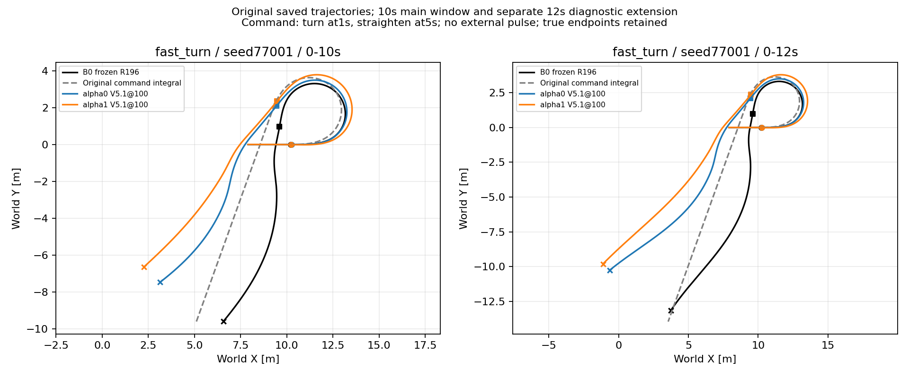
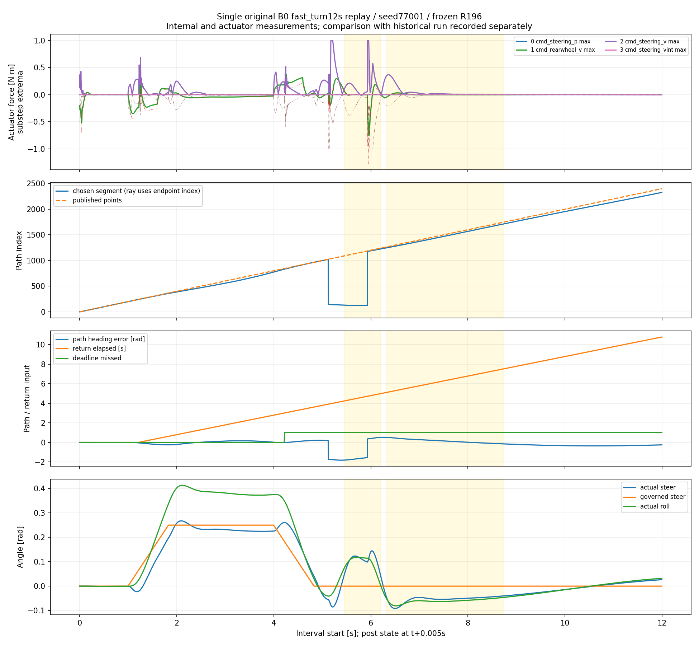

# R196 回正接口诊断与局部底层候选



本轮针对已知 R196 回正失配，未重新搜索偏好可行解。图取原 V5.1@100 保存轨迹，seed77001；B0 是冻结 R196＋ECBC/ESO＋零上层，alpha0/1 是各自原上层@100。1s 请求转弯、5s 请求回正，无外加扰动。12s 延伸不替代10s主窗口结论。

## 三段控制链：数据首先支持什么

下表均值单位为 rad/s；转角误差为 actual−governed，单位 rad。每行同一5ms执行参考配其后状态，无平移评分。ECBC拆解从完整准备状态的 ESO/gains 出发，以原轨迹的上一后状态作为下一前状态，零新增物理。重建 ECBC 与原 `u_nom[:,0]` 全12秒最大差：B0 `1.915e-6`、alpha0 `1.639e-6 rad/s`。

| 原区间 | 转角误差范围 | ECBC：轮角 / 姿态 / ESO / 角速度贡献均值 | ECBC合计 | R196残差 | 最终命令 / 实际角速度均值 |
|---|---|---|---:|---:|---|
| B0 [5.445,6.205) | +.04218 至 +.14442 | −.98395 / +1.01839 / −.02122 / −.13475 | −.12154 | +.12825 | +.006715 / +.007117 |
| B0 [6.315,8.745) | −.09160 至 −.04008 | +.49999 / −.63183 / +.00376 / +.00262 | −.12546 | +.12527 | −.000189 / −.000553 |
| alpha0 [9.020,10.240) | −.07131 至 −.04308 | +.54737 / −.71030 / +.00399 / +.04376 | −.11518 | +.13670 | +.021516 / +.021319 |

- **A，姿态恢复与轮角目标竞争：有直接控制分解证据。** 第一段轮角纠偏项负、姿态项正，之后两段相反。后两段姿态项均值幅值超过轮角项，ECBC合计为负。实际姿态尚未到当前 governed 转角对应的平衡参考，不能只凭 governed 已稳定就认为闭环动态已平稳。ESO贡献明显小于主轮角/姿态项；没有证据把 ESO 认定为唯一主因。
- **B，R196抵消轮角纠偏：不能对三段一概而论。** 第一段存在双向残差和显著动态；第二段及alpha0段，残差每步都朝减少当前轮角误差的方向作用，反而部分抵消 ECBC 的负输出。这里“纠偏”专指轮角误差，不表示有利于整体姿态建立；它同时可能抵消姿态恢复动作，独立因果份额未测。旧路径/return 确实进入策略，但仅凭相关性不能把某组输入宣布为唯一原因。本轮不做 OOD 字段清零、梯度扫描或闭环消融。
- **C，执行器跟不上最终命令：原5ms输出不支持这是主导解释。** 三段 actual steer-rate − final-command 的 RMSE 分别 `.000863 / .000402 / .000204 rad/s`。alpha0整个区间最终命令和实测角速度均为正，转角虽然为负，却正向缓慢修正。角度落后与角速度执行误差必须分开。原记录没有力矩证据；补充B0重放则确实检出了短暂force饱和：第一段22/3800子步触界、累计4.4ms，第二段0/12150。不能由无 command clip 推断无 force saturation；这也不是持续2.43s角度滞后的充分解释。alpha0未重放，force仍未测。
- **D，组合效应仍有未决部分。** 平衡姿态项、R196残差、几何投影和持续 return 状态同时存在。没有独立干预就不能定量分摊旧路径输入造成了多少闭环滞后；候选未训练，不能宣称修复成功。

三段完整图（含ECBC四项、NN、角度/角速度、路径、return及ESO）：

- [B0 5.445–6.205s](evidence/lower_interface_20261009/chain_B0_5.445_6.205.png)
- [B0 6.315–8.745s](evidence/lower_interface_20261009/chain_B0_6.315_8.745.png)
- [alpha0 9.020–10.240s](evidence/lower_interface_20261009/chain_alpha0_9.020_10.240.png)
- [分项数值](evidence/lower_interface_20261009/interval_summary.json)、[离线重建误差及跳段](evidence/lower_interface_20261009/offline_checks.json)。原 `lower_tracking_gate` 及18条误差分解直接复用，未重跑。

## 已核实的任务语义差异

[身份与原声明摘录](evidence/lower_interface_20261009/source_identity.json)来自 registry 的本地 immutable `source_declaration`，不是以仓库同名JSON代替。声明未提供可核实的 `source_revision`，因此精确旧训练源码Git身份为 UNKNOWN；以下原任务配置有冻结声明支持，控制关系由现存对应 `TimedRecoveryEnv.control_reference` 核对，不能据此冒称旧Git逐字复现。

R196实际为 `310→128→128→128→2 ELU+tanh`，310=`10×30+10mask`。Actor SHA `a2e5bf112e0cb986b4ec207fa9f20dcf90f48af6d7855b0abda32bfa13206672`，sidecar SHA `efced7cd83cfd8f691821e29cca28ccd4b40e5b5f32b42b9b708ea945bea8a0e`。已读取实际 mean/std，未套用旧27字段通用类默认。

原声明 `tracking.geometric=true`、`timed=true`、`objective=asymmetric_geometric_huber`、`priority_ratio=34.2`；yaw_feedback=1、lateral_feedback=.4、max_steer=.35。原控制参考关系：

```text
r_req = v*kappa_path − 1*path_heading + .4*path_lateral
steer_reference = clip(atan(.408*r_req/(max(v,.1)*cos(25°))), ±.35)
```

现接口 `DirectCommandEnv → RegisteredLowerController` 直接把 `governed_delta` 送给 ECBC 和 R196 的 steer_reference，仍保留根据 governed 历史积分路径的 lateral/heading/curvature、return八字段及timed三字段。旧几何任务与新局部轮角命令任务并不因字段/单位/310维相同而等价。将原控制关系仅代入当前几何字段，三个区间得到的反事实转角参考均值分别+.15845、−.18869、−.18832rad，而实际governed是0、0、+.02768rad（[数值](evidence/lower_interface_20261009/reference_relationship.json)）。这定量展示字段关系改变，不是原连续投影重演或已执行指令。R196基础速度槽仍为 `rear_rate*.1`；没有直接真实前向速度。真实速度只间接参与 return 更新，不等于直接测量输入。

`lower_reference_centered=true` 时 `u_nom=u_goal`。实测链为 ECBC(governed_delta)+`1.5*lower_action[0]` 与 governed_v/.1+`10*lower_action[1]`，再过原权限。没有额外独立的“上层电机差值”。推理中 return 更新影响下次输入，**没有更新网络权重，也不是奖励在推理时自动调权**。`slip_proxy` 仅是轮速代理与车体前向速度之差，不是已验证真实滑移率。

### 投影不只是理论上可能跳段

以原完整初始参考和原 governed 逐步积分，再对保存位姿复现全历史最近段＋终点ray，原日志同时存在显著 path_heading 跳变：

| 方法 / 时刻 | 重建选段 index 前→后 | 重建投影进度 m 前→后 | 原日志路径航向误差 rad 前→后 |
|---|---|---|---|
| B0 5.125s | 1023→144 | 12.669→1.665 | +.172→−1.745 |
| B0 5.930s | 123→1177 | 1.425→14.443 | −1.565→+.353 |
| alpha0 5.680s | endpoint1135→45 | 13.462→.537 | +.092→−2.275 |
| alpha0 6.865s | 0→1342 | 0→15.907 | −1.878→+.592 |

补充B0真实内部日志在5.125s直接记录1023→144，在5.930s记录123→1177，时刻与原记录相同；见[单次重放内部图](evidence/lower_interface_20261009/B0_replay_internals.png)。5.925→5.930s，记录的NN转向残差从−.37717变到−.19783rad/s、随后5.935s为+.02855，最终命令也由−.07475变到+.10973；这是观察到的输入/输出突变联系，不是已隔离单字段因果效应。

离线CPU重建与原GPU路径字段存在小数值差：B0 lateral/heading/curvature最大约`1.94e-6m / 3.66e-4rad / 4.15e-4m⁻¹`，alpha0约`1.43e-6 / 1.74e-4 / 5.14e-4`。不把重建index冒充原已保存的index；原航向突变是直接日志证据，重建解释了其选段来源。旧 TimedRecoveryEnv 是连续已提交进度投影，当前适配器是全历史最近段，语义不同。

三段重建 return.pending 与 deadline_missed 均持续为真，elapsed 分别约4.23–4.985、5.10–7.525、7.83–9.045s。因为源配置是 geometric objective，return判定不使用timed的longitudinal/yaw-rate条件；重建用下一原日志path作为本步post-path，未伪造历史输入或物理snapshot。

## 一次补充 B0 重放

状态与完整产物入口：[单次重放](../runs/lower_interface_20261009/B0/status.json)、[原始完整诊断NPZ](../runs/lower_interface_20261009/B0/trace.npz)、[精简核验与力矩数据](evidence/lower_interface_20261009/replay_summary.json)。这次只补原B0 fast_turn至12s一次；alpha0控制链已用原记录解释，不增加alpha0仿真。

- 同一完整 prepared bank SHA `6bb5fc54499ecc4451251bc984c1d4459a32977ba92f09fb53d3382c5bf535d0`，index3，env77001/episode0，原 `.5/.3` slew，原 float32 MJX、`.0002/.005/.020s` 时序。没有从qpos/qvel拼5秒假snapshot。
- 原ESO、lower history及return每真实tick只提交一次。诊断是静态opt-in；额外纯读取不提交状态。原ECBC和R196都未改。
- 保存 pre_time/post_time、raw310/normalized310/mask/mean/std、path index/u/progress/distance/endpoint、reference pose、return各字段、ESO/gains/四贡献、NN残差、final/actual rate、ctrl和各执行器25个物理子步force极值及触界计数。
- `old_reference_relationship` 仅把原关系代入当前几何作对照，不是执行命令，也不是旧连续投影的精确重演。
- 已完成一次2400控制tick / 60,000物理子步，未失败、无lower fault；alpha0新增物理0。编译24.47s、同步热执行累计2379.59s；与其他作业并行，此值是诊断耗时，不是性能A/B或吞吐提升声明。
- 原记录与本次重放time/governed最大差0；delta最大差2.41e-5rad、车体速度3.55e-5m/s、roll1.60e-5rad、XY最大分量差.0002828m、final command最大差.0007744（两个通道一起取max）。不声称bitwise相同。
- `u_nom=u_goal`、ECBC输出与u_nom、无clip时执行合成均最大差0；ESO提交连续性差0；return全部字段提交连续一致，pending elapsed每tick只增.005s（float32最大差8.4e-7）；history前10tick有效帧依次1…10；所有新帧lower_alpha=1，标准化重算最大差2.38e-7。没有发现重复提交ESO/history/return的接口错误。
- MuJoCo转向速度执行器`cmd_steering_v` forcerange为±1Nm，全程36/60000子步触界（0.06%，累计7.2ms），分布在含触界的5ms日志区间[5.125,5.150)、[5.175,5.220)、[5.930,5.960)、[5.980,6.040)；这些区间内仅部分200µs子步触界，不能把区间长度都算饱和时长。[逐tick计数](evidence/lower_interface_20261009/force_limit_events.json)、[区间](evidence/lower_interface_20261009/force_limit_intervals.json)。
- 原B0第一失配段22/3800子步触界（0.579%，4.4ms）；第二段0/12150，力矩范围−.2074至+.3680Nm，远未到±1Nm。后轮全程未触及±3Nm；禁用启动舵机`cmd_steering_p`和积分通道`cmd_steering_vint`的force均为0。
- 本次B0重放支持“短暂饱和存在，但长期偏差不能统一归因于执行器不执行最终命令”。alpha0只有原5ms命令/响应证据，没有MuJoCo force数据，不补造无饱和结论。



## 新局部候选：实现准备，不是已修好R196

| 契约 | 冻结 R196 | 新局部候选 |
|---|---|---|
| 输入 | 30字段×10＋mask=310，含路径/alpha/return/timed | 原 `lower_command` 20字段×10＋mask=210，Critic211 |
| 速度 | 轮速代理直接入网，真实速度间接更新return | 前向速度估计、world yaw rate直接输入；轮速代理另存 |
| 目标 | 旧速度＋原几何路径任务 | 实际下发的 governed v/delta及变化率 |
| 历史 | 旧路径/return持续进入神经输入 | 局部状态、上次参考/执行器/残差及ESO，无upper alpha、绝对XY、原始航向欠账或deadline |
| 网络与来源 | ELU128³，原权重/normalizer冻结 | ELU256→128，fresh Actor/Critic/Adam，固定20字段 SCALES；不加载R196第一层 |
| 输出 | 两个有界执行器残差 | 同tanh×[1.5,10]，同ECBC/物理/执行器限制 |
| 身份 | `STTW_R196_ALPHA1`原样保留 | `STTW_LOCAL_CMD_V1`仅预留，尚无权重、未注册、未部署 |

配置：[lower_local_candidate.json](../learning/configs/lower_local_candidate.json)。原 [lower_command.py](../learning/src/sttw_control/lower_command.py) 与 [lower_command_training.py](../learning/src/sttw_control/lower_command_training.py) 原位复用，候选由 `candidate_local_interface` 静态开关启用；旧配置默认行为保留。没有复制trainer或叠第三个部署网络。字段16/17精确沿用原实现的 `log.applied_residual`（权限范围裁剪后、最终执行器命令限幅前）；最终命令另在14/15，不能在发生末级限幅时把16/17冒充最终电机命令差。仿真前向速度定义与上层相同，实机需要估计器。候选沿用既有lower_command完整准备bank（SHA `2eb3b3069043085e72bff29a94f058b22e9c3f712a4b54aadab281c95271cd06`）；它不同于原V5.1诊断bank。候选固定验证的R196基线使用相同候选bank，不把这项新局部协议当作旧失配完整状态对照。

命令覆盖正负对称平稳、降速→转弯→回正→加速，以及回正后±.02–.06rad小转向。v1.7–2.8、|delta|≤.28；90%抽样使用|delta/q(v)|≤.24上界，10%允许≤.26，发布的每个slew点仍筛查≤.26，必要时等待降转角再加速。**仅筛选候选训练任务，不修改活跃上层权限；准静态筛查不保证瞬态可行。** 回正初态来自完整动态序列，不能用直立稳态成绩声称修复旧激进转弯状态。

候选成本为附件指定 `8H(ev/.10)+8H(ed/.04)+40H((peak_roll−.26)+/.04)+120H((peak_roll−.30)+/.02)+H((|roll_rate|−.8)+/.8)+.01||a||²+.02||a−a_prev||²`。peak_roll取区间物理子步峰值。独立caps按上述顺序为100/100/900/3000/40/.02/.16，总上界4140.18；这是新候选设计值，未声称优化所得。非失败 reward=`−.1*.005*sum(capped_terms)`；失败替换当前及剩余有限任务的折扣最坏成本并额外−5，无全局总成本裁剪，不保留旧failure=−10。

候选训练回合和固定局部验证均遵循既有10s默认上限；仅本轮原失配诊断按用户指令延伸12s。建议但未启动的预算：512×256（200Hz），200更新=26,214,400正式控制转移；4epochs/4minibatches，Actor1e-4/Critic3e-4，gamma=exp(−.005/4)、lambda=.99、std=.15、clip=.2、grad1、soft/hardKL=.01/.03。配置无额外墙钟终止。CLI对候选默认拒绝启动，需要另行确认资源后显式授权；本轮没有执行该授权。

### best、验证和KL

- 每10更新保存last；随机rollout奖励最佳仅为 `train_best_candidate.json`，归属采样前模型，不写正式best。
- 正式候选验证100/150/200，**没有20/25验证**；固定3类别×正负=6个10s回合，匹配完整准备状态、命令、slew和同源冻结R196基线。基线缓存校验协议/物理/底层/完整准备SHA与逐文件SHA，发布参考一致性另断言。准备代码尚未执行这6回合。
- 复用V5.2 `selection_key/is_better/persist_best/load_best`：物理失败、工作界失败、主要局部跟踪失败、最终共同保持失败、物理误差质量依次排序；同等级质量需超过0.5%才替换。declared qualified使用稳定段速度RMSE≤.10、转角≤.04，末.5s同时保持，并有共同工作界`.302rad`（沿用V5.2 `.30+.002` 数值容差）。不按训练reward选择。
- checkpoint SHA、来源更新、配置/协议SHA、全部指标、qualified、候选集合保留；最终从磁盘重新校验加载best，再做数值验证，last单独保存。qualified只指声明局部协议，**旧父失配完整状态对照仍为not_run，未过该门槛不能采用或注册别名**。
- `DirectCommandPPO`原全rollout KL、epoch完整Actor/Critic/log_std/Adam/RNG恢复不改；候选遇一次hard KL后减半Actor LR（floor1e-5）并重新采样，三次连续hard reject或nonfinite停止，复用V5.2处理。未降低检查频率。
- 源旧1024×128×200 lower run存在但未采用：`lower-command-tracking/runs/lower_random_commands_1024_200_20261008`；旧训练reward候选update156、由rollout157计分，不能当已合格底层或本轮初始化来源。

## 核验范围与可复现入口

6项新必要CPU检查通过，另5项直接相关旧lower_command回归通过，共11项。新增检查覆盖ECBC贡献重构、分项上界/失败替换、逐tick命令包络、物理best与reward分离、KL减LR/连续拒绝、故障/重复时钟拒绝。另核验默认CLI在导入仿真或创建run之前拒绝候选训练。已有底层接口验证不重复，未跑全仓测试或第二个训练，未跑候选GPU工程批次；候选验证/训练/采用均为 **not_run / not_adopted**。

```bash
# CPU-only; no new physics
JAX_PLATFORMS=cpu CUDA_VISIBLE_DEVICES='' PYTHONPATH=learning/src \
  /home/qy/mujoco_playground/.venv/bin/python -m pytest -q \
  learning/tests/test_lower_interface_diagnostics.py learning/tests/test_local_lower_candidate.py

# Original saved chain reconstruction, no simulation (full preparation file is locally retained)
JAX_PLATFORMS=cpu PYTHONPATH=learning/src /home/qy/mujoco_playground/.venv/bin/python \
  learning/cli/audit_lower_control_chain.py --parent-run <original_V51_run> \
  --initial-state runs/lower_interface_20261009/B0/initial_full_state.pkl \
  --output runs/lower_interface_20261009/offline
```

活跃上层保护记录：`runs/lower_interface_20261009/protected_run_before.json`。PID2556760，cwd=`v52-best-tracking`，run=`preference_v52_tracking_best_start_20261009`，启动源码413f58c；本轮工作树从55f7706隔离，未覆盖后续修改。没有热换底层、修改该run奖励/normalizer、停止或重启进程，未向DVGC/JIT写入。2026-10-09 21:05只读核验两端新增100/200，正执行既定evaluate100；不是新插入评价。最终状态与commit详见本次交付记录。

## 2026-10-10 远端交付范围

本分支交付诊断代码、报告、5张PNG和紧凑数值证据，并包含已有候选实现提交63c9d68/6e47341。候选训练、GPU工程批、旧失配完整状态对照仍未执行，冻结R196未替换。原始内部大trace、完整状态pickle和模型保留在本地 `runs/lower_interface_20261009/`，不随Git上传；因此远端紧凑包不是包含全部外部模型/初态的独立重放包。

上文“活跃V5.2”是诊断执行时的保护记录。V5.2后来已正常完成；最终结果单独保存于[已推送V5.2报告](https://github.com/QaQaaa-zzz/STTW_CONTROL/blob/2eeef426367e8922cf4fd334ce4989fc6fcc0515/docs/V52_VALIDATION.md)，没有将本候选安装到该训练。
