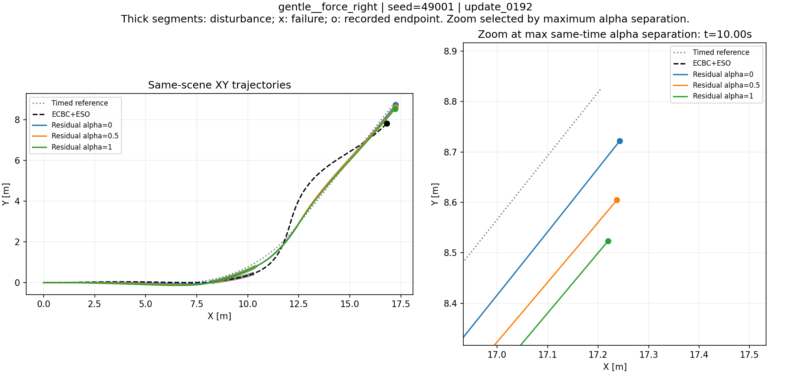

# 奖励设计分析表：gentle__force_right / best192

固定模型update0192、seed49001；三种α，各配对ECBC＋ESO，10秒、200Hz；4–5秒横向外力−2N。训练范围内面板。以下内容可在远端直接阅读，CSV可用Excel/LibreOffice打开。

**结论边界：这些数据支持重新审视奖励与条件策略是否一致，不能单独证明所有问题都由奖励函数造成。动作未饱和，速度奖励接近平台，但有限训练、共享网络优化及数据分布也可能有影响。**

## 1. 跟踪结果（本表仅残差；CSV含基线）

| α | 速度RMSE m/s | yaw RMSE rad/s | 沿程RMSE m | 横向RMSE m | XY RMSE m | 终态保持 | 曾超恢复期限 |
|---|---|---|---|---|---|---|---|
| 0.0 | 0.014415 | 0.104610 | 0.060707 | 0.088489 | 0.107311 | True | True |
| 0.5 | 0.012819 | 0.102695 | 0.117390 | 0.097990 | 0.152913 | False | True |
| 1.0 | 0.017127 | 0.100337 | 0.167972 | 0.104364 | 0.197754 | False | True |

[完整指标CSV](01_metrics.csv)。三个α均存活，α0终态保持也不抹去此前超时。

## 2. 每项奖励在2000个实际转移上的有符号总和

| 分项 | α0轨迹/α0评分 | α.5轨迹/α.5评分 | α1轨迹/α1评分 |
|---|---|---|---|
| action | -0.000741 | -0.000658 | -0.000589 |
| action_delta | -0.000002 | -0.000002 | -0.000002 |
| alive | 10.000000 | 10.000000 | 10.000000 |
| attitude | 0.000000 | 0.000000 | 0.000000 |
| failure | 0.000000 | 0.000000 | 0.000000 |
| longitudinal_budget | 0.000000 | 0.000000 | 0.000000 |
| path_budget | -0.438814 | 0.000000 | 0.000000 |
| path_tail | -0.881763 | -0.931121 | -0.272617 |
| path_tracking | 74.705374 | 36.068697 | 5.808002 |
| recovery | 2.000000 | 0.000000 | 0.000000 |
| return_time | -4.361250 | -6.126250 | -6.826250 |
| roll_rate | -0.040743 | -0.039556 | -0.035087 |
| speed_budget | 0.000000 | 0.000000 | 0.000000 |
| speed_tail | -0.000708 | -0.003081 | -0.010001 |
| speed_tracking | 5.427328 | 29.881661 | 54.163586 |
| yaw_rate_budget | 0.000000 | -0.000727 | -0.456436 |
| yaw_rate_tail | -0.036793 | -0.195237 | -0.338049 |
| yaw_rate_tracking | 4.211517 | 23.649182 | 42.974217 |
| 累计总奖励 | 90.583404 | 92.302910 | 105.006775 |

**此表不同列使用不同α权重，不能直接据此排名策略。** [含配对基线CSV](02_reward_components.csv)。

## 3. 同一奖励标准下的交叉评分

| 评分采用α | 保存轨迹α0 | 保存轨迹α.5 | 保存轨迹α1 |
|---|---|---|---|
| 0.0 | 90.583405 | 76.762919 | 65.178372 |
| 0.5 | 101.006647 | 92.302911 | 86.815364 |
| 1.0 | 110.495798 | 106.717316 | 105.006775 |

行内奖励标准相同，可横向比较。三行均偏好保存的α0轨迹；不是全局最优证明，也不是改变α后重跑控制器。

## 4. 离线奖励变体（不改变轨迹）

| 变体 | 评分α | 轨迹α0 | 轨迹α.5 | 轨迹α1 |
|---|---|---|---|---|
| all_tracking_x3_again | 0.0 | 256.555689 | 222.621687 | 189.258974 |
| all_tracking_x3_again | 0.5 | 287.825414 | 269.241664 | 254.169950 |
| all_tracking_x3_again | 1.0 | 316.292865 | 312.484877 | 308.744184 |
| preference_ratio20 | 0.0 | 89.526747 | 75.187599 | 63.205234 |
| preference_ratio20 | 0.5 | 101.006647 | 92.302911 | 86.815364 |
| preference_ratio20 | 1.0 | 111.552456 | 108.292636 | 106.979914 |
| speed_fine005 | 0.0 | 90.399089 | 76.617802 | 64.933672 |
| speed_fine005 | 0.5 | 99.992909 | 91.504767 | 85.469511 |
| speed_fine005 | 1.0 | 108.652638 | 105.266144 | 102.559770 |

`all_tracking_x3_again`：tracking_rate/tail_rate/budget_rate在当前已放大3倍的基础上再×3；`preference_ratio20`：10→20；`speed_fine005`：速度精细Gaussian尺度.15→.05m/s。所有数值仅为离线重评分，不能预测重新训练的结果。[完整矩阵CSV](05_cross_scores.csv)。

## 5. 分阶段误差

| α | 阶段 | 速度RMSE m/s | XY RMSE m |
|---|---|---|---|
| 0.0 | before | 0.013575 | 0.054372 |
| 0.0 | during | 0.008329 | 0.128939 |
| 0.0 | after | 0.015941 | 0.131683 |
| 0.5 | before | 0.011812 | 0.071918 |
| 0.5 | during | 0.013972 | 0.156924 |
| 0.5 | after | 0.013341 | 0.194137 |
| 1.0 | before | 0.021653 | 0.100141 |
| 1.0 | during | 0.016657 | 0.184961 |
| 1.0 | after | 0.012500 | 0.251633 |

before/during/after按记录后步时间分组：[0,4)、[4,5)、[5,10.01)秒。不同α扰动前状态已经不同，不是同状态瞬时干预实验。[CSV](03_phase_errors.csv)。

## 6. 权限与网络条件响应

| α | 转向归一化最大绝对值 | 后轮归一化最大绝对值 | 转向最大增量rad/s | 后轮最大增量rad/s | 速度正奖励/理论上限 |
|---|---|---|---|---|---|
| 0.0 | 0.268020 | 0.069324 | 0.402030 | 0.693237 | 0.995010 |
| 0.5 | 0.267221 | 0.064439 | 0.400831 | 0.644388 | 0.996055 |
| 1.0 | 0.195059 | 0.058280 | 0.292589 | 0.582796 | 0.992999 |

归一化动作范围±1；残差scale为转向1.5rad/s、后轮10rad/s；执行器指令限幅3/60rad/s。后轮轴转速增量不是车体真实速度增量。当前所有abs(action)>.95比例为0。

[权限CSV](04_action_authority.csv) · [同观测替换α后的网络响应CSV](07_network_sensitivity.csv) · [冻结参数CSV](06_frozen_parameters.csv)

## 7. 可下载数据

- [完整表格与逐步CSV压缩包](reward_design_tables.zip)：7张摘要表、6张逐步表（3α×残差/基线，各2000行）、图与来源哈希。
- 逐步表排除reset虚拟行，保留实际终止罚，每步/累计总奖励及分项、参考/实际XY、速度/yaw/位置误差；列名带单位。alpha使用产生转移的前步值。
- [来源与SHA-256](provenance.json)。本包是用户指定工况的派生表格，不包含模型或完整训练产物。
- 目前奖励命令组由速度与yaw各占一半；位置组包含沿程、横向、航向。权重wv=(1+9α)/11、wp=(10−9α)/11，普通奖励率乘dt=.005；恢复bonus和终止罚按事件计入。参数表保存精确配置。
- 80%基线仅是待研究建议，未执行；在2.1m/s时少4.2rad/s后轮指令，补回占当前后轮残差范围42%，不能把这种被迫补偿直接解释为更好的恢复。
