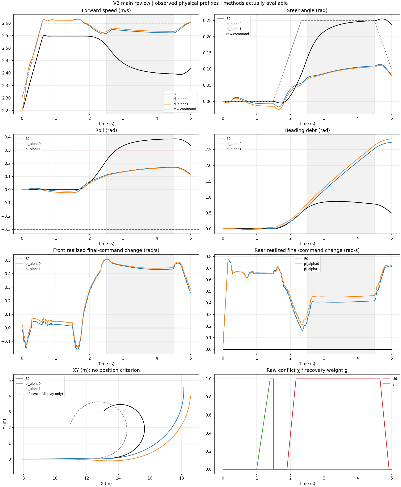

# V3 500轮尝试：未达到协调目标

效果：冲突段速度RMSE由ECBC+ESO的0.178降至α0/α1的0.034/0.029 m/s，但转角RMSE由0.038增至0.155/0.157 rad。侧倾减小，两种alpha仍主要保速度、牺牲转向，没有达到要求的取舍。方向恢复未验证。

训练问题：实际采样456/500轮，第456轮触发硬KL停止，回滚模型与455相同。主场景只保存5秒，随机场景未完成。零物理失败不能替代共同跟踪合格。不能仅据此认定弱ECBC是学习问题的原因。

下一步：冻结用户指定path_rsl_4096的update_0200（低层alpha1），重新训练共享上层500轮，对照不同底层的效果。

[20与456对比](comparison_20_456.png) · [训练曲线](training_summary.png) · [指标](review/metrics.json) · [同alpha奖励](review/main_rewards.png) · [逐轮CSV](training_metrics.csv)

原始run：runs/direct_command_v3_fresh500_20260928，源码cc03aa6；原始checkpoint留本地，关键5ms物理轨迹随本目录保留。所有曲线在真实保存终点截止，本目录不声称完整16秒回合。
