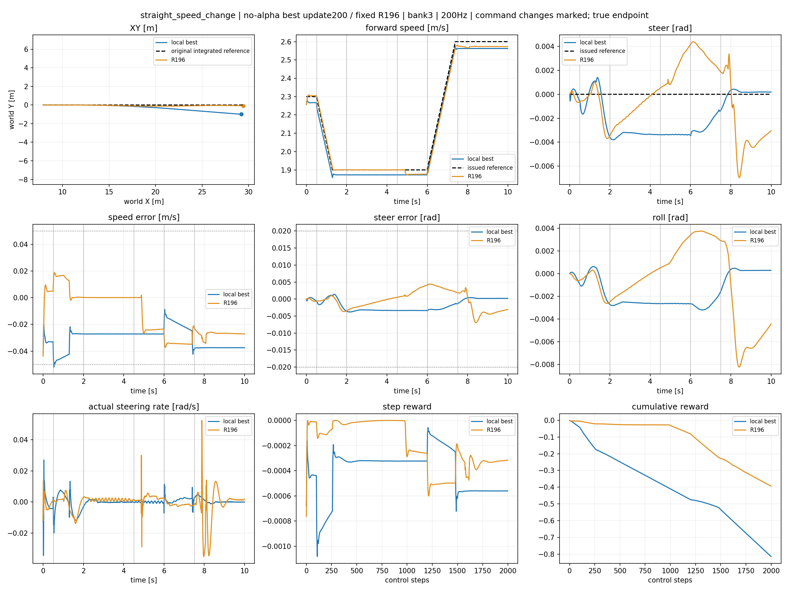
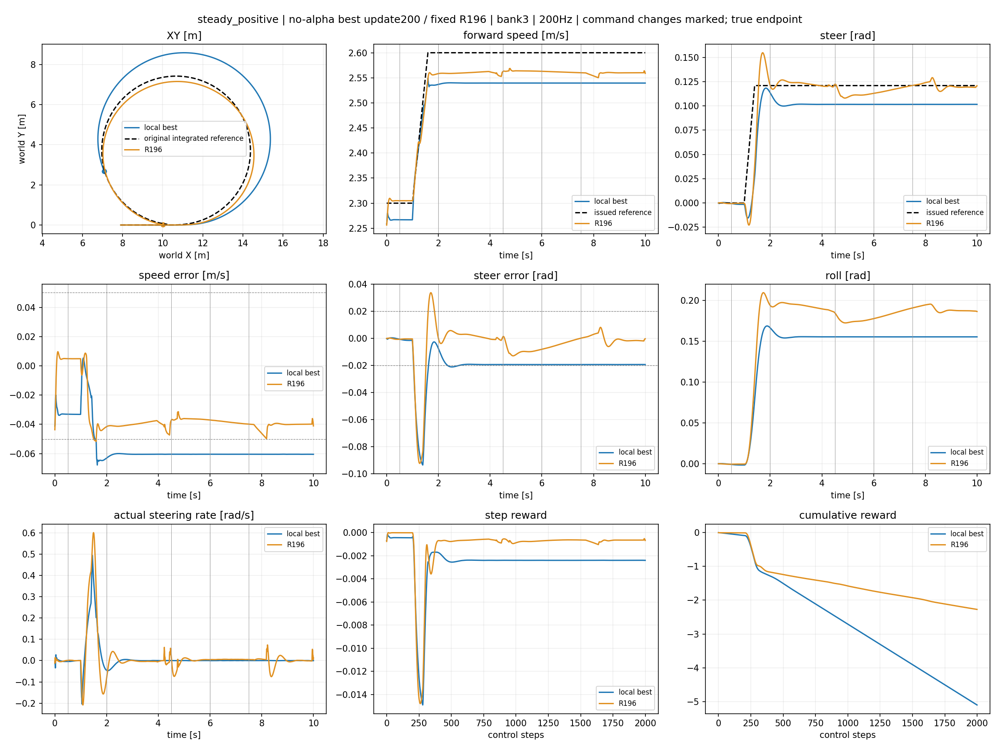
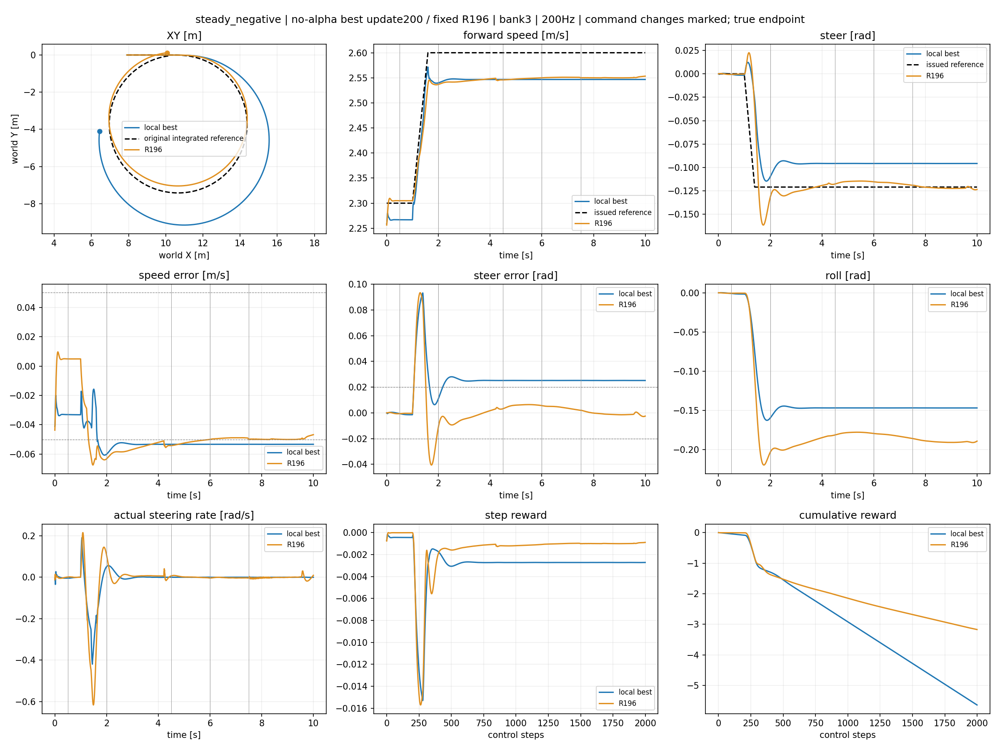
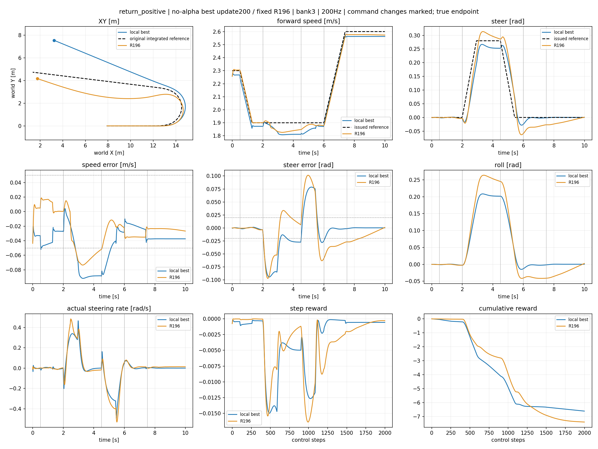
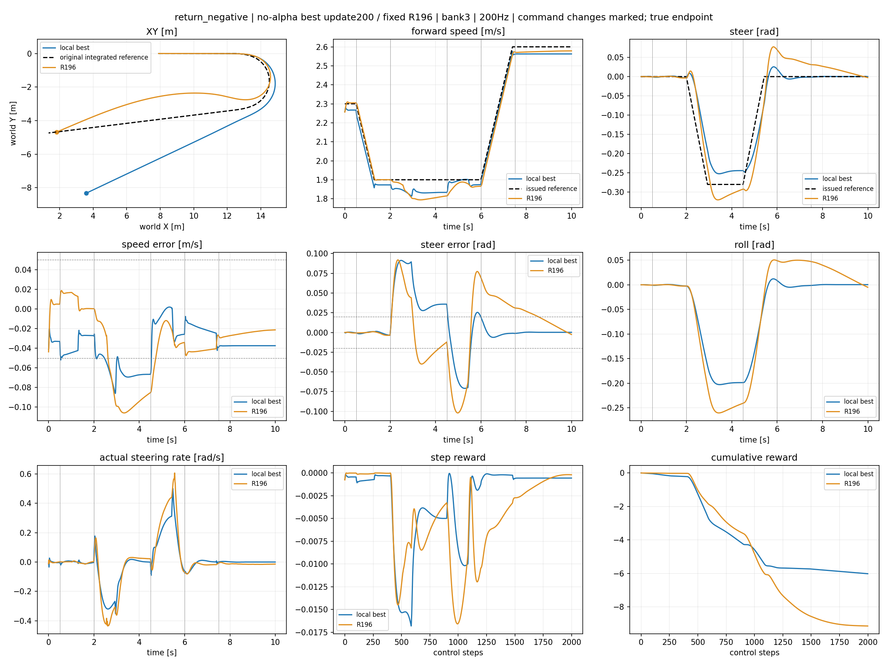
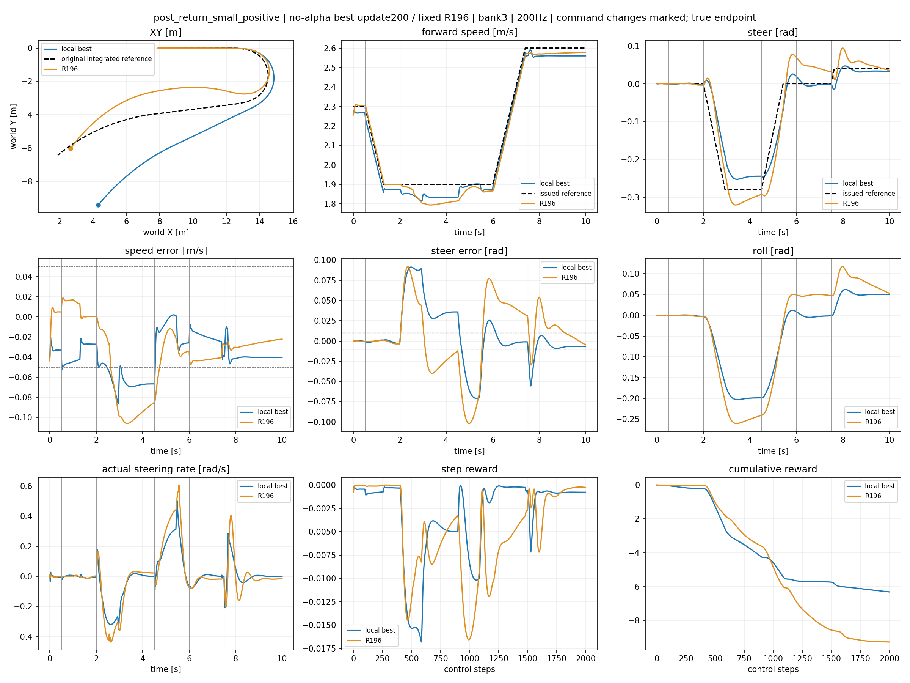
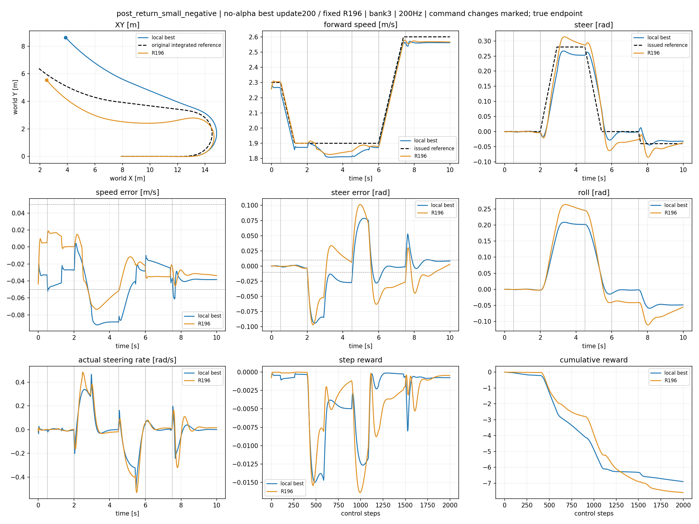

# Local no-alpha lower — fixed best review

Checkpoint update200; SHA 5d2cf35739f81429b7f6cbff39066dc1ad6d72f939dd8524e955e0609ef37df4. Local qualification=False; parent-state gate remains separate.

XY first, then exact issued/actual tracking, step reward and cumulative reward. R196 receives the identical published reference.

## straight_speed_change

## steady_positive

## steady_negative

## return_positive

## return_negative

## post_return_small_positive

## post_return_small_negative

|case|physical fail|working fail|tracking fail|final hold fail|peak roll|steady RMSE v/delta|small RMSE v/delta|
|---|---|---|---|---|---|---|---|
|straight_speed_change|False|False|False|False|0.003203868865966797|[0.030948271974921227, 0.0027417470701038837]|None|
|steady_positive|False|False|True|True|0.16865992546081543|[0.06042133644223213, 0.019322136417031288]|None|
|steady_negative|False|False|True|True|0.16264355182647705|[0.05332612246274948, 0.025226132944226265]|None|
|return_positive|False|False|True|False|0.20842695236206055|[0.05801907926797867, 0.014354005455970764]|None|
|return_negative|False|False|False|False|0.20303630828857422|[0.048258595168590546, 0.018892785534262657]|None|
|post_return_small_positive|False|False|True|False|0.20303702354431152|[0.05022650957107544, 0.020274406298995018]|[0.04019908607006073, 0.0069479080848395824]|
|post_return_small_negative|False|False|True|False|0.2084265947341919|[0.05971888452768326, 0.016052227467298508]|[0.038692817091941833, 0.00794238317757845]|

[200-update analysis and authorized extension](RESULTS_0200.md)

## Supplementary training, reward components and velocity estimation

[Stage200 training reward/loss/KL and completed-episode errors](training_0200.png)

- straight_speed_change: [per-step and cumulative signed reward parts](straight_speed_change_reward_parts.png); [request/true/wheel-proxy velocity](straight_speed_change_speed_proxy.png)
- steady_positive: [per-step and cumulative signed reward parts](steady_positive_reward_parts.png); [request/true/wheel-proxy velocity](steady_positive_speed_proxy.png)
- steady_negative: [per-step and cumulative signed reward parts](steady_negative_reward_parts.png); [request/true/wheel-proxy velocity](steady_negative_speed_proxy.png)
- return_positive: [per-step and cumulative signed reward parts](return_positive_reward_parts.png); [request/true/wheel-proxy velocity](return_positive_speed_proxy.png)
- return_negative: [per-step and cumulative signed reward parts](return_negative_reward_parts.png); [request/true/wheel-proxy velocity](return_negative_speed_proxy.png)
- post_return_small_positive: [per-step and cumulative signed reward parts](post_return_small_positive_reward_parts.png); [request/true/wheel-proxy velocity](post_return_small_positive_speed_proxy.png)
- post_return_small_negative: [per-step and cumulative signed reward parts](post_return_small_negative_reward_parts.png); [request/true/wheel-proxy velocity](post_return_small_negative_speed_proxy.png)
