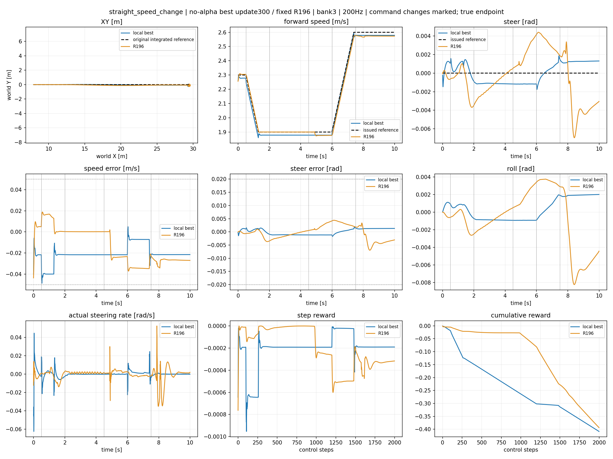
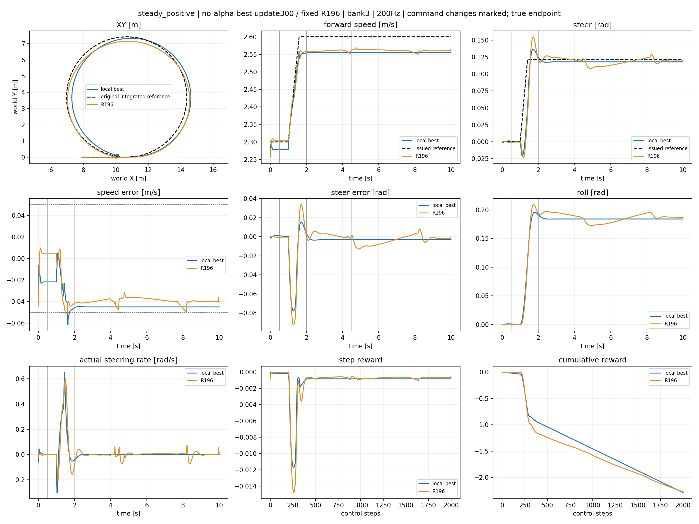
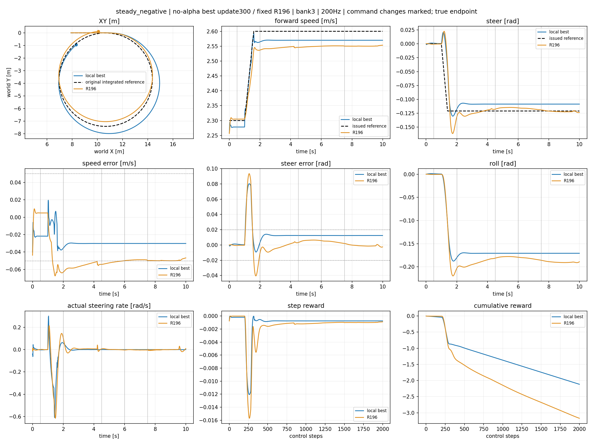
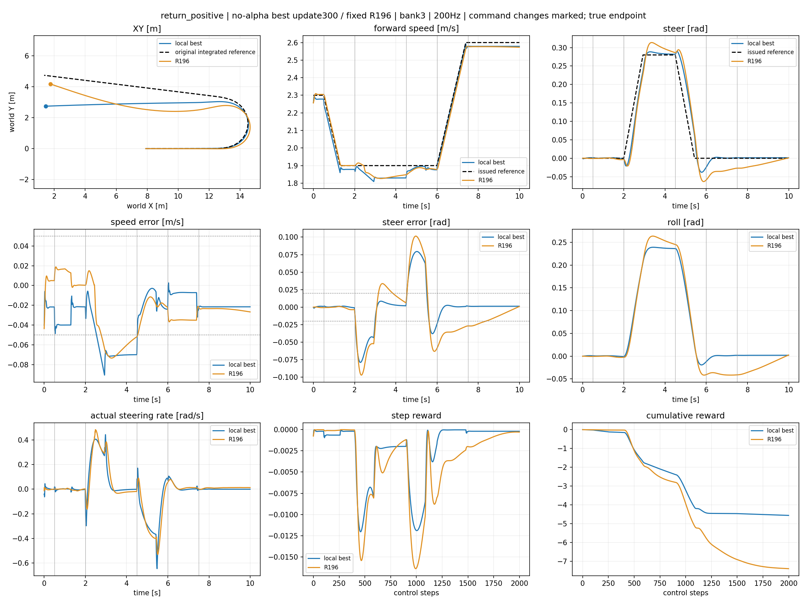
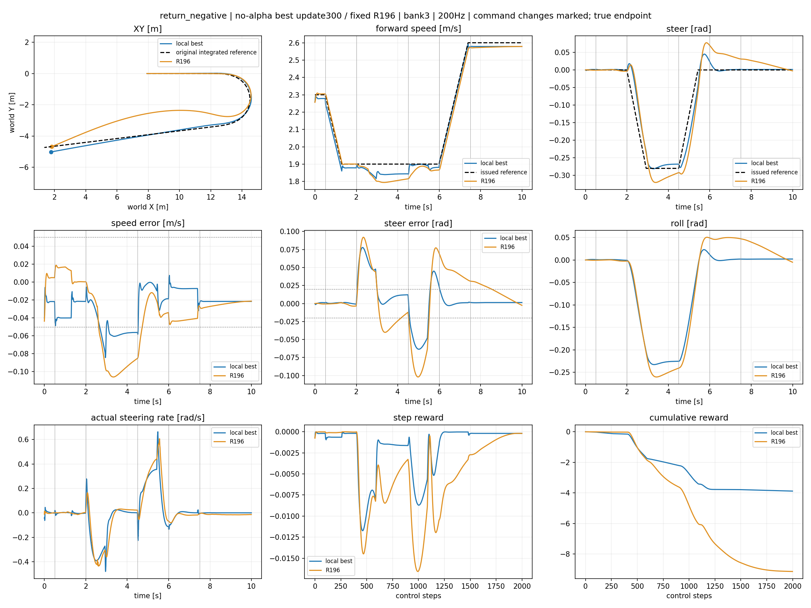
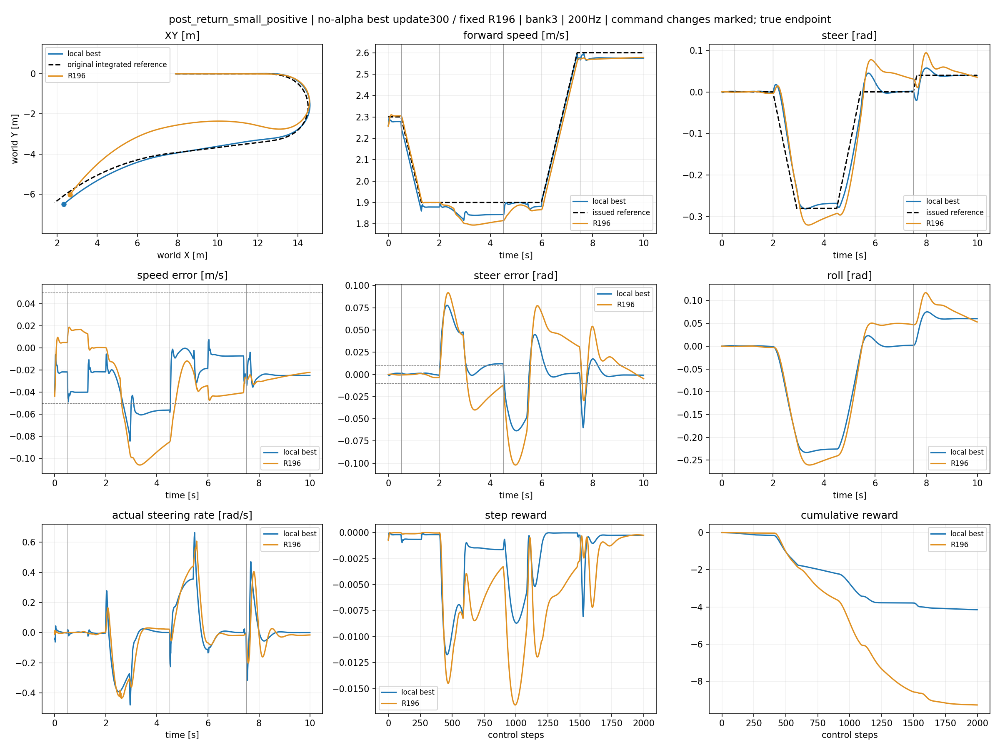
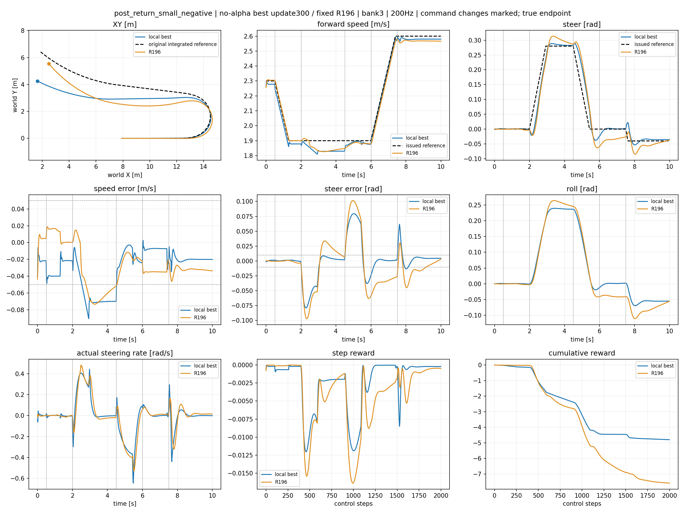
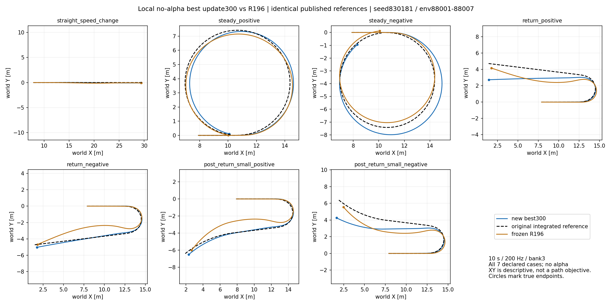

# Local no-alpha lower — fixed best review

Checkpoint update300; SHA 8aa8a90e76dce8c8ad34a8cbca3b4602015926f3d18e24af3000ac2bc26b3577. Local qualification=True; parent-state gate remains separate.

XY first, then exact issued/actual tracking, step reward and cumulative reward. R196 receives the identical published reference.

## straight_speed_change

## steady_positive

## steady_negative

## return_positive

## return_negative

## post_return_small_positive

## post_return_small_negative

|case|physical fail|working fail|tracking fail|final hold fail|peak roll|steady RMSE v/delta|small RMSE v/delta|
|---|---|---|---|---|---|---|---|
|straight_speed_change|False|False|False|False|0.0020096302032470703|[0.02166106179356575, 0.0011715063592419028]|None|
|steady_positive|False|False|False|False|0.19590723514556885|[0.04491494596004486, 0.0030750087462365627]|None|
|steady_negative|False|False|False|False|0.1876155138015747|[0.030179915949702263, 0.012444854713976383]|None|
|return_positive|False|False|False|False|0.23919081687927246|[0.04311228543519974, 0.0045461454428732395]|None|
|return_negative|False|False|False|False|0.23298251628875732|[0.03665265813469887, 0.006840969435870647]|None|
|post_return_small_positive|False|False|False|False|0.23298132419586182|[0.03860609233379364, 0.007432515732944012]|[0.024662436917424202, 0.00318647432141006]|
|post_return_small_negative|False|False|False|False|0.23919081687927246|[0.0439688041806221, 0.005941873881965876]|[0.02046642079949379, 0.004912790842354298]|

## Supplementary training, reward components and velocity estimation

[Stage300 training reward/loss/KL and completed-episode errors](training_0300.png)

- straight_speed_change: [per-step and cumulative signed reward parts](straight_speed_change_reward_parts.png); [request/true/wheel-proxy velocity](straight_speed_change_speed_proxy.png)
- steady_positive: [per-step and cumulative signed reward parts](steady_positive_reward_parts.png); [request/true/wheel-proxy velocity](steady_positive_speed_proxy.png)
- steady_negative: [per-step and cumulative signed reward parts](steady_negative_reward_parts.png); [request/true/wheel-proxy velocity](steady_negative_speed_proxy.png)
- return_positive: [per-step and cumulative signed reward parts](return_positive_reward_parts.png); [request/true/wheel-proxy velocity](return_positive_speed_proxy.png)
- return_negative: [per-step and cumulative signed reward parts](return_negative_reward_parts.png); [request/true/wheel-proxy velocity](return_negative_speed_proxy.png)
- post_return_small_positive: [per-step and cumulative signed reward parts](post_return_small_positive_reward_parts.png); [request/true/wheel-proxy velocity](post_return_small_positive_speed_proxy.png)
- post_return_small_negative: [per-step and cumulative signed reward parts](post_return_small_negative_reward_parts.png); [request/true/wheel-proxy velocity](post_return_small_negative_speed_proxy.png)

[300更新结果与边界](RESULTS_0300.md)

