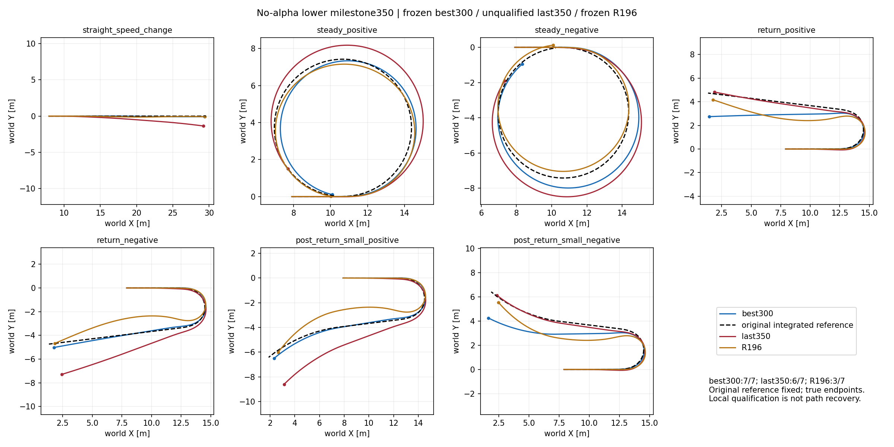

# 无alpha局部底层350检查点：退步与剩余预算决策

[逐时真实跟踪、同reward每步／累计曲线](INDEX.md)。覆盖7声明场景×best300/last350/R196，同一实际发布指令/rates/初态/物理，bank3、200Hz、各10s；best300图采用原selection轨迹，最终重载另审计。

**结论：last350为6/7，正向稳态速度失败；物理best保持300（7/7）。300通过、350失败，连续两次后期验证合格未满足。旧完整状态门槛仅对未变的best300已经通过；未进入冻结upper组合。**

350/350及350接受更新已完成、45,875,200控制转移，本阶段精确300→350无重新初始化；最终磁盘重载best300 Q=1.739118710且7/7，非last350。随机采样奖励best为336（由337采样计分），独立角色。best SHA8aa8a90e76dce8c8ad34a8cbca3b4602015926f3d18e24af3000ac2bc26b3577，未改变。

|候选|主跟踪失败|末段保持失败|物理/工作失败|质量Q，低为好|全局部通过|
|---|---|---|---|---|---|
|300|0|0|0/0|1.739090|7/7|
|350|1|1|0/0|1.734559|6/7|
|R196同协议|4|0|0/0|3.506210|3/7|

质量Q均值350较300只降约.26%，但失败类别增加，安全／任务门槛优先，不能用均值替换合格判断或把350设为best。

|场景|300速度／转角平稳RMSE m/s,rad|350速度／转角|350小角窗口速度／转角|350结论|
|---|---|---|---|---|
|straight_speed_change|[0.02166106179356575, 0.0011715063592419028]|[0.030455652624368668, 0.0030958778224885464]|None|通过|
|steady_positive|[0.04491494596004486, 0.0030750087462365627]|[0.053094036877155304, 0.014874568209052086]|None|失败|
|steady_negative|[0.030179915949702263, 0.012444854713976383]|[0.021199317649006844, 0.018035301938652992]|None|通过|
|return_positive|[0.04311228543519974, 0.0045461454428732395]|[0.04676518961787224, 0.006032553035765886]|None|通过|
|return_negative|[0.03665265813469887, 0.006840969435870647]|[0.029462262988090515, 0.017286626622080803]|None|通过|
|post_return_small_positive|[0.03860609233379364, 0.007432515732944012]|[0.032787028700113297, 0.018811585381627083]|[0.03785748779773712, 0.008797286078333855]|通过|
|post_return_small_negative|[0.0439688041806221, 0.005941873881965876]|[0.04533379524946213, 0.005676504224538803]|[0.026180297136306763, 0.0028726172167807817]|通过|

## 持续失配与解释边界

350 steady_positive发布速度2.6m/s，真实速度约2.547m/s：平稳RMSE.053094m/s>.05门槛，连续[1.520,10.000)超差8.48秒。平稳转角RMSE.014875rad<.02，末段速度仍超差，因此主跟踪及末段联合保持都失败。该差额.003094m/s远大于重复验证最大速度浮点差约.000021m/s，不当作边界舍入；不放宽阈值。

较300该场景速度RMSE.044915→.053094、转角.003075→.014875，姿态峰值反而较低；说明继续优化随机训练成本未保证固定跟踪保持。双跟踪＋共同姿态成本未改。是否由于姿态成本与驱动／转向耦合导致新的稳态偏置只是待证假设，不能凭曲线确证原因。

原best300负向稳态7.835秒偏差仍消除；原6.315s状态恢复.445秒入带保持证据继续有效，因为选定best身份未变。不能把last350的验证或新checkpoint继承这份恢复结论。350小正／负转角RMSE.008797/.002873rad均过.01，但小正角较300退步，不能只挑小负角改善。XY仍有位置偏移；局部通过不等于航向／路径任务通过。

## 后期训练证据

[训练reward/loss/KL与固定开发失败曲线](training_0350.png)。完整回合跨变化策略与随机任务，只作描述性训练统计。

|窗口|完整回合数|平均每步成本|速度RMSE m/s|转角RMSE rad|
|---|---|---|---|---|
|276-300|1536|0.00186361|0.024270|0.030790|
|301-325|1536|0.00171331|0.023718|0.029050|
|326-350|1536|0.00174558|0.023923|0.029098|

后25相对前25成本上升1.88%，速度/转角也略升；相对276–300仍有成本/转角改善。分族ordinary与post_small成本改善，但turn_return与reversal成本恶化；混合信号，不能称所有族持续改善或已收敛。未达到“最近三次失败类别相同”的平台判断：250/300/350主失败4/0/1。

## 后续执行

按已声明的最后至多100更新澄清块，执行其剩余350→400的50更新，而不是再新开100更新；新增6,553,600，累计52,428,800转移达到400硬上限。完整恢复350 Actor/Critic/Adam/std/RNG/512环境；不改reward/采样/权限/物理，无新工程小批、无20/25验证。只做既定400固定验证，保存每10/完整50，结束重新加载物理best。保留本次best/last/重载档案。

本块回答“退步是否继续/最后候选是否再恢复局部跟踪”，不能预先保证通过。即使400通过，350失败仍使300和400不能被算作连续两次后期通过；400后停止，不突破预算凑合格、不自动注册安装或冻结upper组合。单次best300合格和单状态恢复已经证明的能力保留，完整任务书未达标部分如实报告。用户原任务授权与本次继续分析沿用，不另行确认；仅启动核验，随后依用户偏好无持续Codex轮询。

## 审计与保留

350完整状态和resume_boundary策略一致，Adam非空，512×10×20历史/RNG保存；metrics1–350无缺重复。R196缓存与upper两端best checkpoint/Actor哈希不变；双方发布command/rates/time/reference逐值同一。当前best重载最大XY浮点差.00012684m、转角.00001330rad，合格判断不变；不声称逐位物理复现。没有源码修改或新增仿真，仅读取已有350和最终best的输出，重建绘图与检查。旧11/全仓无需重跑。

best300完整奖励分项与轮速／真实速度详图直接复用[原300图集](../local_lower_noalpha_v2_0300/INDEX.md)，固定同一配置与baseline缓存；last350分项仍在validation_0350各原NPZ reward_parts_*，原数据不覆盖。
