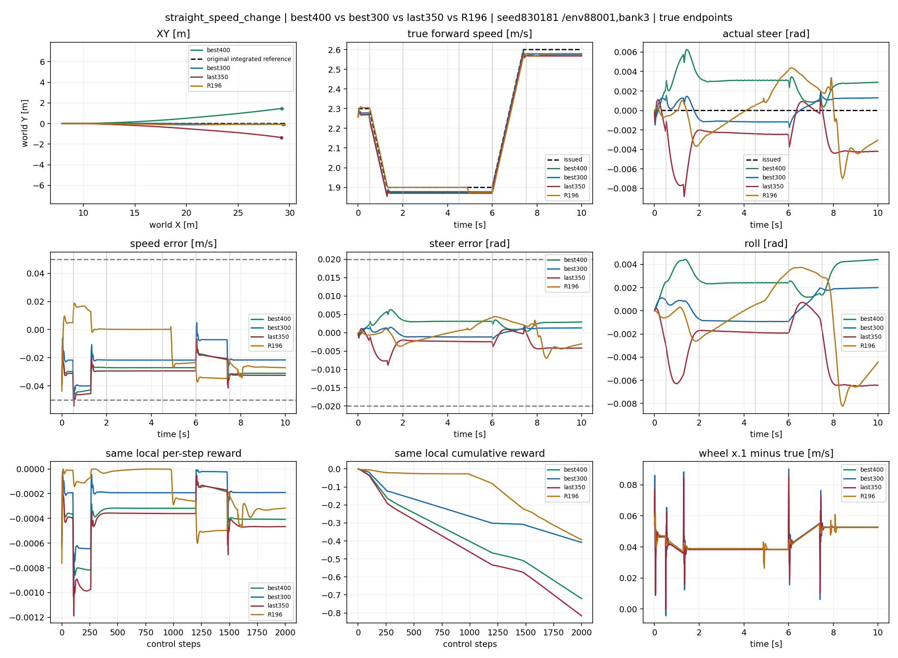
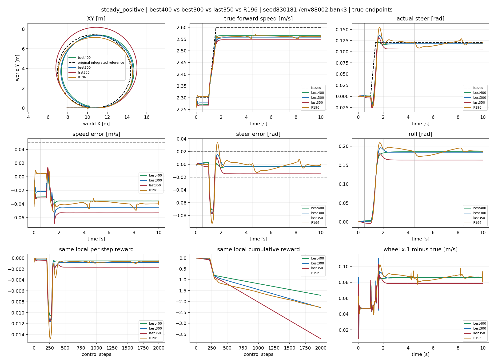
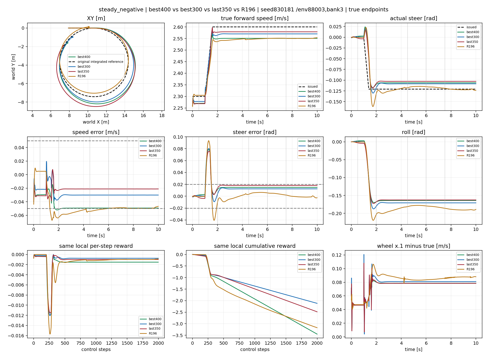
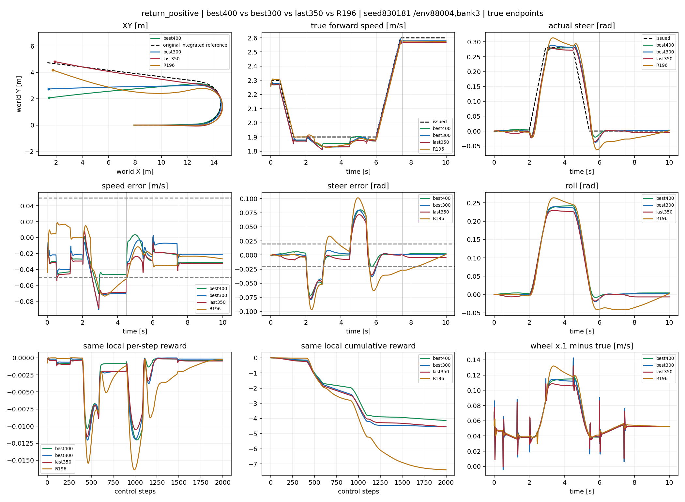
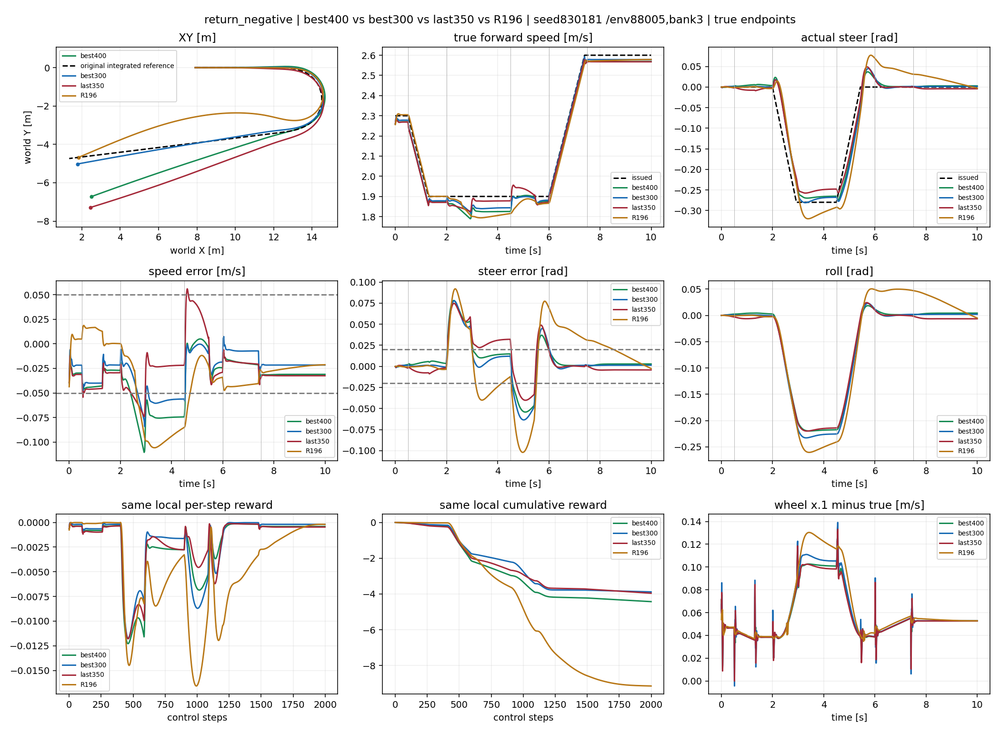
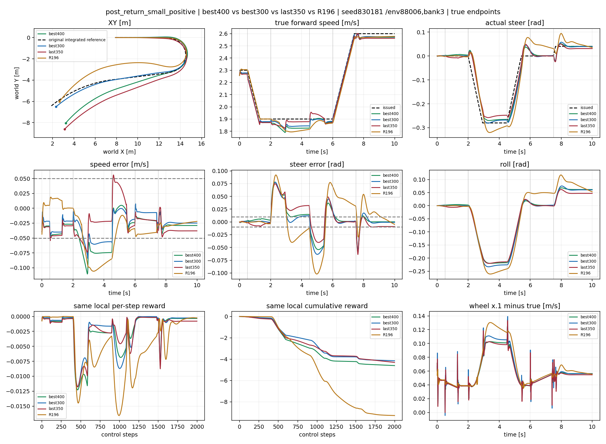
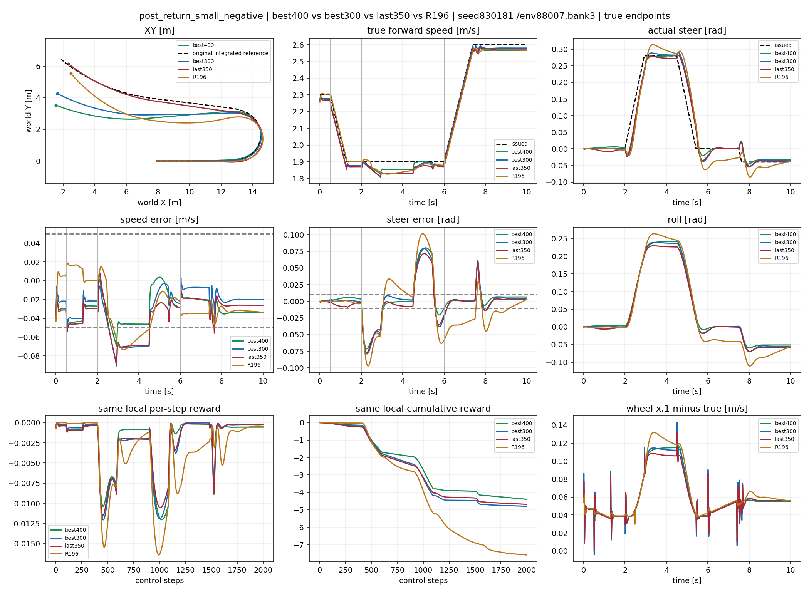

# 400 final — best400 / best300 / last350 / frozen R196

All seven cases,10s,200Hz,bank3,env88001–88007; identical issued reference. best400 and best300 selection traces used here; current final reload separately audited. last350 is a distinct unqualified candidate. No alpha or path objective in new lower.

## straight_speed_change

## steady_positive

## steady_negative

## return_positive

## return_negative

## post_return_small_positive

## post_return_small_negative

[Training reward/loss/KL and fixed validation](training_0400.png)

[最终400结果、持续超差和原始任务误差](RESULTS_0400.md)

[最终重载best400完整奖励/速度图集](final_best/INDEX.md)
