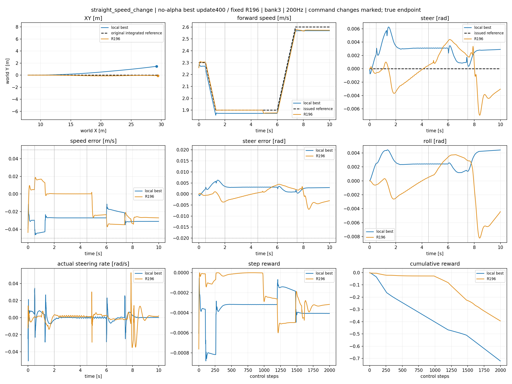
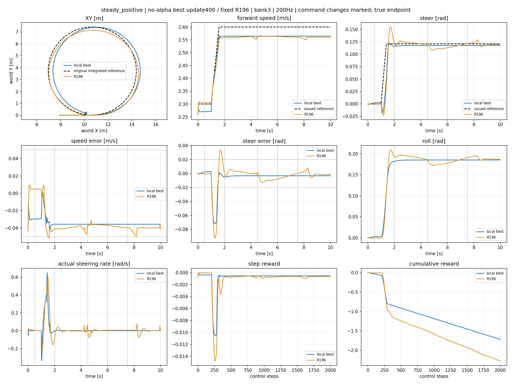
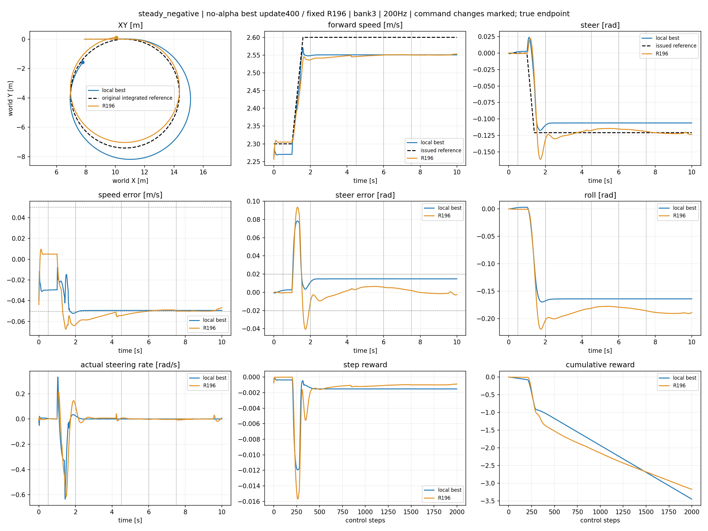
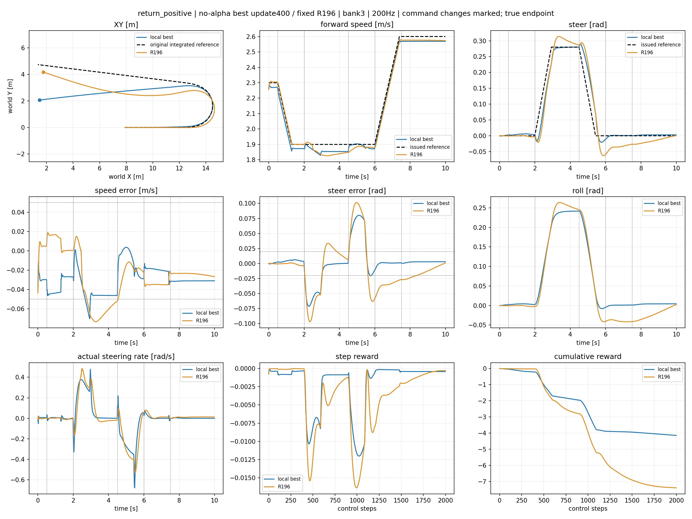
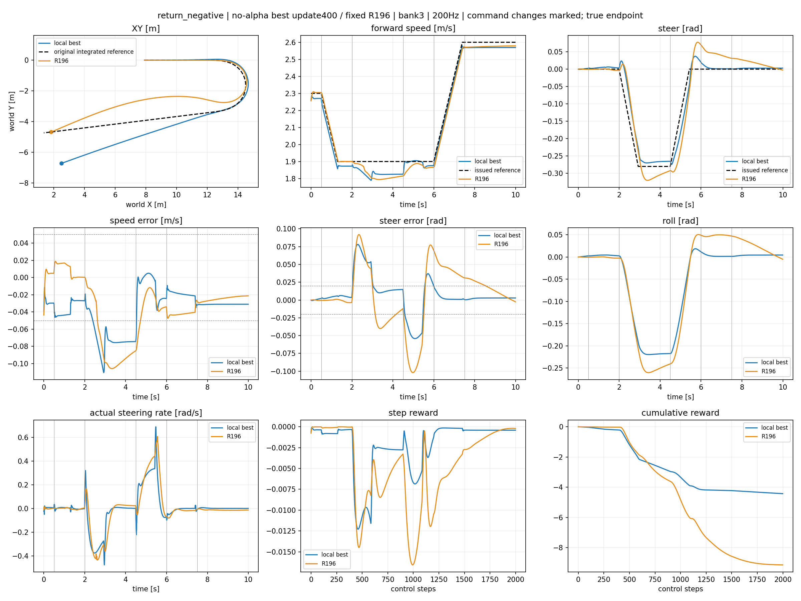
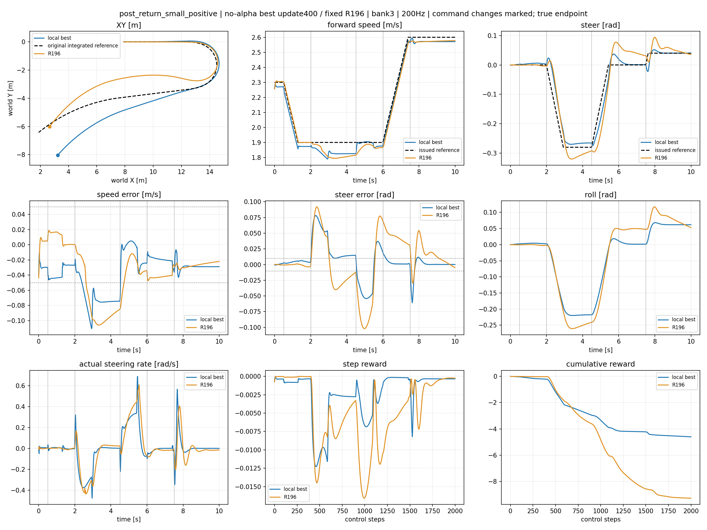
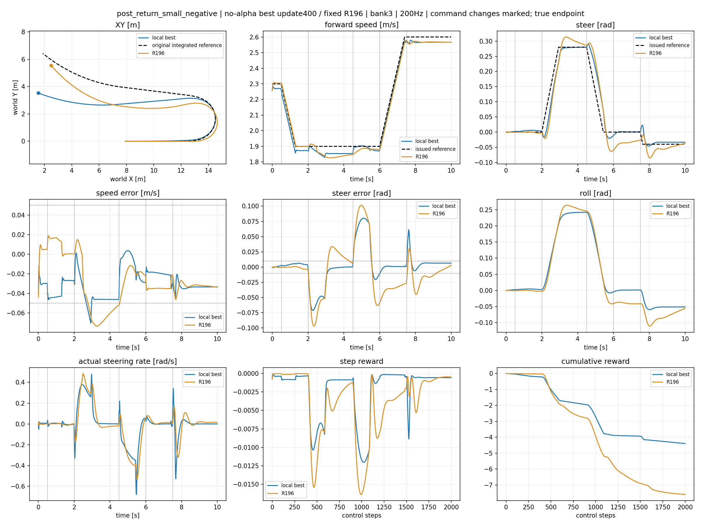

# Local no-alpha lower — fixed best review

Checkpoint update400; SHA 452e3a6f93047f91e16d332c2e67084b6018cdb4e133530e0bd9046147f68ca5. Local qualification=True; parent-state gate remains separate.

XY first, then exact issued/actual tracking, step reward and cumulative reward. R196 receives the identical published reference.

## straight_speed_change

## steady_positive

## steady_negative

## return_positive

## return_negative

## post_return_small_positive

## post_return_small_negative

|case|physical fail|working fail|tracking fail|final hold fail|peak roll|steady RMSE v/delta|small RMSE v/delta|
|---|---|---|---|---|---|---|---|
|straight_speed_change|False|False|False|False|0.004446744918823242|[0.028496796265244484, 0.0030110436491668224]|None|
|steady_positive|False|False|False|False|0.18533742427825928|[0.03565302863717079, 0.0033201107289642096]|None|
|steady_negative|False|False|False|False|0.1699002981185913|[0.049346186220645905, 0.014761467464268208]|None|
|return_positive|False|False|False|False|0.24182343482971191|[0.03621973097324371, 0.0030175375286489725]|None|
|return_negative|False|False|False|False|0.21988093852996826|[0.04888381063938141, 0.008487604558467865]|None|
|post_return_small_positive|False|False|False|False|0.2198808193206787|[0.04912745580077171, 0.008559830486774445]|[0.028795091435313225, 0.0013053102884441614]|
|post_return_small_negative|False|False|False|False|0.24182486534118652|[0.03785910829901695, 0.005203902721405029]|[0.033649131655693054, 0.006216003093868494]|

## Supplementary training, reward components and velocity estimation

[Stage400 training reward/loss/KL and completed-episode errors](training_0400.png)

- straight_speed_change: [per-step and cumulative signed reward parts](straight_speed_change_reward_parts.png); [request/true/wheel-proxy velocity](straight_speed_change_speed_proxy.png)
- steady_positive: [per-step and cumulative signed reward parts](steady_positive_reward_parts.png); [request/true/wheel-proxy velocity](steady_positive_speed_proxy.png)
- steady_negative: [per-step and cumulative signed reward parts](steady_negative_reward_parts.png); [request/true/wheel-proxy velocity](steady_negative_speed_proxy.png)
- return_positive: [per-step and cumulative signed reward parts](return_positive_reward_parts.png); [request/true/wheel-proxy velocity](return_positive_speed_proxy.png)
- return_negative: [per-step and cumulative signed reward parts](return_negative_reward_parts.png); [request/true/wheel-proxy velocity](return_negative_speed_proxy.png)
- post_return_small_positive: [per-step and cumulative signed reward parts](post_return_small_positive_reward_parts.png); [request/true/wheel-proxy velocity](post_return_small_positive_speed_proxy.png)
- post_return_small_negative: [per-step and cumulative signed reward parts](post_return_small_negative_reward_parts.png); [request/true/wheel-proxy velocity](post_return_small_negative_speed_proxy.png)
