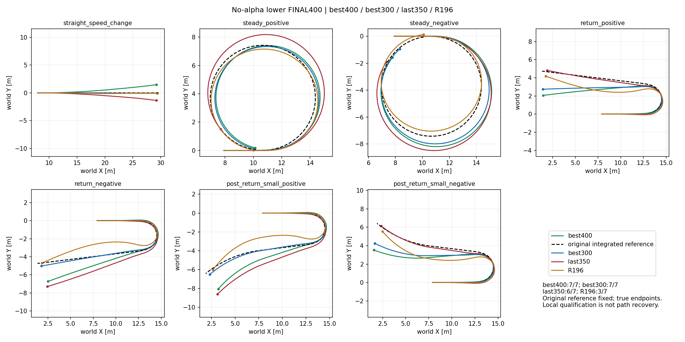

# 无alpha局部底层：200–400更新及旧状态恢复结果汇总

本页汇总同一次从零初始化、完整状态续训的四个阶段及一次旧完整状态恢复比较。固定lower repair基准4e956f0、upper V5.2基准2eeef42；R196对照lower_alpha固定1，新底层无alpha。正式512环境×256步，共400接受更新、52,428,800控制转移，预算已结束。代码、配置和逐轮日志随本实验分支发布；没有新增训练、仿真、模型安装或上层训练。

|阶段|局部合格场景/7|固定验证质量Q（越低越好）|分析与完整图集|
|---|---|---|---|
|200|2/7|2.846016|[200分析](../local_lower_noalpha_v2_0200/RESULTS_0200.md)；[逐场景图](../local_lower_noalpha_v2_0200/INDEX.md)|
|300|7/7|1.739090|[300分析](../local_lower_noalpha_v2_0300/RESULTS_0300.md)；[逐场景图](../local_lower_noalpha_v2_0300/INDEX.md)|
|350|6/7|1.734559|[350退步分析与XY](../local_lower_noalpha_v2_0350/RESULTS_0350.md)；[逐场景图](../local_lower_noalpha_v2_0350/INDEX.md)|
|400|7/7|1.728900|[最终400分析](../local_lower_noalpha_v2_0400/RESULTS_0400.md)；[逐场景图](../local_lower_noalpha_v2_0400/INDEX.md)|
|固定R196|3/7|3.506210|各阶段同流配对基线|

最终重新加载的是物理best400，SHA `452e3a6f93047f91e16d332c2e67084b6018cdb4e133530e0bd9046147f68ca5`；重载Q=1.728908，仍7/7。[重载best400的XY、逐步奖励及分项、真实速度/轮速估计图](../local_lower_noalpha_v2_0400/final_best/INDEX.md)。best与last分别保留；随机训练奖励best336不是物理best。以上best仅在已评100/150/200/250/300/350/400候选间选择，不是每更新全程物理最优或独立holdout。

## 证据支持的改善与保留的负结果

200负向稳态转角持续超差7.835秒，在300及400消除；350正向稳态速度持续超差8.48秒，在400消除。小转角按0.01rad验收，400两个小角平台均通过。七场景合格使用声明的平稳段RMSE及最后0.5秒联合保持规则，不表示全程每步都在容差内；400部分前置转弯仍有约2.135秒速度超差。

局部合格并未解决原始航向和路径。400直行终点横向偏差约+1.464m、航向误差−0.128rad，明显差于300的−0.077m/−0.00672rad。Q300→400仅改善约0.59%，不能据此宣称整体任务能力更强。全部七场景原始参考终点误差、持续超差区间及反例见[400详细分析](../local_lower_noalpha_v2_0400/RESULTS_0400.md)。参考保持原始指令积分，不按实际轨迹重定位。

## 旧完整状态恢复：仅best300已验证

[完整恢复协议、逐时跟踪和结果](../local_lower_parent_recovery_20261010/INDEX.md)：同一原B0失配完整状态、真实因果十帧历史、相同plant/ESO/执行器状态，best300与R196各继续2秒；best300在0.445秒进入局部联合容差并保持，R196两秒内未进入。单个状态的证据不能推广为普遍恢复能力，也不能转记给不同checkpoint的best400。

300通过、350失败、400通过，没有达到连续两次后期合格。best400旧状态恢复及两个冻结upper best的新旧组合均未执行；没有自动注册、安装、修改上层reward、合并、蒸馏或上层训练。现有upper best0新增200/best1新增250保持冻结。组合任务是否合格、上层是否需要适应仍未验证。

## 可复核数据和来源

[数据清单及原文件SHA256](data_manifest.json)列出复制的原始评估NPZ，包含真实XY、固定参考、指令与实际跟踪及其他原始记录；文件逐字节保留，没有修改源运行。覆盖200最终重载、300选择及重载、350候选、400选择及最终重载、固定R196和best300旧状态恢复。350阶段重新加载的best仍来自300；图中对应300来源另行保留，不能称为best350。

[400个更新完整标量日志](metrics.jsonl)和[固定验证指标日志](validation_metrics.json)供复核训练与选择范围；[固定训练配置](../../../learning/configs/lower_local_tracking_no_alpha_v2.json)供复核方法。checkpoint、Actor权重、完整状态pickle、缓存及TensorBoard原日志继续留在本地不可变运行目录，不作为本次Git结果附件。历史阶段文档中的本地run路径是来源记录；远端查看图和数据请从本页及各阶段docs/evidence入口进入。

发布只扩大结果可访问性，不改变训练状态、验收标准或采用状态。
