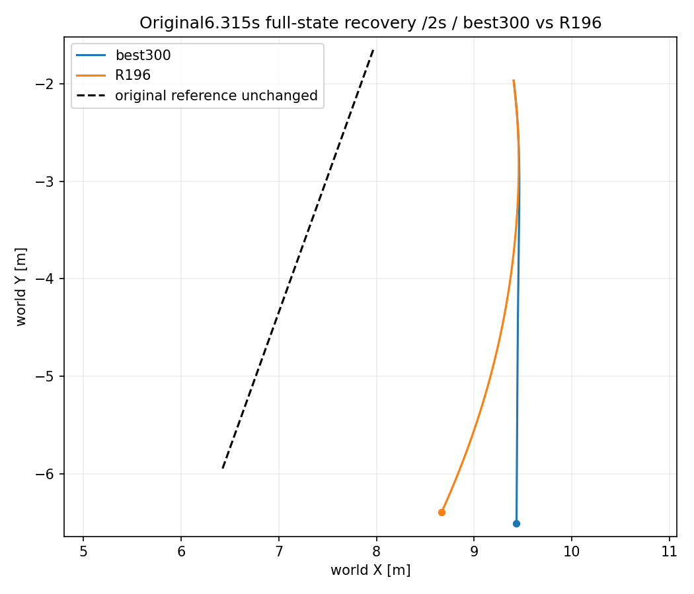
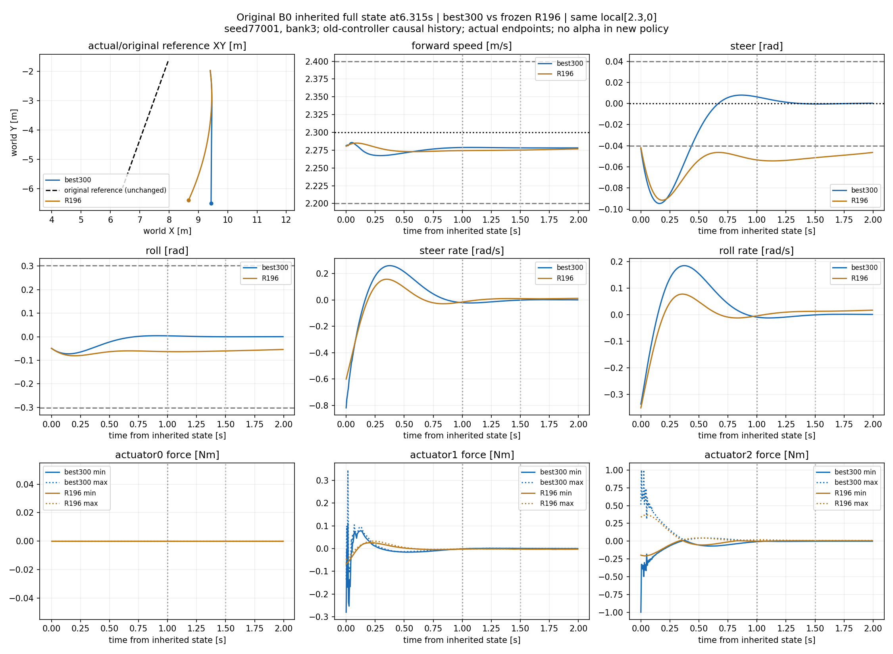

# 原 B0 完整状态恢复比较：best300与R196

best300通过原6.315秒状态的2秒局部恢复门槛。与R196从全部相同plant/ESO/actuator/reference状态开始，固定请求[2.3,0]。新十帧局部历史由真实前序old-controller状态/命令/执行动作构造，R196原310历史/return保留，没有reset物理或用日志拼闭环快照。

原快照没有6.315秒中间状态，因此只从原initial_full_state.pkl单次重放1263步取状态；与原B0前1263步的XY/转角/真实速度/侧倾/governed逐值一致。完整状态、因果历史和新旧最终状态均保存。新增1263+400+400=2063控制转移，训练0；没有重复12秒诊断。

|指标|best300|R196|
|---|---|---|
|2秒恢复门槛|通过|未通过|
|联合误差带进入时间|.445秒|2秒内未进入|
|后续保持|保持至2秒，不重新离带|全2秒转角超差|
|速度RMSE m/s|.023982|.024332|
|转角RMSE rad|.036734|.058006|
|峰值侧倾 rad|.072501|.080807|
|新增工作界超限／物理失败|0／0|0／0|
|前轮force峰值 Nm|.345306|.067810|
|后轮force峰值 Nm|1.000000|.367957|
|后轮force触限子步|4/10000|0/10000|

验收带为|ev|≤.10m/s、|ed|≤.04rad，1秒内进入，连续保持≥.5秒且后续不离带，原初态在工作界内时不新增>.302rad。日志time是输入/预步时间，actual在time+.005；因此首合格记录time=.440的真实进入时间=.445秒。区间图保留原预步标签。新策略初期短暂反打和force触限不隐去，前轮未触force限制；限幅不称稳定性保证。

本结果证明声明的单个旧失配状态局部执行恢复；不代表原始世界航向／路径恢复，XY仍与原始参考有偏差。不把旧父V5.1状态冒充V5.2两端best的同一状态，也不宣称组合已合格。new仍not_adopted，upper组合not_run。

下一阶段补足连续两次后期验证合格：300首次合格，250未过。在总400上限内，恢复完整300边界先执行至350的50更新（6,553,600转移，累计45,875,200），用既定350固定验证判断；这是最后至多100更新块的首个停止检查点。350通过则与300形成连续合格并结束底层训练；未过再按证据决定剩余至400的50更新，不重新初始化。固定reward／采样／物理／权限不变，不改upper。按用户要求有桌面CMD及TensorBoard，启动核验后不持续轮询，结束用户叫回。

新增验收与直接相关既有v2测试9项通过；不重跑旧11项或全仓。原始NPZ与完整pickle在run目录，精简交付PNG+JSON。结果详情见results.json/shared_state_audit.json。
