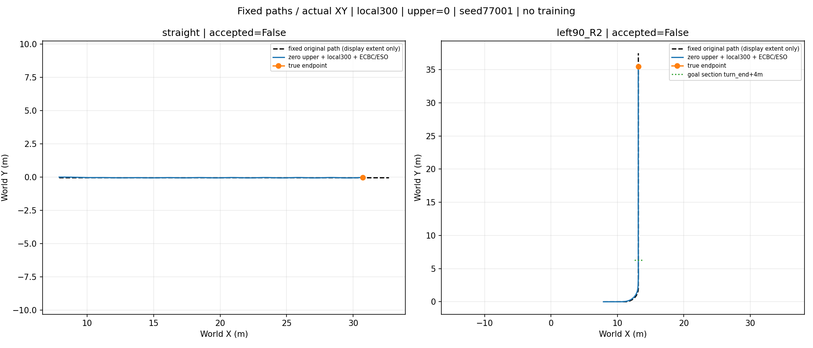

# Path Feedback V1：A/B 已执行，几何保持 0/2，C 未训练

**当前系统已有局部状态反馈；本次新增实际 XY/方向到固定名义路径的几何外环。缺少路径外环与指令振荡是两类问题；50/200Hz 未变不能证明无振荡。**

底层冻结local300＋ECBC/ESO，上层修正恒零；不是纯ECBC基线。seed77001，原完整准备bank index3；straight10s、left90_R2 20s，共6000/6000底层步，训练0。基准ab195e7；无重跑旧四条、旧七场景或ESO/mask大检查，无换400、重训、best变更、自动push或DVGC/JIT操作。

## 阶段B：完整窗口验收

|工况|步数|横向RMSE m|峰值侧倾 rad|穿越目标截面|末1s航向超限|末1s最大航向误差 rad|结果|
|---|---:|---:|---:|---|---:|---:|---|
|straight|2000|0.014395|0.051983|不适用|92/200|0.063810|未通过|
|left90_R2|4000|0.032809|0.190124|5.270s|112/200|0.073436|未通过|

两条均无物理失败/非有限故障/PP适用域退出；全程横向RMSE≤.10m、峰值侧倾≤.302rad。最后1秒速度与横向均200/200步合格，但航向门槛|e_heading|≤.05rad不满足。弯道穿过turn_end+4m（s=10.641593m）只说明通过目标截面，不等于出口保持完成。末帧航向误差虽然合格，也不能覆盖末1秒超限。

初始/过渡与全程结果全部保留。直线路径相对初态右移.05m一次，实际初态未改；车辆初始左侧误差+.05m。弯道固定3m前缀＋.5m曲率过渡＋平台＋.5m过渡＋70m出口，累计90°。路径仅reset锚定，图中只限制显示范围，不移动参考、不平移评分。位姿继续沿用RecoveryEnv.pose的qpos[0:2]与车架xmat航向原点。

|工况|lower速度RMSE m/s|lower转角RMSE rad|最后4s governed转角p-p rad|actual转角p-p rad|Welch峰 Hz|
|---|---:|---:|---:|---:|---:|
|straight|0.019394|0.041072|0.074821|0.142215|0.78125|
|left90_R2|0.021621|0.061470|0.100535|0.178683|0.78125|

**失败定位边界：** 左右纠偏符号、投影连续性和前方预瞄检查通过；两条后段存在持续的参考—转向—航向摆动，实际转角振幅大于governed，lower转角误差不能忽略。最后4秒50Hz/Hann128点Welch峰落在.78125Hz频格（分辨率.390625Hz），只作为低频闭环动态的描述，不能称精确固有频率。此次零上层，因此这不是旧Actor的20ms交替输出；更不能据此把所有原因归给底层。未做因果消融或参数扫描，路径参考/转向动态耦合是下一步待定位对象。

**本轮不为通过而调参、不缩小弯角、不放宽门槛。** Pure Pursuit速度目标仍为外部2.3/2.0m/s，只有名义slew，无曲率减速。上层修正、滤波与offset均逐步为零。路径沿空间进度实时生成转角；20秒窗口没有用墙钟决定走完弯道。

### 全部图与原始数据

- [直线完整XY/指令/误差/侧倾/执行器](straight_overview.png) · [每步/累计奖励与轮速代理](straight_reward_speed.png) · [轨迹](data/straight.npz) · [固定路径](data/straight_path.npz)
- [90°弯完整XY/指令/误差/侧倾/执行器](left90_R2_overview.png) · [每步/累计奖励与轮速代理](left90_R2_reward_speed.png) · [轨迹](data/left90_R2.npz) · [固定路径](data/left90_R2_path.npz)
- [完整验收/分窗口/限幅/频谱指标](stage_B_metrics.json) · [末段诊断](endpoint_diagnosis.json)

奖励图为新几何奖励alpha0、零上层诊断，不能与旧teleop回报比较，也不是alpha策略评价。独立NumPy重建普通奖励误差见JSON（量级1e-9），scored_tick_reward已核对；本轮无物理失败罚。横向检查仅从已记录投影重建误差恒等式，不冒称独立重做全部投影；投影数学行为由专门测试核验。

## 阶段A：复用旧四条及匹配R196数据

[全部统一50Hz数据、窗口表、请求/governed/actual频谱、ECBC/残差/限幅图](stage_A/INDEX.md) · [旧四条原始XY](../select300_integration_20261010/FOUR_CONTROL_TRAJECTORIES.png)

相同6–10s外部名义稳态窗口，local300组合governed转角反转33.5/34.0/33.5/33.75次每秒（直行alpha0/1、fast alpha0/1），旧R196为6.5/7.5/3/0。直行10–25Hz能量占比84.67%/84.35%，旧0.0344%/0.0374%；实际转角占比6.59%/4.88%，必须区别指令和物理响应。反转是事件数，不当作Hz。完整请求、保护后offset、ECBC/下层残差和实际转角导数均在JSON。

直行末.5s速度恒等式重核：alpha0 task+.070624=upper+.071312+lower−.000687；alpha1 task+.082493=upper+.062244+lower+.020249m/s。DC补偿不是低通能消除的问题。旧四条没有持续.5s干净governed平台，复用已完成审计，不因此宣称局部跟踪器普遍失效。限幅按通道原数组计数；只记录any的参考限幅不拆造通道比例。

## 实现、身份与未执行项

- [实际消费配置/模型/初态SHA及运行源码SHA](manifest.json) · [6000步完成与保护检查](status.json) · [附件数学复算](attachment_math_checks.json) · [审查](REVIEW.md)
- 新独立geometric_path模式：固定路线、连续局部投影、Pure Pursuit真弦长、50Hz目标/200Hz名义slew，既有physics/local210 adapter复用。XML、物理.0002×25、lower.005、upper/path.02断言通过。
- 新351/352 schema/Actor/Critic、共享修正通道滤波与几何奖励已准备；旧teleop/345Actor/时间航向评估源码未改。[阶段C准备及训练集成缺口](../../path_feedback_phase_C.md)。C=not_run：随机路径训练采样/PPO生命周期/正式best接口未接线，不能拿本JSON直接启动旧trainer。
- 9项必要新数学/接口/频谱/非有限防护测试通过；附件数学检查通过，非全仓回归。运行后修复了非有限lower action保护，有限轨迹逐步确认全有限，因此本轮结果不受该分支变化影响，未重跑物理。精确执行源码已按manifest逐文件SHA核对保存在runs/path_feedback_v1_20261010/executed_source；[执行后防护差异](post_execution_guard.patch)。
- 无阶段C训练、无新模型采用或安装。用户本轮进一步明确：尽快验证主线，不追求底层或零上层基线完美。两条未达最终航向保持的事实保留，但不再将基线全部合格设为主线上层偏好验证的硬前置。下一步优先补齐阶段C最小训练接口，再以预声明有界预算比较冻结300上alpha0/1相对零上层的速度/路径收益与代价；不为基线反复调参，不自动开训或改写现有门槛。
