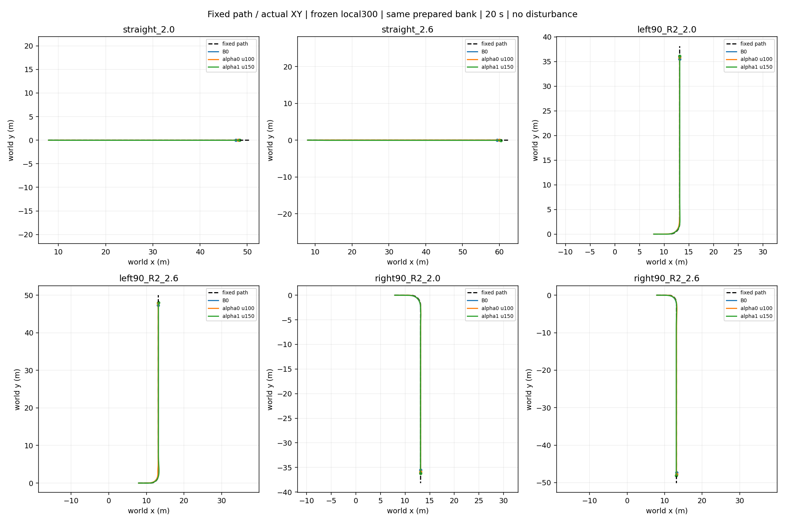
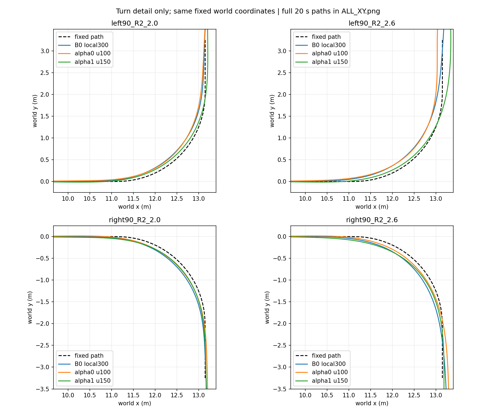
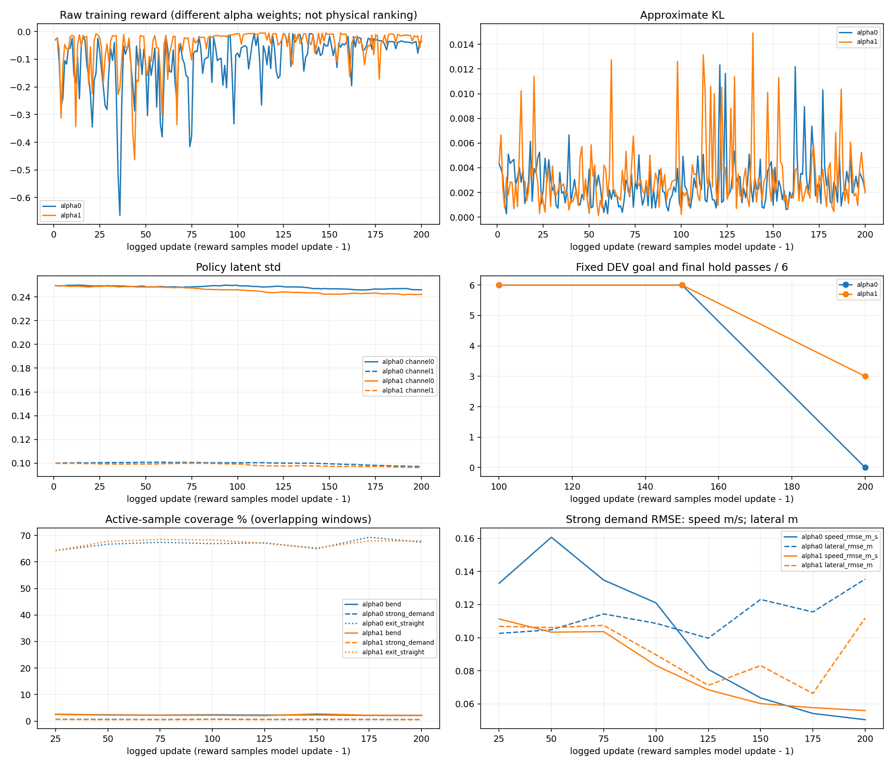

# 几何路径主线：200轮与奖励峰值补评结果（2026-10-11）

[逐场景XY、名义/修正/governed/actual/lower误差、逐步与累计奖励](paired/INDEX.md)

两端各200/200且各200次accepted，训练与全部报告已完成。峰值补评新增3个候选×6场景=18回合、72000个底层步；alpha1/150已有评价复用，零新增训练。最终仍选alpha0/100与alpha1/150，原best指针未改。**两端都学到了出口保持，但尚未达到共同工作侧倾限制，也没有建立稳定的预期alpha取舍。**

## 选择范围与身份

每10轮保存不等于逐轮参评。原固定候选100/150/200，加本次训练奖励峰值邻近保存点：alpha0候选总集100/120/130/150/200；alpha1为100/150/160/200。这是同一六场景DEV上的扩展选择，不是全程逐轮best，也不是独立泛化检验。原始奖励记录125/156分别归属更新124/155后的采样模型，未保存这两份精确权重，故评120/130及150/160。

| alpha | 候选 | 工作侧倾失败/6 | 主目标超带/6 | 目标或保持失败/6 | 主误差质量 | 来源 |
|---|---:|---:|---:|---:|---:|---|
| 0 | 100 | 2 | 2 | 0 | 1.5755 | 固定DEV |
| 0 | 120 | 2 | 2 | 0 | 1.7311 | 峰值补评 |
| 0 | 130 | 2 | 3 | 0 | 1.5224 | 峰值补评 |
| 0 | 150 | 2 | 4 | 0 | 1.4160 | 固定DEV |
| 0 | 200 | 2 | 4 | 6 | 1.9688 | 固定DEV |
| 1 | 100 | 2 | 1 | 0 | 1.1261 | 固定DEV |
| 1 | 150 | 2 | 0 | 0 | 0.7024 | 峰值补评（复用） |
| 1 | 160 | 2 | 0 | 0 | 0.7992 | 峰值补评 |
| 1 | 200 | 2 | 1 | 3 | 1.0150 | 固定DEV |

所有上述候选的六场景均无物理或PP域失败，但不能据此称安全合格。alpha0/130主误差1.5224小于100的1.5755，却有3个主目标超带场景，100只有2个，故不能越过任务排序选130。完整来源、SHA与分场景分数见[selection.json](selection.json)及[身份记录](paired/identities.json)。

## 两个alpha各保住什么、牺牲什么

下表为固定路径**空间弯道段**RMSE，非不同到达时刻的强行对齐；单位速度m/s、路径m。

| 弯道 | B0速度 / 路径 | alpha0速度 / 路径 | alpha1速度 / 路径 | 判断 |
|---|---|---|---|---|
| left90_R2_2.0 | 0.04335 / 0.10273 | 0.03625 / 0.10825 | 0.01460 / 0.05263 | alpha1速度与路径均优于alpha0，未体现alpha0路径优势 |
| left90_R2_2.6 | 0.07210 / 0.14447 | 0.06637 / 0.15181 | 0.02891 / 0.05403 | alpha1两项均更优，alpha0减速没有换来更小路径误差 |
| right90_R2_2.0 | 0.03418 / 0.09359 | 0.01934 / 0.06793 | 0.02484 / 0.07071 | alpha0两项略优，未形成预期取舍 |
| right90_R2_2.6 | 0.05986 / 0.12131 | 0.03484 / 0.06882 | 0.03343 / 0.10729 | 方向符合预期，但速度代价仅0.00141m/s，差异很小 |

直线中alpha0速度/路径两项均优于alpha1，但两端全程横向RMSE均大于B0；它们仍把B0未满足的最终保持修正为满足。因此不能用全程RMSE单独否定保持改善，也不能把保持成功说成全过程误差全面改善。高速左弯alpha0实际均速2.5413、alpha1为2.5821m/s；相对各自入弯前分别下降0.0589/0.0375m/s。高速右弯均速2.5752/2.5809，相对入弯前下降0.0302/0.0388m/s：没有一致的alpha0更主动减速机制证据。

## 共同安全与出口保持

两端均到达目标并在真实20秒窗口末满足连续1秒保持：|速度误差|≤0.1m/s、|横向误差|≤0.1m、|路径航向误差|≤0.05rad。固定路径没有平移，B0六场景都到达目标但均未通过保持。两端各4/6场景满足共同工作侧倾限制；高速左右弯各失败一次，故均非整体合格。工作侧倾阈值0.302rad（17.30°），不等同物理摔倒阈值。

| 高速弯 | B0峰值rad / 超限秒 | alpha0峰值rad / 超限秒 | alpha1峰值rad / 超限秒 |
|---|---|---|---|
| left90_R2_2.6 | 0.32751 / 0.510 | 0.35678 / 0.615 | 0.32373 / 0.460 |
| right90_R2_2.6 | 0.32493 / 0.470 | 0.32824 / 0.500 | 0.35443 / 0.565 |

## 下层是否阻断任务

现有证据不支持把失败直接归咎于冻结local300，也不能证明下层在全部工况没有限制。保留best的全程actual−governed速度RMSE为0.0212–0.0292m/s，转角RMSE为0.00182–0.02134rad；12个策略场景都能完成最终保持。B0也能走完路径而不发生域失败。上层修正会改变PP后续名义转角，两端名义流不同是闭环的正常结果，不能据此否定配对。

下层误差非零、转向瞬态和高速侧倾仍需保留；没有同任务的理想跟踪器反事实或其他隔离实验，不能给出“下层造成”或“下层完全不影响”的因果结论。本轮不重训下层、不换400。

## 后期趋势与下一步

| alpha | 更新窗口结束 | 弯道样本% | 强需求样本% | 出口直线样本% | 强需求速度RMSE | 强需求横向RMSE |
|---|---:|---:|---:|---:|---:|---:|
| 0 | 150 | 2.386 | 0.600 | 64.958 | 0.06362 | 0.12309 |
| 0 | 175 | 2.164 | 0.632 | 69.272 | 0.05423 | 0.11551 |
| 0 | 200 | 2.166 | 0.604 | 67.396 | 0.05047 | 0.13537 |
| 1 | 150 | 2.755 | 0.734 | 65.248 | 0.06020 | 0.08312 |
| 1 | 175 | 2.232 | 0.662 | 67.927 | 0.05773 | 0.06630 |
| 1 | 200 | 2.166 | 0.597 | 67.834 | 0.05598 | 0.11181 |

统计为每25更新的有效底层样本；窗口相互重叠，比例不能相加。alpha0强需求横向RMSE从175的0.1155恶化至200的0.1354m；alpha1速度误差略改善，但横向0.0663→0.1118m。固定DEV到200轮又丢失出口保持（alpha0六场景、alpha1三场景）。这不足以支持“仍稳定改善，直接加100轮”。

**下一步只定位一个主要问题：弯道/强需求的有效训练样本被长出口直线稀释。** 场景家族抽样接近声明比例，并不保证真正转弯时刻的采样占比；末期强需求只有约0.6%，出口直线约67%。这是可测量的分布事实；它是否导致偏好未学成仍是待检验假设。先明确有效样本覆盖的修正方案和短预算，再申请下一阶段，不自动续训、不补新路径、不改奖励系数或底层。

末期还观察到偏负转角修正：alpha0约98.6%、alpha1约93.7%的执行修正为负，尽管左右初始弯向接近均衡。这是伴随现象，不另立第二套原因或借此调参。分项触顶并未普遍淹没信号：末期path项触顶alpha0约0.050%、alpha1约0.187%，其他记录项为0；修正slew触发约48.0%/65.8%，幅值clip为0。保留而不放宽这些限制。

[完整训练窗口、分项成本、KL/std、失败及采样耗时](training_summary.json)；[原始两端训练日志与窗口记录](training/)；[完成状态](completion.json)；[必要SHA/逐步奖励重建核验](verification.json)。

alpha0：训练物理失败0、域失败415（均保留在原始奖励/回合统计）；完整回合13041；最终std=[0.2460441103736937, 0.09701357722940568]；KL范围0.000270755–0.0123402。训练分布统计不是精确固定六场景成功率。

alpha1：训练物理失败0、域失败215（均保留在原始奖励/回合统计）；完整回合12914；最终std=[0.2421096287475512, 0.09635833436317165]；KL范围0.000139131–0.0149261。训练分布统计不是精确固定六场景成功率。

## 图和原始数据覆盖

主配对18条物理轨迹（B0+alpha0+alpha1，各六场景）及固定路径原NPZ位于[data](data/)。三份新候选的18条轨迹位于[candidate_data](candidate_data/)；alpha1/150直接复用data/alpha1，避免重复。不同训练种子用于两独立端点，但固定评价使用同一prepared bank，不把场景或时刻当独立训练种子。每端只有一个训练种子，alpha与训练随机性的影响未隔离，不能把所有行为差异完全归因于alpha。无额外扰动，本次分析新增仿真0。

| 场景 | 两端best详细对照 | alpha0全部补评候选 | alpha1全部补评候选 |
|---|---|---|---|
| straight_2.0 | [XY](paired/straight_2.0_XY.png) / [指令误差奖励](paired/straight_2.0.png) / [分项](paired/straight_2.0_reward_components.png) | [XY/逐步累计奖励](candidate_plots/alpha0/straight_2.0.png) | [XY/逐步累计奖励](candidate_plots/alpha1/straight_2.0.png) |
| straight_2.6 | [XY](paired/straight_2.6_XY.png) / [指令误差奖励](paired/straight_2.6.png) / [分项](paired/straight_2.6_reward_components.png) | [XY/逐步累计奖励](candidate_plots/alpha0/straight_2.6.png) | [XY/逐步累计奖励](candidate_plots/alpha1/straight_2.6.png) |
| left90_R2_2.0 | [XY](paired/left90_R2_2.0_XY.png) / [指令误差奖励](paired/left90_R2_2.0.png) / [分项](paired/left90_R2_2.0_reward_components.png) | [XY/逐步累计奖励](candidate_plots/alpha0/left90_R2_2.0.png) | [XY/逐步累计奖励](candidate_plots/alpha1/left90_R2_2.0.png) |
| left90_R2_2.6 | [XY](paired/left90_R2_2.6_XY.png) / [指令误差奖励](paired/left90_R2_2.6.png) / [分项](paired/left90_R2_2.6_reward_components.png) | [XY/逐步累计奖励](candidate_plots/alpha0/left90_R2_2.6.png) | [XY/逐步累计奖励](candidate_plots/alpha1/left90_R2_2.6.png) |
| right90_R2_2.0 | [XY](paired/right90_R2_2.0_XY.png) / [指令误差奖励](paired/right90_R2_2.0.png) / [分项](paired/right90_R2_2.0_reward_components.png) | [XY/逐步累计奖励](candidate_plots/alpha0/right90_R2_2.0.png) | [XY/逐步累计奖励](candidate_plots/alpha1/right90_R2_2.0.png) |
| right90_R2_2.6 | [XY](paired/right90_R2_2.6_XY.png) / [指令误差奖励](paired/right90_R2_2.6.png) / [分项](paired/right90_R2_2.6_reward_components.png) | [XY/逐步累计奖励](candidate_plots/alpha0/right90_R2_2.6.png) | [XY/逐步累计奖励](candidate_plots/alpha1/right90_R2_2.6.png) |

执行源：主训练50fcf33，峰值补评79695b8；配置/物理/冻结300与prepared-bank来源见[source_manifest.json](source_manifest.json)。原始运行分别为`path_phase_C_200_terminal_v2_20261010`、`path_phase_C_200_optimized_20261010`及`path_reward_peak_review_20261011`。最后两个运行均completed/reported。旧中断目录保留；原旧teleop上层best、下层local300及原best指针保持。
