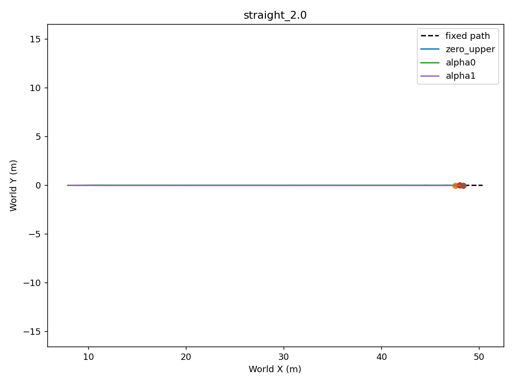
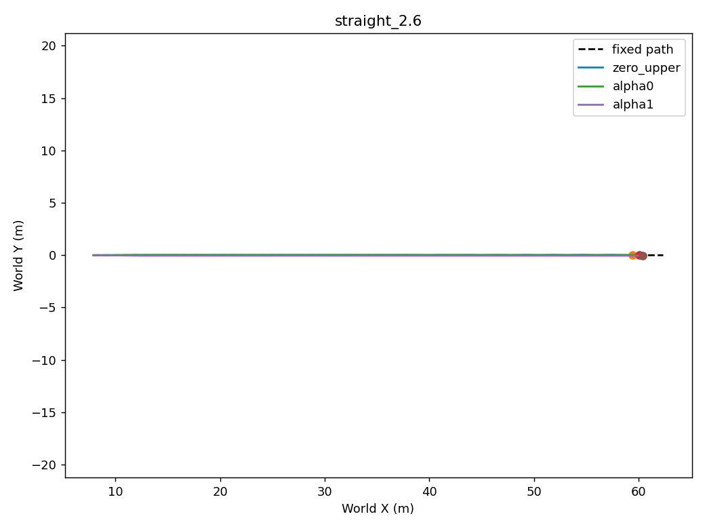
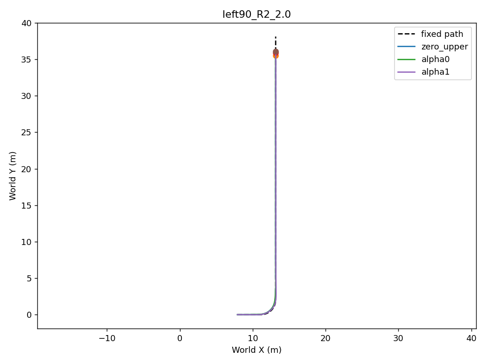
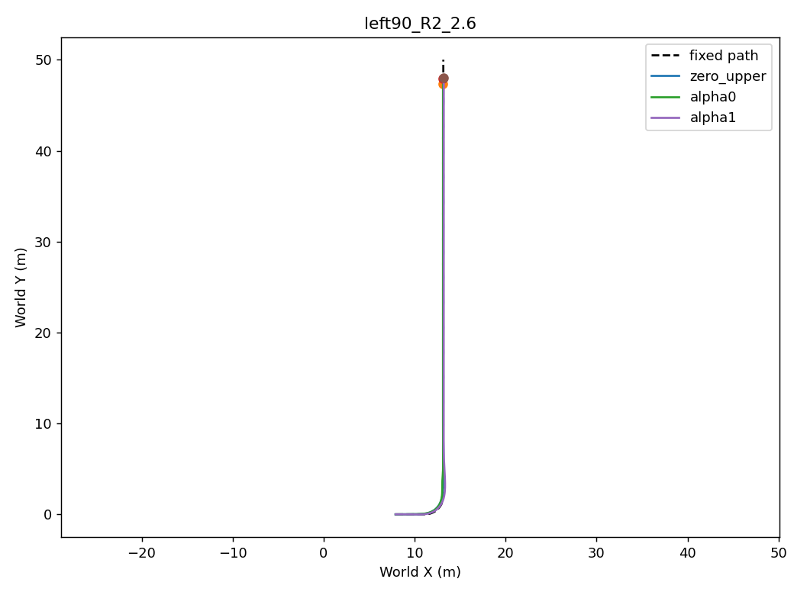
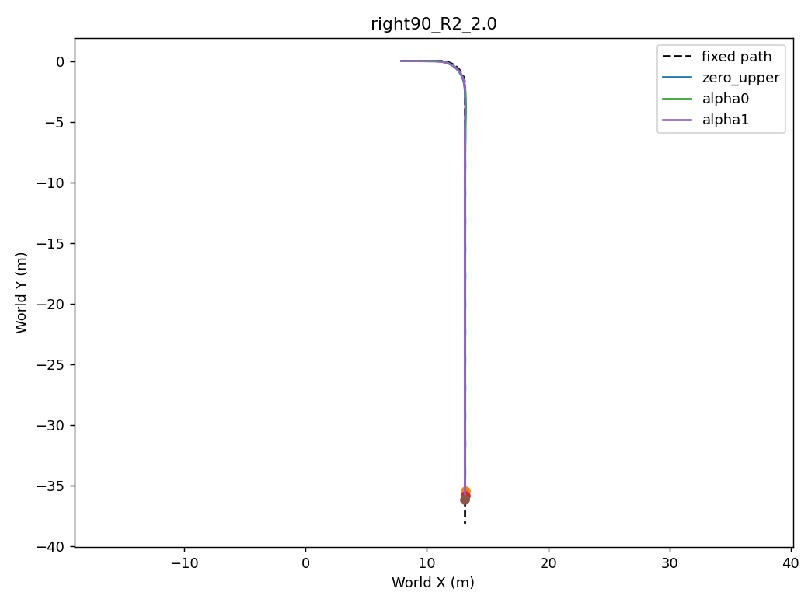
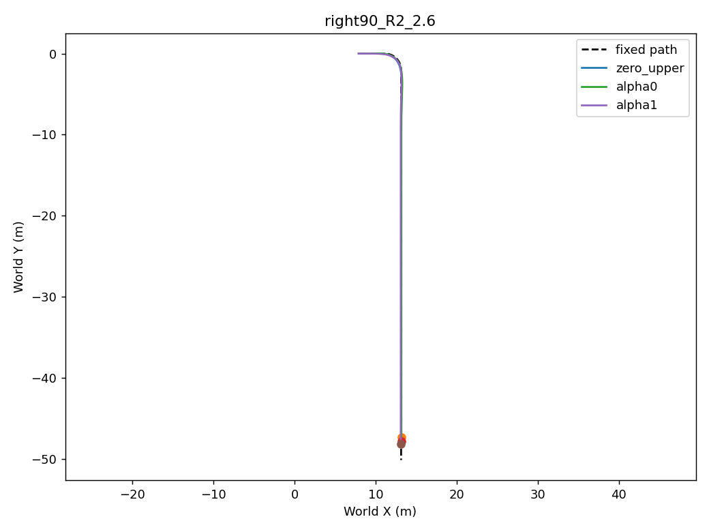

# Geometric upper fixed-path comparison

Same immutable path and prepared state; nominal PP reference may differ by actual pose. No post-hoc smoothing. Best is fixed-DEV ranking, not independent validation or proof of alpha preference.

## straight_2.0

[Full commands/errors/reward](straight_2.0.png)
[Signed and cumulative components](straight_2.0_reward_components.png)

| Method | Whole speed RMSE m/s | Whole path RMSE m | Turn speed RMSE m/s | Turn path RMSE m | Peak roll rad | Goal / hold | Physical / domain failure |
|---|---:|---:|---:|---:|---:|---|---|
| zero_upper | 0.03169 | 0.00362 | N/A | N/A | 0.03639 | True / False | False / False |
| alpha0 | 0.02650 | 0.01180 | N/A | N/A | 0.00739 | True / True | False / False |
| alpha1 | 0.03295 | 0.01548 | N/A | N/A | 0.00751 | True / True | False / False |

| Window | Dv m/s | Dy m | Direction supported | Discernible reference |
|---|---:|---:|---|---|
| whole | -0.00645 | 0.00367 | False | False |
| spatial_turn | N/A | N/A | N/A | N/A |
| strong_demand | N/A | N/A | N/A | N/A |
| exit | N/A | N/A | N/A | N/A |

## straight_2.6

[Full commands/errors/reward](straight_2.6.png)
[Signed and cumulative components](straight_2.6_reward_components.png)

| Method | Whole speed RMSE m/s | Whole path RMSE m | Turn speed RMSE m/s | Turn path RMSE m | Peak roll rad | Goal / hold | Physical / domain failure |
|---|---:|---:|---:|---:|---:|---|---|
| zero_upper | 0.03658 | 0.00910 | N/A | N/A | 0.07187 | True / False | False / False |
| alpha0 | 0.03023 | 0.03333 | N/A | N/A | 0.00804 | True / True | False / False |
| alpha1 | 0.03634 | 0.04594 | N/A | N/A | 0.01250 | True / True | False / False |

| Window | Dv m/s | Dy m | Direction supported | Discernible reference |
|---|---:|---:|---|---|
| whole | -0.00611 | 0.01261 | False | False |
| spatial_turn | N/A | N/A | N/A | N/A |
| strong_demand | N/A | N/A | N/A | N/A |
| exit | N/A | N/A | N/A | N/A |

## left90_R2_2.0

[Full commands/errors/reward](left90_R2_2.0.png)
[Signed and cumulative components](left90_R2_2.0_reward_components.png)

| Method | Whole speed RMSE m/s | Whole path RMSE m | Turn speed RMSE m/s | Turn path RMSE m | Peak roll rad | Goal / hold | Physical / domain failure |
|---|---:|---:|---:|---:|---:|---|---|
| zero_upper | 0.03169 | 0.03281 | 0.04335 | 0.10273 | 0.19012 | True / False | False / False |
| alpha0 | 0.02853 | 0.03487 | 0.03625 | 0.10825 | 0.21023 | True / True | False / False |
| alpha1 | 0.03269 | 0.02474 | 0.01460 | 0.05263 | 0.19831 | True / True | False / False |

| Window | Dv m/s | Dy m | Direction supported | Discernible reference |
|---|---:|---:|---|---|
| whole | -0.00416 | -0.01013 | False | False |
| spatial_turn | 0.02165 | -0.05562 | False | False |
| strong_demand | N/A | N/A | N/A | N/A |
| exit | -0.01407 | 0.00623 | False | False |

## left90_R2_2.6

[Full commands/errors/reward](left90_R2_2.6.png)
[Signed and cumulative components](left90_R2_2.6_reward_components.png)

| Method | Whole speed RMSE m/s | Whole path RMSE m | Turn speed RMSE m/s | Turn path RMSE m | Peak roll rad | Goal / hold | Physical / domain failure |
|---|---:|---:|---:|---:|---:|---|---|
| zero_upper | 0.04023 | 0.04171 | 0.07210 | 0.14447 | 0.32751 | True / False | False / False |
| alpha0 | 0.03469 | 0.05513 | 0.06637 | 0.15181 | 0.35678 | True / True | False / False |
| alpha1 | 0.03641 | 0.06039 | 0.02891 | 0.05403 | 0.32373 | True / True | False / False |

| Window | Dv m/s | Dy m | Direction supported | Discernible reference |
|---|---:|---:|---|---|
| whole | -0.00171 | 0.00526 | False | False |
| spatial_turn | 0.03746 | -0.09778 | False | False |
| strong_demand | 0.04204 | -0.11181 | False | False |
| exit | -0.01552 | 0.02163 | False | False |

## right90_R2_2.0

[Full commands/errors/reward](right90_R2_2.0.png)
[Signed and cumulative components](right90_R2_2.0_reward_components.png)

| Method | Whole speed RMSE m/s | Whole path RMSE m | Turn speed RMSE m/s | Turn path RMSE m | Peak roll rad | Goal / hold | Physical / domain failure |
|---|---:|---:|---:|---:|---:|---|---|
| zero_upper | 0.03084 | 0.03038 | 0.03418 | 0.09359 | 0.19403 | True / False | False / False |
| alpha0 | 0.02720 | 0.02632 | 0.01934 | 0.06793 | 0.19646 | True / True | False / False |
| alpha1 | 0.03348 | 0.02570 | 0.02484 | 0.07071 | 0.21406 | True / True | False / False |

| Window | Dv m/s | Dy m | Direction supported | Discernible reference |
|---|---:|---:|---|---|
| whole | -0.00628 | -0.00062 | False | False |
| spatial_turn | -0.00550 | 0.00278 | False | False |
| strong_demand | N/A | N/A | N/A | N/A |
| exit | -0.01371 | -0.00242 | False | False |

## right90_R2_2.6

[Full commands/errors/reward](right90_R2_2.6.png)
[Signed and cumulative components](right90_R2_2.6_reward_components.png)

| Method | Whole speed RMSE m/s | Whole path RMSE m | Turn speed RMSE m/s | Turn path RMSE m | Peak roll rad | Goal / hold | Physical / domain failure |
|---|---:|---:|---:|---:|---:|---|---|
| zero_upper | 0.03872 | 0.04004 | 0.05986 | 0.12131 | 0.32493 | True / False | False / False |
| alpha0 | 0.03166 | 0.04791 | 0.03484 | 0.06882 | 0.32824 | True / True | False / False |
| alpha1 | 0.03695 | 0.05111 | 0.03343 | 0.10729 | 0.35443 | True / True | False / False |

| Window | Dv m/s | Dy m | Direction supported | Discernible reference |
|---|---:|---:|---|---|
| whole | -0.00530 | 0.00320 | False | False |
| spatial_turn | 0.00141 | 0.03848 | True | False |
| strong_demand | 0.00222 | 0.04064 | True | False |
| exit | -0.01550 | -0.00188 | False | False |

[Same-path paired windows, spatial bins, commands and lower evidence](paired_metrics.json)
Differences: Dv=Ev(alpha0)-Ev(alpha1), Dy=Ey(alpha1)-Ey(alpha0). Positive values support the intended direction; .03m/s and .02m are descriptive discernibility references, not reward terms. Lower causal blocking remains unproved from RMSE alone.
[Exact checkpoint identities and fixed-validation metrics](identities.json)
