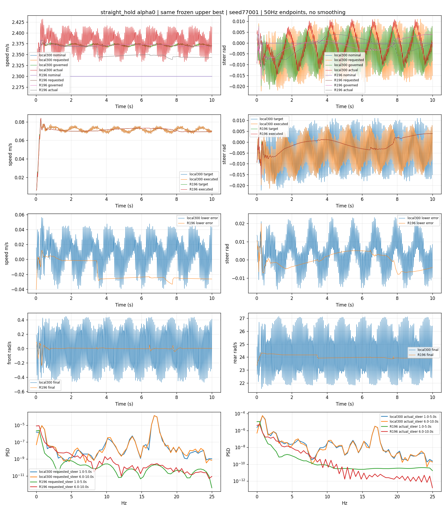
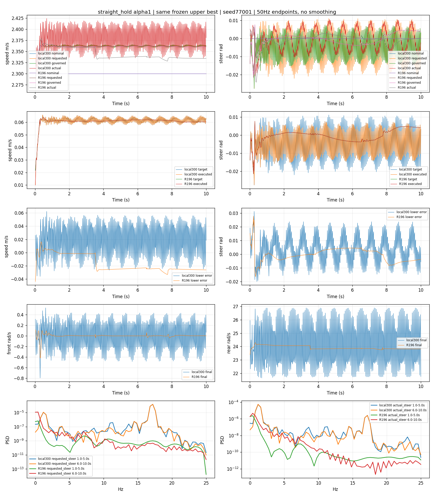
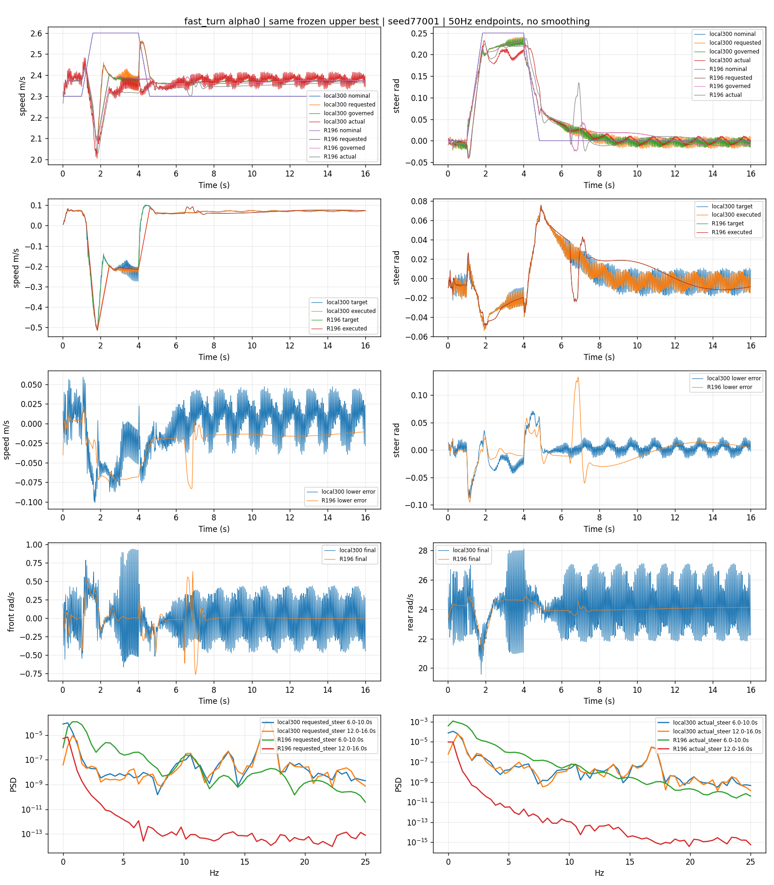
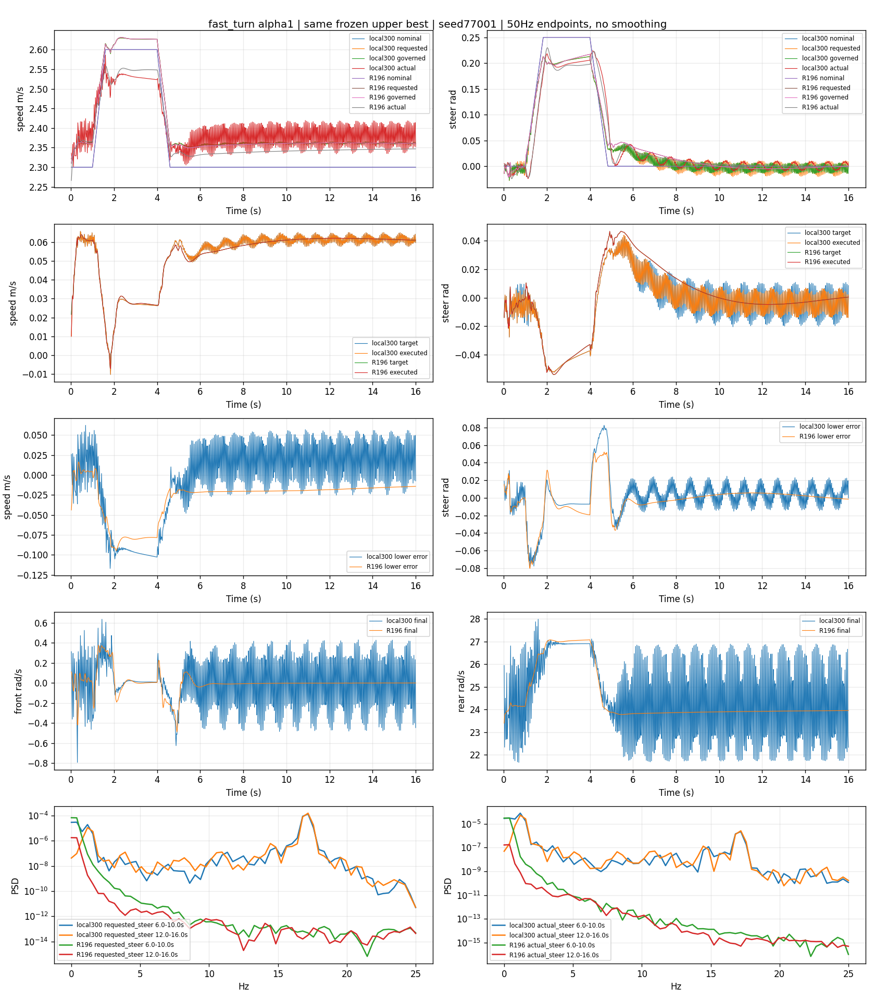
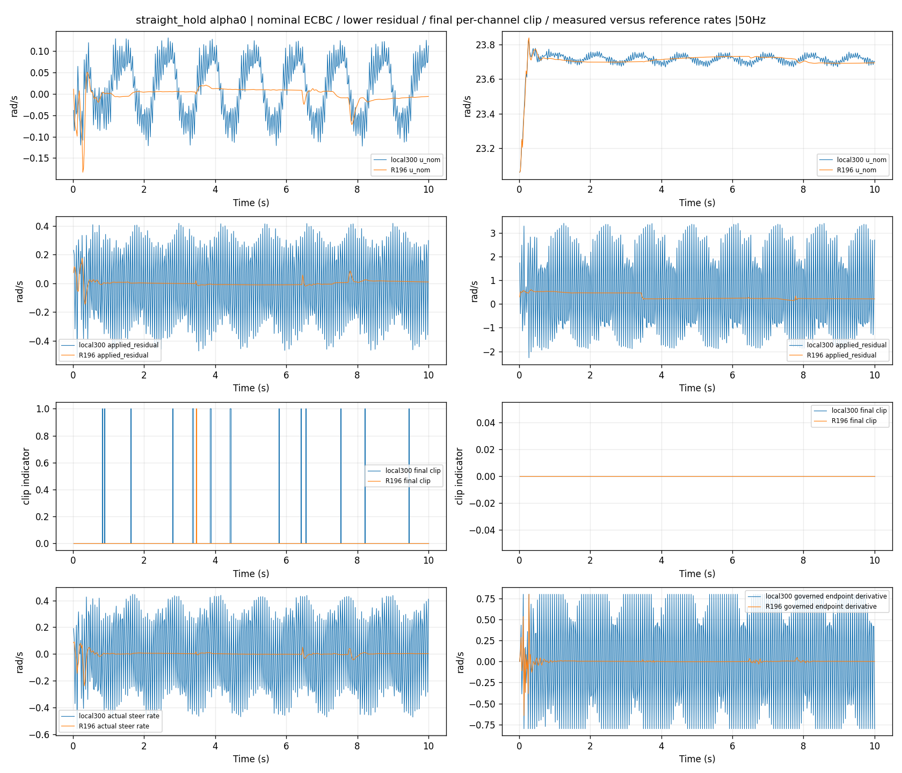
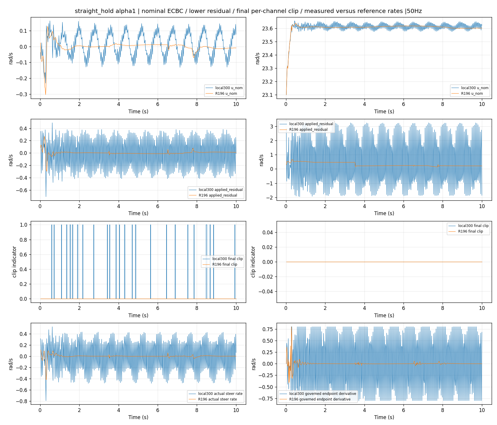
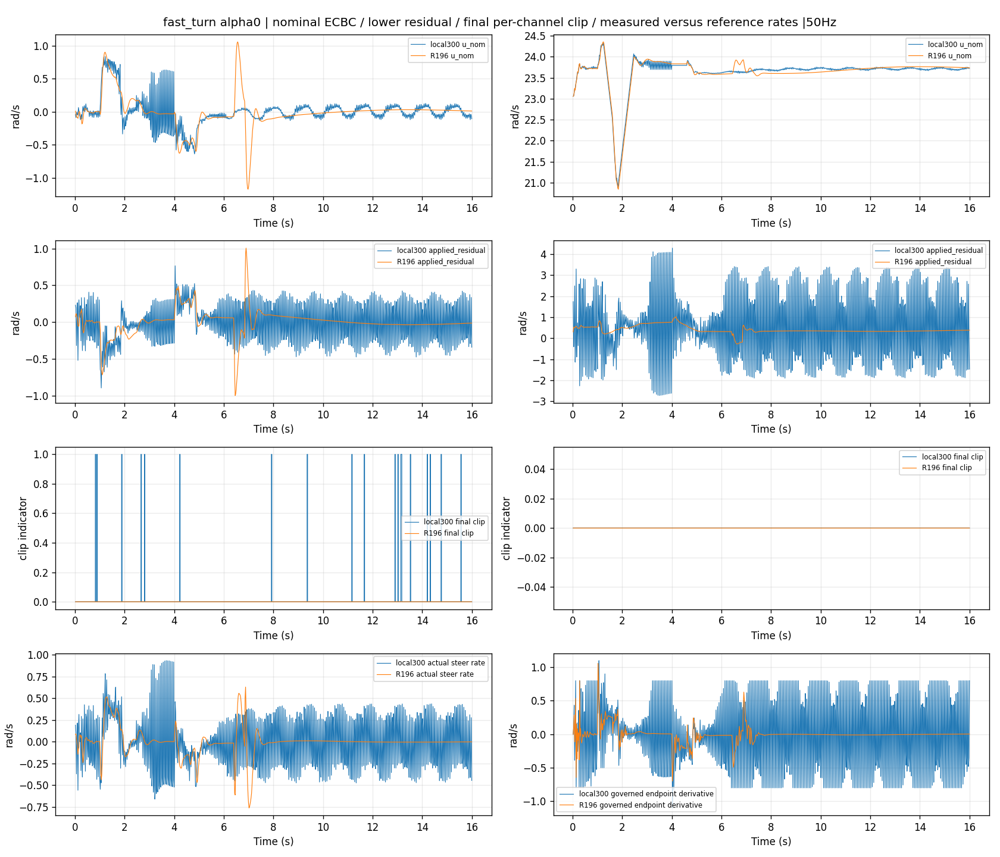
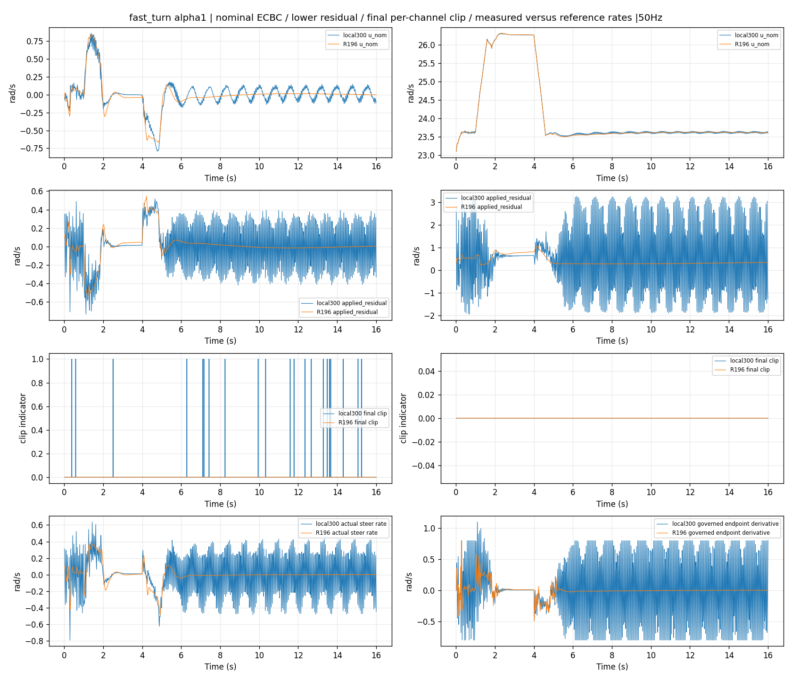

# Stage A: existing closed-loop oscillation evidence

Local state feedback already exists. Missing geometric path feedback and high-frequency command oscillation are distinct issues. No physics rerun. Fixed physics/lower/upper frequencies: 5000/200/50 Hz. Sign reversals are events/s, not periodic Hz.

Same external nominal windows, each4s: straight1–5 and6–10; fast6–10 and12–16 (extension separately). Samples are post-state endpoints of each four-tick block. No averaging/smoothing or selection on governed steadiness. Hann Welch nperseg128, overlap64, mean removed over full segment;10–25Hz power / total discrete PSD power.50Hz sampling cannot resolve higher-frequency plant motion.

Amplitude criterion: adjacent valid direction runs with |rate|>.05rad/s, both movements≥.002rad. Raw adjacent sign statistics retained. Excursion/deadband statistics apply to steering position signals; other channel values in JSON use native-unit thresholds and are not steering-qualified physical claims.

|case/alpha/lower|window s|signal|raw events/s|qualified events/s|peak Hz|10–25Hz fraction|p-p rad|AC RMS rad|
|---|---|---|---:|---:|---:|---:|---:|---:|
|straight_hold/alpha0/local300|1-5|requested_steer|33.75|33.50|16.797|0.943307|0.032834|0.010189|
|straight_hold/alpha0/local300|1-5|governed_steer|33.75|33.50|16.797|0.826532|0.027258|0.007769|
|straight_hold/alpha0/local300|1-5|actual_steer|33.50|30.00|0.781|0.065033|0.025748|0.006405|
|straight_hold/alpha0/local300|6-10|requested_steer|33.50|33.50|16.797|0.946923|0.029052|0.010086|
|straight_hold/alpha0/local300|6-10|governed_steer|33.50|33.50|16.797|0.846750|0.023886|0.007625|
|straight_hold/alpha0/local300|6-10|actual_steer|33.75|29.00|0.781|0.065896|0.022399|0.006011|
|straight_hold/alpha0/R196|1-5|requested_steer|3.50|0.00|0.391|0.000504|0.007878|0.002036|
|straight_hold/alpha0/R196|1-5|governed_steer|3.50|0.00|0.391|0.000504|0.007878|0.002036|
|straight_hold/alpha0/R196|1-5|actual_steer|2.50|0.00|0.391|0.000055|0.011985|0.004258|
|straight_hold/alpha0/R196|6-10|requested_steer|6.50|0.00|0.391|0.000344|0.007537|0.002970|
|straight_hold/alpha0/R196|6-10|governed_steer|6.50|0.00|0.391|0.000344|0.007537|0.002970|
|straight_hold/alpha0/R196|6-10|actual_steer|2.75|0.00|0.391|0.000068|0.008305|0.002034|
|straight_hold/alpha1/local300|1-5|requested_steer|33.75|33.75|17.188|0.929429|0.033170|0.010266|
|straight_hold/alpha1/local300|1-5|governed_steer|33.75|33.75|17.188|0.848818|0.023370|0.007724|
|straight_hold/alpha1/local300|1-5|actual_steer|33.50|21.75|1.172|0.053306|0.021069|0.005827|
|straight_hold/alpha1/local300|6-10|requested_steer|34.00|34.00|17.188|0.928143|0.031654|0.010244|
|straight_hold/alpha1/local300|6-10|governed_steer|34.00|34.00|17.188|0.843510|0.021416|0.007697|
|straight_hold/alpha1/local300|6-10|actual_steer|33.75|23.25|1.172|0.048811|0.020172|0.006006|
|straight_hold/alpha1/R196|1-5|requested_steer|8.00|0.00|0.391|0.014103|0.003578|0.000913|
|straight_hold/alpha1/R196|1-5|governed_steer|8.00|0.00|0.391|0.014103|0.003578|0.000913|
|straight_hold/alpha1/R196|1-5|actual_steer|3.75|0.00|0.391|0.000213|0.006488|0.001808|
|straight_hold/alpha1/R196|6-10|requested_steer|7.50|0.00|0.391|0.000374|0.008516|0.003408|
|straight_hold/alpha1/R196|6-10|governed_steer|7.50|0.00|0.391|0.000374|0.008516|0.003408|
|straight_hold/alpha1/R196|6-10|actual_steer|4.75|0.00|0.391|0.000109|0.007697|0.001774|
|fast_turn/alpha0/local300|6-10|requested_steer|33.50|33.50|16.797|0.551126|0.059319|0.015127|
|fast_turn/alpha0/local300|6-10|governed_steer|33.50|33.50|0.391|0.365336|0.057836|0.014042|
|fast_turn/alpha0/local300|6-10|actual_steer|33.50|27.00|0.391|0.020322|0.047335|0.011830|
|fast_turn/alpha0/local300|12-16|requested_steer|33.50|33.50|16.797|0.947294|0.028999|0.010111|
|fast_turn/alpha0/local300|12-16|governed_steer|33.50|33.50|16.797|0.841330|0.024084|0.007644|
|fast_turn/alpha0/local300|12-16|actual_steer|33.75|27.50|0.781|0.061590|0.022670|0.006159|
|fast_turn/alpha0/R196|6-10|requested_steer|3.00|1.00|0.781|0.001909|0.068054|0.014581|
|fast_turn/alpha0/R196|6-10|governed_steer|3.00|1.00|0.781|0.001909|0.068054|0.014581|
|fast_turn/alpha0/R196|6-10|actual_steer|1.75|0.75|0.391|0.000062|0.158868|0.034334|
|fast_turn/alpha0/R196|12-16|requested_steer|0.25|0.00|0.391|0.000000|0.011542|0.003107|
|fast_turn/alpha0/R196|12-16|governed_steer|0.25|0.00|0.391|0.000000|0.011542|0.003107|
|fast_turn/alpha0/R196|12-16|actual_steer|0.00|0.00|0.000|0.000000|0.012777|0.004032|
|fast_turn/alpha1/local300|6-10|requested_steer|33.75|33.75|17.188|0.730847|0.050261|0.012466|
|fast_turn/alpha1/local300|6-10|governed_steer|33.75|33.75|17.188|0.590475|0.043784|0.010827|
|fast_turn/alpha1/local300|6-10|actual_steer|33.75|20.00|1.172|0.022963|0.046021|0.010204|
|fast_turn/alpha1/local300|12-16|requested_steer|33.75|33.75|17.188|0.932029|0.030969|0.010266|
|fast_turn/alpha1/local300|12-16|governed_steer|33.75|33.75|17.188|0.852955|0.021234|0.007687|
|fast_turn/alpha1/local300|12-16|actual_steer|34.00|22.50|1.172|0.051322|0.020363|0.005912|
|fast_turn/alpha1/R196|6-10|requested_steer|0.00|0.00|0.000|0.000000|0.037434|0.010980|
|fast_turn/alpha1/R196|6-10|governed_steer|0.00|0.00|0.000|0.000000|0.037434|0.010980|
|fast_turn/alpha1/R196|6-10|actual_steer|0.00|0.00|0.391|0.000000|0.028998|0.007537|
|fast_turn/alpha1/R196|12-16|requested_steer|1.25|0.00|0.000|0.000001|0.005179|0.001680|
|fast_turn/alpha1/R196|12-16|governed_steer|1.25|0.00|0.000|0.000001|0.005179|0.001680|
|fast_turn/alpha1/R196|12-16|actual_steer|2.50|0.00|0.391|0.000001|0.001904|0.000554|

The same legacy upper over local300 produces greater high-frequency governed steering than over R196; this is paired closed-loop evidence, not independent causal attribution to either network. Actual steering is not equal to the issued reference, and its PSD must be reported separately. The old audit found no clean governed platform lasting.5s; it is reused, not rerun.

## DC speed identity, final.5s

|case/alpha/lower|task m/s|upper m/s|lower m/s|
|---|---:|---:|---:|
|straight_hold/alpha0/local300|+0.070624|+0.071312|-0.000687|
|straight_hold/alpha0/R196|+0.043216|+0.069375|-0.026159|
|straight_hold/alpha1/local300|+0.082493|+0.062244|+0.020249|
|straight_hold/alpha1/R196|+0.034145|+0.060257|-0.026112|
|fast_turn/alpha0/local300|+0.086498|+0.071413|+0.015085|
|fast_turn/alpha0/R196|+0.063373|+0.074432|-0.011059|
|fast_turn/alpha1/local300|+0.080835|+0.060658|+0.020177|
|fast_turn/alpha1/R196|+0.046673|+0.061148|-0.014475|

Pointwise float64 check: actual−nominal=(governed−nominal)+(actual−governed). Low-pass filtering cannot remove DC compensation. Fast terminal values are16s extension, not10s main result.

## Clip counts, each channel from its own raw arrays

|case/alpha/lower|residual front/rear full200Hz|final front/rear full200Hz|50Hz final front/rear|
|---|---|---|---|
|straight_hold/alpha0/local300|[0, 0]|[349, 0]|[13, 0]|
|straight_hold/alpha0/R196|[0, 0]|[6, 0]|[1, 0]|
|straight_hold/alpha1/local300|[0, 0]|[362, 0]|[26, 0]|
|straight_hold/alpha1/R196|[0, 0]|[2, 0]|[0, 0]|
|fast_turn/alpha0/local300|[0, 0]|[467, 0]|[19, 0]|
|fast_turn/alpha0/R196|[0, 0]|[3, 0]|[0, 0]|
|fast_turn/alpha1/local300|[0, 0]|[403, 0]|[21, 0]|
|fast_turn/alpha1/R196|[0, 0]|[0, 0]|[0, 0]|

Residual clipping: abs(requested)>[1.5,10]rad/s. Final clipping: final_command != u_prelimit per channel, matching original flag semantics (includes floating-point composition differences). Reference per-channel amplitude counts UNKNOWN: only aggregate any-channel flags logged; aggregate is preserved in JSON, never split into fake channel rates. New substep actuator-force hits are separate from command clipping; old data lacks these.

[All numeric channels and windows](metrics.json) · [Welch arrays](spectra.npz)

