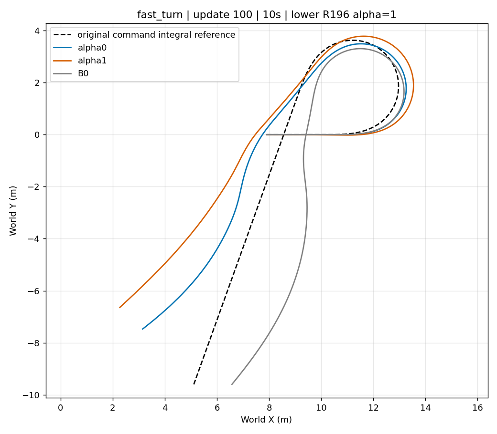
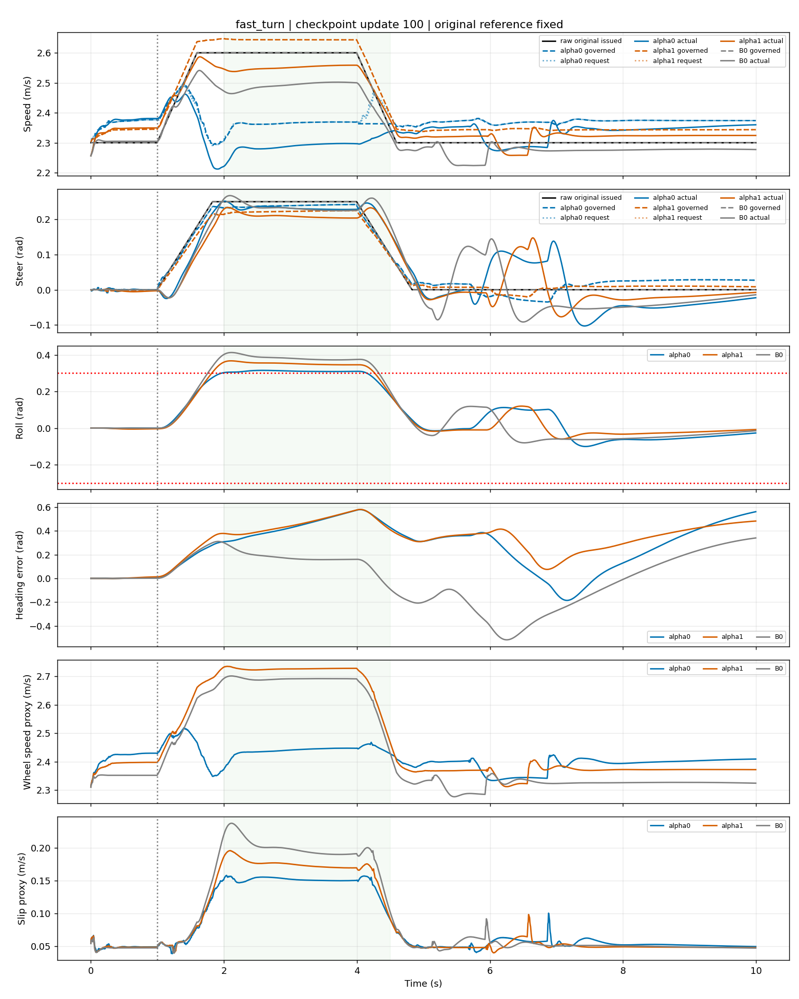

# R196 Preference V5.1：update25 与 update100 结果

两个上层从零独立训练，各完成100/100次PPO更新。下列固定评价均为原六场景协议、seed 77001、冻结R196 lower_alpha=1＋ECBC/ESO，图中同时画原始指令积分参考、B0、alpha0、alpha1。update25只评价直行和急转；update100评价六场景。评价结果为**不合格、不采用**。

## 先看XY实际轨迹

[fast_turn 16秒XY](figures/update100_fast_turn_16s_xy.png) · [straight_hold XY](figures/update100_straight_hold_10s_xy.png) · [speed_changes XY](figures/update100_speed_changes_10s_xy.png) · [gentle_positive XY](figures/update100_gentle_positive_10s_xy.png) · [gentle_negative XY](figures/update100_gentle_negative_10s_xy.png) · [steer_reversal XY](figures/update100_steer_reversal_10s_xy.png)

阶段对照：[update25 fast_turn 10秒XY](figures/update25_fast_turn_10s_xy.png) · [16秒XY](figures/update25_fast_turn_16s_xy.png) · [straight_hold XY](figures/update25_straight_hold_10s_xy.png)。XY位置误差只作描述；本任务未给上层增加XY成本，不能据此声称已学会路径恢复。

## 实际控制与任务判断

fast_turn [2,4)s 的物理量；RMSE为实际运动相对原始速度/转角指令：

|update|方法|实际速度 m/s|实际转角 rad|速度RMSE m/s|转角RMSE rad|峰值侧倾 rad|越0.302 rad秒数|
|---:|---|---:|---:|---:|---:|---:|---:|
|25|alpha0|2.4357|.2317|.1649|.0215|.3818|2.510|
|25|alpha1|2.5155|.2300|.0854|.0231|.4104|2.570|
|100|B0|2.4901|.2345|.1106|.0197|.4131|2.575|
|100|alpha0|2.2858|.2322|.3145|**.0186**|.3154|2.160|
|100|alpha1|2.5504|.2103|**.0500**|.0404|.3676|2.445|

update100 alpha0转角满足≤.05rad，alpha1速度满足≤.08m/s。然而两端侧倾均超过共同上界.302rad。alpha0相对转前实际速度降≥.1m/s最长只有.44秒，没有持续降≥.2m/s；其减速不是可靠的持续协调。alpha1保速但仍越侧倾界。

六场景10秒末速度/转角/航向联合保持，alpha0为**3/6**、alpha1为**1/6**。fast_turn两端10秒和16秒均未达到方向保持；16秒最终航向RMSE为.0775/.2496rad（门槛≤.05）。[16秒控制图](figures/update100_fast_turn_16s_control.png)。普通straight_hold依然受到速度修正：平均绝对上层速度偏置.0753/.0442m/s，使速度RMSE从B0的.0082恶化为.0710/.0400m/s。[直行控制图](figures/update100_straight_hold_10s_control.png)。

新primary_excess只在fast_turn有非零积分，alpha0/alpha1分别为2.422/.165，触顶率均为0；yaw_recovery亦未触顶。主要成本项的积分与触顶率按update、场景、方法和10/16秒窗口保存在[汇总CSV](data/fixed_case_summary.csv)，全部分项与控制链见[update100结构化指标](data/update100_metrics.json)。B0在保存轨迹中按alpha0奖励计分；跨alpha比较以物理量为准。12条update100上层轨迹的独立reward重建均通过；reward或零摔倒不替代上述物理门槛。

## 图与可复核数据

每个声明场景均有同场景叠加的[XY、控制、每步/累计reward及有符号分项图](figures/)；fast_turn另有[电机命令链图](figures/update100_fast_turn_10s_motor_chain.png)。图按真实轨迹终点绘制，原始参考不会随上层改令重定位。

- [update100六场景5ms轨迹NPZ](data/update100_timeseries.npz) · [update25两场景5ms轨迹NPZ](data/update25_timeseries.npz)。键格式为 `case__method__field`；包括原始命令、governed、实际速度/转角、侧倾、航向、实际/参考XY、上下层与电机命令、reward和分项/触顶标志。
- [逐场景汇总CSV](data/fixed_case_summary.csv) · [update25结构化指标](data/update25_metrics.json) · [update100结构化指标](data/update100_metrics.json)。
- [TensorBoard训练曲线图](figures/tensorboard_training_curves.png) · [全部导出标量CSV](data/tensorboard_scalars.csv)，共6200行、31个tag，保留alpha、step、wall time和值。训练曲线只说明优化过程。
- [alpha0冻结配置](config/alpha0.json) · [alpha1冻结配置](config/alpha1.json) · [运行状态](identity/status.json) · [运行manifest](identity/manifest.json) · [评价故障原始收据](identity/evaluation100_error_receipt.json) · [补评收据](identity/evaluation100_recovery.json)。

最初update100评价在straight_hold之后被错误的共用tick上限中断；此时两个上层训练已各完成100更新。修复后只从已保存update100策略补齐另外五场景，没有新增训练批次或改写checkpoint。修复源码提交为77f715f，本目录[构建脚本](build_bundle.py)只导出已保存的数据与图，不运行物理。
