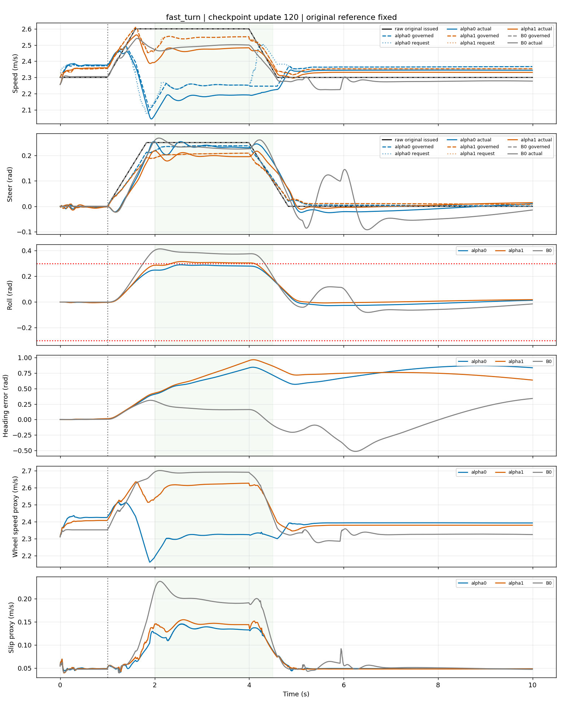
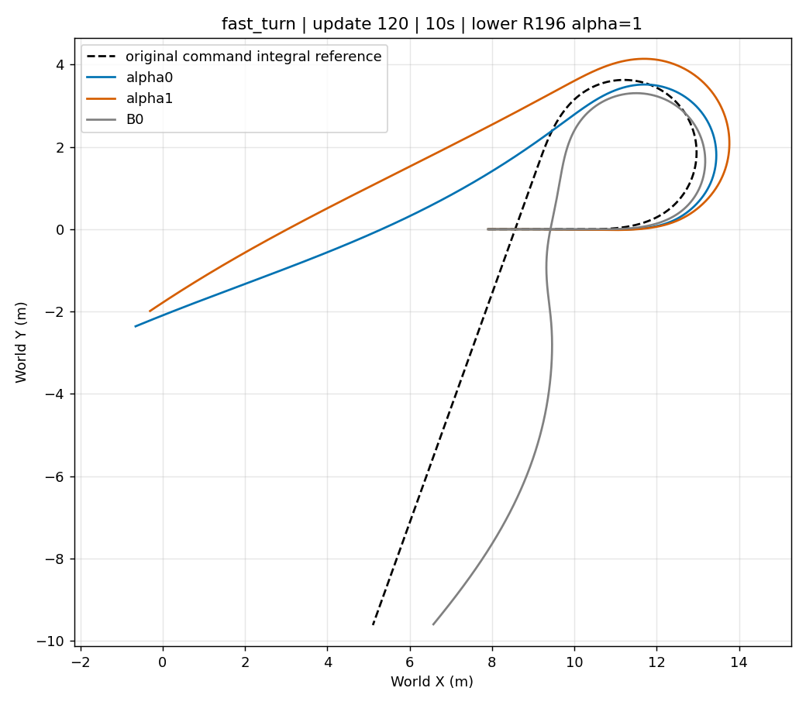
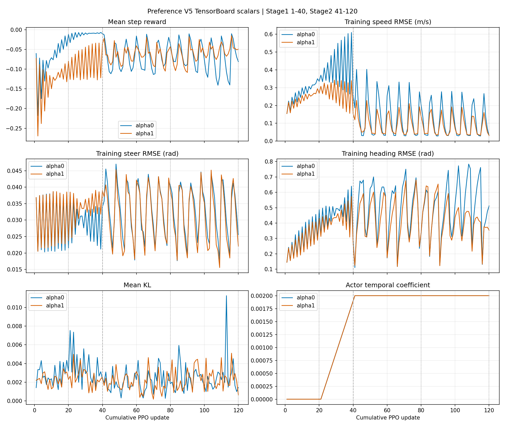

# R196 Preference V5：Stage1 1–40 + Stage2 41–120 精简证据包

本目录同时包含前40轮和后80轮，不只提供最终图片。训练源码为本分支 `68996da`；冻结底层为 `STTW_R196_ALPHA1`，lower alpha固定1，ECBC/ESO、`lower_reference_centered`、物理、执行器与残差权限未改。alpha0/alpha1始终独立训练，没有合并或蒸馏。

## 先看实际控制与XY

Stage2完成120/120，但整体未合格、未采用。fast_turn `[2,4)` 中：

|方法|governed速度/转角|上层速度/转角修改|实际速度/转角|峰值侧倾|
|---|---:|---:|---:|---:|
|B0|2.600 / .250|0 / 0|2.490 / .235|.4131|
|alpha0|2.244 / .235|-.356 / -.0149|2.177 / .233|.2895|
|alpha1|2.543 / .205|-.057 / -.0452|2.469 / .197|.3150|

alpha0确实持续减速并保留较多转向；请求低于-.30m/s连续2.44s，governed低于-.30m/s连续2.415s，最终后轮命令与实际速度同步下降，没有接口抵消。alpha1更保速，但减少更多转角并超过共同.302rad侧倾门槛。

update120的10秒联合速度/转角/航向末段保持为alpha0 0/6、alpha1 1/6；fast_turn16秒两端仍失败。fast_turn XY误差在10秒为9.269/9.356m，在16秒为18.794/15.169m。转角回零没有偿还累计航向欠账，不能称方向或路径恢复。

## 前40轮证据

Stage1 update20和update40的正/负转配对均在本包中。update40：

|转向|方法|速度RMSE m/s|转角RMSE rad|峰值侧倾 rad|实际降速≥.2m/s持续|
|---|---|---:|---:|---:|---:|
|正|alpha0|.6252|.01405|.2425|2.5s|
|正|alpha1|.2630|.03979|.2980|2.5s|
|负|alpha0|.6219|.01243|.2411|2.5s|
|负|alpha1|.3093|.02515|.3092|2.5s|

alpha0的持续减速、保转向和端点取舍方向成立；alpha1速度远高于≤.08m/s门槛，负转侧倾也超过.302rad，因此Stage1 gate失败。用户随后明确覆盖gate试行Stage2；覆盖不改写Stage1失败。

[update20正转控制](figures/stage1_u20_positive_control.png) · [update20负转控制](figures/stage1_u20_negative_control.png) · [update40正转控制](figures/stage1_u40_positive_control.png) · [update40负转控制](figures/stage1_u40_negative_control.png)

[update20正转XY](figures/stage1_u20_positive_xy.png) · [update20负转XY](figures/stage1_u20_negative_xy.png) · [update40正转XY](figures/stage1_u40_positive_xy.png) · [update40负转XY](figures/stage1_u40_negative_xy.png)

## TensorBoard静态图与数值

图直接从两个run的TensorBoard event文件导出，横轴是累计PPO更新；20/40/80/120为评价点，40为Stage1/Stage2边界。曲线显示训练reward和训练分布误差，但这些量没有替代固定场景的航向、XY和侧倾门槛。

- [全部TensorBoard标量CSV](data/tensorboard_scalars.csv)：7,440行，含stage、alpha、tag、step、wall time、value。
- 图中包含每步reward、速度/转角/航向RMSE、mean KL和Actor时间正则系数。

## 数值数据入口

- [Stage1配对汇总CSV](data/stage1_pair_summary.csv)：update20/40 × 正负转 × B0/alpha0/alpha1。
- [Stage2六场景汇总CSV](data/stage2_six_case_summary.csv)：update80/120的10秒指标，以及fast_turn16秒指标；包含末端保持、侧倾、XY/along/lateral/heading终值。
- [fast_turn控制链CSV](data/fast_turn_chain_summary.csv)：update80/120的`[2,4)`请求、governed、最终电机命令与实际运动；持续时间列使用完整保存回合。
- [Stage1 update20 5ms轨迹](data/stage1_update20_timeseries.npz) · [update40](data/stage1_update40_timeseries.npz)
- [Stage2 update80 5ms轨迹](data/stage2_update80_timeseries.npz) · [update120](data/stage2_update120_timeseries.npz)
- [update20 gate JSON](data/stage1_gate_update20.json) · [update40 gate JSON](data/stage1_gate_update40.json)
- [update80完整结构化指标](data/stage2_metrics_update80.json) · [update120](data/stage2_metrics_update120.json)

NPZ键格式为`<scenario>__<method>__<field>`。保留字段包括时间、原始命令、target、governed、latent、实际速度/转角、侧倾/角速度、航向欠账、XY/参考XY、along/lateral、轮速与滑移代理、`u_nom/u_goal`、请求/应用残差、冻结底层动作、最终电机命令、每步reward、所有有符号reward分项和真实失败标志。数据足以重画本包的实际控制、XY和奖励结论；checkpoint本体因体积和仓库规则不提交，以SHA-256固定身份。

## 其余图片

update120六场景实际控制与XY：

- [straight_hold控制](figures/stage2_u120_straight_hold_control.png) · [XY](figures/stage2_u120_straight_hold_xy.png)
- [speed_changes控制](figures/stage2_u120_speed_changes_control.png) · [XY](figures/stage2_u120_speed_changes_xy.png)
- [gentle_positive控制](figures/stage2_u120_gentle_positive_control.png) · [XY](figures/stage2_u120_gentle_positive_xy.png)
- [gentle_negative控制](figures/stage2_u120_gentle_negative_control.png) · [XY](figures/stage2_u120_gentle_negative_xy.png)
- [steer_reversal控制](figures/stage2_u120_steer_reversal_control.png) · [XY](figures/stage2_u120_steer_reversal_xy.png)
- [fast_turn控制](figures/stage2_u120_fast_turn_control.png) · [XY](figures/stage2_u120_fast_turn_xy.png) · [16秒控制](figures/stage2_u120_fast_turn_16s_control.png) · [16秒XY](figures/stage2_u120_fast_turn_16s_xy.png)

[fast_turn电机链](figures/stage2_u120_fast_turn_motor_chain.png) · [逐步/累计reward](figures/stage2_u120_fast_turn_reward.png) · [有符号reward分项](figures/stage2_u120_fast_turn_reward_components.png)

## 身份、配置与复核

- [Stage1 alpha0配置](config/alpha0_stage1.json) · [alpha1](config/alpha1_stage1.json)
- [Stage2 alpha0配置](config/alpha0_stage2.json) · [alpha1](config/alpha1_stage2.json)
- [Stage1 manifest](identity/stage1_manifest.json) · [Stage2 manifest](identity/stage2_manifest.json) · [恢复收据](identity/stage2_stage_transition.json)
- [最终checkpoint SHA-256](identity/final_checkpoints.json) · [结论收据](identity/decision.json)
- [源码提交序列](identity/source_commits.txt) · [源码差异统计](identity/source_diff_stat.txt)
- [全包文件SHA-256清单](manifest.json) · [可复现构建脚本](build_bundle.py)

两阶段共12组策略固定轨迹的独立reward重建均通过：最大分项误差1.145e-5、最大政策步误差4.233e-8，分项cap触发率为0。训练和评价均完成；结论为`qualified=false`、`not_adopted`，没有自动追加250/500。
