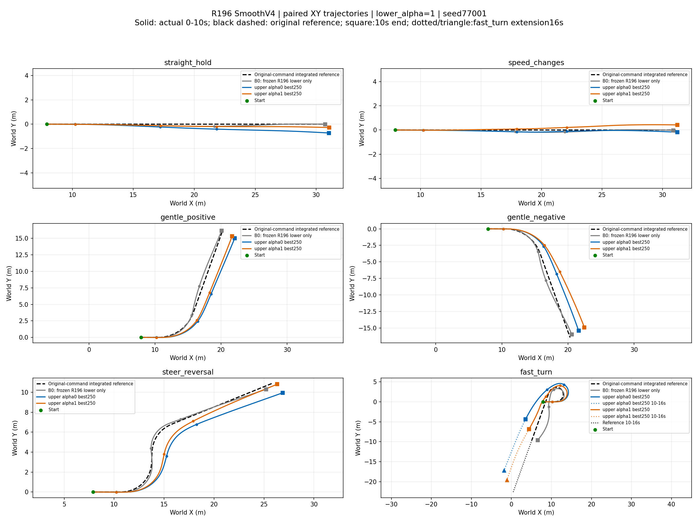

# R196 SmoothV4：独立上层各250轮结果

**训练与评测完成并停止。明显减少了抖动，改善了部分方向恢复，但尚未实现六场景共同合格，也未可靠学出预期的alpha取舍。** 两端best均为update250，候选范围仅实际评测过的60/250；`qualified=false`。不是全250个checkpoint逐一评选的最优。

## 先看XY平面轨迹

各场景叠加原始指令积分参考、B0、新alpha0/newalpha1 best250；坐标为世界坐标米且横纵等比例。黑虚线为原始参考，彩色实线为0–10秒实际运动，方块为10秒终点；fast_turn点线/三角仅表示10–16秒延伸，无B0延伸对照。参考不是网络修改后指令积分，也不代表额外路径成功标准。直接读取已保存actual_xy/reference_xy，未新增仿真。对应字段已补入原timeseries.npz。

## 指令与实际运动曲线

每图依次为原始/修改后速度指令、转角指令、实际速度、真实轮角、侧倾、航向误差、前/后实际残差。新alpha0蓝色、新alpha1橙色、B0灰色；旧上层为浅色虚线。黑实线是原始发布指令，**不是网络输出**。绿色区域是原10秒末保持窗口。

| 场景图 | B0末保持 | 新alpha0末保持 | 新alpha1末保持 |
|---|---|---|---|
| [直行 straight_hold](straight_hold.png) | 通过 | 航向未通过 | 通过 |
| [变速 speed_changes](speed_changes.png) | 通过 | 通过 | 通过 |
| [正向缓转 gentle_positive](gentle_positive.png) | 航向未通过 | 航向未通过 | 通过 |
| [反向缓转 gentle_negative](gentle_negative.png) | 航向未通过 | 通过 | 通过 |
| [转向反转 steer_reversal](steer_reversal.png) | 航向未通过 | 通过 | 通过 |
| [快速转弯 fast_turn](fast_turn.png) | 航向未通过 | 航向未通过 | 航向未通过 |
| **合计** | **2/6** | **3/6** | **5/6** |

B0为同一个冻结R196残差底层＋ECBC/ESO、上层零修正，**不是纯ECBC**。表格仅统计9.5–10秒每个采样均满足速度误差≤0.1m/s、转角误差≤0.04rad、航向误差≤0.05rad；不能替代全程工作范围与安全检查。最终12条新策略轨迹无摔倒，但fast_turn两端均超过侧倾工作界0.30rad。

## 收益与代价

- **alpha0确实平滑了**：直行安静窗口内，保护后转角offset变化率RMS从0.60975降到0.00864rad/s，二阶差分RMS从35.0357降到0.3531rad/s²（下降98.99%），有效反转139→0；真实轮角变化率RMS从0.13268降到0.00937rad/s，接近B0的0.00919。六场景offset二阶差分下降96.28%–98.99%。这些使用相同原始指令静稳窗口、20ms采样，排除窗口边界；不把必要转向总变化或slew裁剪比例当抖动。
- **代价是部分转向精度和响应下降**：alpha0快速转弯转角RMSE相对旧alpha0增加5.91%，反转增加13.35%；反转指令平台后首次连续100ms进入转角容差的时间从0.250变成0.705秒。其他缓转并非都变慢。
- **alpha1有收益，但不是全面保住速度**：快速转弯速度RMSE比B0下降58.8%，但比旧alpha1的0.01736m/s变差到0.03407m/s。其方向恢复改善；快速转弯平滑指标仅改善约20%，未达到该场景30%目标。
- **普通场景仍有无益干预**：直行平均速度offset仍约+0.0313/+0.0325m/s，两端速度RMSE均比B0大；alpha0末航向还未满足保持门槛。
- **偏好语义未可靠体现**：快速转弯alpha0反而比alpha1速度误差更小、转角误差更大，不能宣称已经学会“alpha0保转向、alpha1保速度”。

快速转弯原10秒结论（指令跟踪RMSE窗口1–6秒，航向为9.5–10秒）：

| 方法 | 速度RMSE m/s | 转角RMSE rad | 末航向RMSE rad | 峰值侧倾 rad | 侧倾越界时长 s |
|---|---:|---:|---:|---:|---:|
| B0 | 0.08265 | 0.05823 | 0.31577 | 0.41314 | 2.570 |
| alpha0 best250 | 0.03085 | 0.07820 | 0.14232 | 0.30921 | 1.170 |
| alpha1 best250 | 0.03407 | 0.06201 | 0.16235 | 0.34531 | 2.255 |

延长fast_turn到16秒，两端在15.5–16秒才都满足末保持，航向RMSE为0.03334/0.00763rad。这说明能迟到恢复，**不撤销10秒不合格或此前侧倾越界**；B0与旧策略没有16秒配对数据。

## 训练过程

[训练曲线](training.png)；[原生TensorBoard事件](tensorboard)。每端250次有效PPO更新、16,384,000策略转移，另有初始2个仅Critic rollout，共131,072转移。Actor/Critic/Adam/std均从零初始化，初始std0.1；150→250恢复完整学习状态，但重建物理/ESO/历史回合，不是仿真逐帧续接。lower_alpha始终1，上层两端独立。

两端各994个接受优化epoch，硬拒绝和非有限批次均0；训练物理失败0/20,480个完成回合/端。最大近似KL为0.01113/0.01621；Actor裁剪前梯度最大2.073/2.388，Critic为151.03/123.94，梯度裁剪保持1。无数值发散证据，但不能据此宣称控制收敛。

末20批平均reward约−0.02089/−0.02080，较首20批改善；末100批存在约6批周期波动，lag6相关0.934/0.908。128步rollout为2.56秒、回合16秒，与这种周期相符，但不是已证明的单一原因。末20批训练航向RMSE仍0.248/0.244rad，侧倾工作界违反比例0.83%/1.78%，最终执行限幅约0.43%/0.40%。reward上升、零摔倒或平滑均不等于任务完成。旧总成本100裁剪已取消，分项保护与失败计分的实际配置、成本分项见数据；不混用旧V3 reward与新V4 reward作能力排名。

本轮fresh及其续训账本累计15,485.4秒（约258.1分钟，含已结转的无效fresh尝试），包括两次评测；不含更早被取消的warm-start尝试。用户后来取消额外墙钟截止，按各250轮结束，未追加训练。已有60轮与250轮共24个新策略条件的奖励重建检查通过，最大绝对误差<6.4e−8。

## 数据与复查

- [evidence.json](evidence.json)：解析配置、源码/模型身份、best选择、全部逐场景指标（含旧策略）、训练统计、审计与耗时。
- [timeseries.npz](timeseries.npz)：六场景B0、新best0、新best1的200Hz必要时序及奖励分项。键名为`场景__方法__字段`。fast_turn新策略16秒，B0与其余场景10秒。旧策略原始数据属于[前次证据](../r196_fixed_six_20261008/)，本包不重复。
- `target`为slew前请求；`limited_command`为原始发布指令与评价基准；`proposal=limited_command+offset`为网络保护前请求；`governed`为保护后下发参考；`actual_forward_speed/actual_delta`为真实运动。proposal可由latent_z重建：速度offset=tanh(z0)×（正向0.25、负向1.0），转角offset=0.2×tanh(z1)，不累加到上次指令。
- TensorBoard各端保留两段原始事件文件，已核对1–250全部250个正step奖励点和2个负step预热点、32个标量标签，未只上传截图。下载本目录后运行：`tensorboard --logdir tensorboard --port 6006`。

仅上传一种图像格式PNG、一份NPZ时序、一份JSON证据、原生事件与本文；不上传checkpoint、PDF、CSV或重复压缩包。单初态seed77001、bank0[3]，六场景已用于择优，属于开发比较而非独立泛化测试；不同奖励与初始化同时变化，不能解释为纯平滑项单因素消融。两端best均保留为候选，**不登记为六场景合格控制器**。
