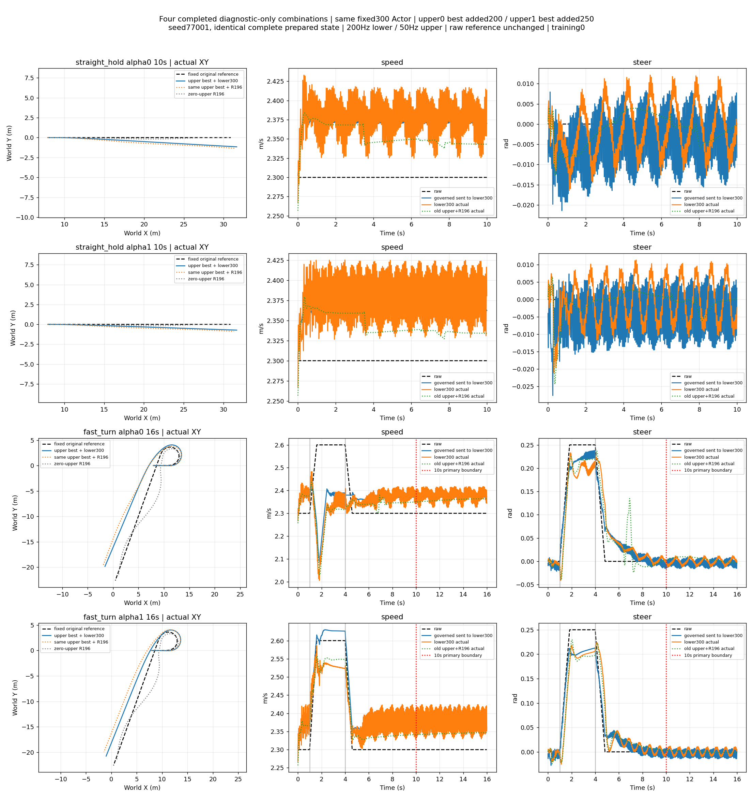

# 固定300 × 冻结upper：四条诊断组合与决策

四条完整控制、逐时误差、航向分解与同alpha逐步/累计奖励图：[直行alpha0 10秒](straight_hold_alpha0_10s.png)、[直行alpha1 10秒](straight_hold_alpha1_10s.png)、[fast_turn alpha0 16秒](fast_turn_alpha0_16s.png)、[fast_turn alpha1 16秒](fast_turn_alpha1_16s.png)。fast_turn的主10秒图单独保留：[alpha0](fast_turn_alpha0_10s.png)、[alpha1](fast_turn_alpha1_10s.png)。不以16秒掩盖10秒失败。

**具体决策：固定300保留为diagnostic_only候选，当前组合不合格，不注册/安装。下一步首先设计旧upper对固定300的补偿与指令时序适应，并补充真实快速反向governed和fast_turn域外请求的覆盖证据；不直接加下层训练预算、不切400、不加全局reward。本轮没有实施这一步训练或参数修改。**

400原best完整保留；300/350/400没有连续两个不同后期checkpoint合格的事实仍在。工程提名不是旧Q改判、300逐项最优或正式部署授权。[候选身份](integration_candidate.json)、[单页选择报告](offline/SELECTION.md)、[逐命令平台全表](offline/platforms.md)、[旧Q与phase-consistent完整诊断](offline/phase_diagnostics.json)。未重跑七场景或旧300恢复。

## 原协议判定：10秒与16秒分开

|场景/alpha|新300：10秒联合保持|旧同upper+R196：10秒|新300：16秒联合保持|旧同upper+R196：16秒|新300 peak_roll rad（全程）|
|---|---|---|---|---|---|
|straight_hold/0|失败|失败|N/A|N/A|0.012849|
|straight_hold/1|失败|通过|N/A|N/A|0.012829|
|fast_turn/0|失败|失败|失败|通过|0.306895|
|fast_turn/1|失败|失败|失败|通过|0.338746|

联合保持要求最后0.5秒逐步速度≤.10m/s、转角≤.04rad、原参考航向≤.05rad、peak_roll≤.302rad。fast_turn两端全程工作姿态越界；alpha0原1–6秒主任务也失败，alpha1主任务通过但工作界/末段不合格。旧alpha1在16秒末段保持虽通过，全程工作越界仍存在，不能称旧整体任务已合格。全部物理失败为0，不能替代任务/工作界条件。

每个末段100个真实步：直行alpha0速度10步超差、航向98步超差；直行alpha1速度35步超差、航向0步超差。fast_turn alpha0在10秒速度26/航向41步超差，16秒速度29/航向59；alpha1在10秒速度32、16秒速度31步超差，航向均未超差。全部末段转角和roll逐步合格，但不能抹掉此前工作姿态越界。[完整保持失败原因](final_hold_causes.json)。

|场景/alpha/窗口|新任务速度RMSE m/s|旧任务速度RMSE|新下层速度RMSE（actual-governed）|新下层转角RMSE rad|新终点航向误差 rad|新/旧原始参考XY距离 m|
|---|---:|---:|---:|---:|---:|---|
|straight/0/10s|.081747|.055313|.023243|.008689|.063867|1.383688 / 1.432623|
|straight/1/10s|.083734|.045983|.031123|.010152|.039344|1.066259 / .973311|
|fast/0/10s|.185933|.185354|.036045|.024607|.045358|3.143489 / 3.305860|
|fast/1/10s|.071963|.044846|.055235|.027084|.046284|2.245872 / 3.073368|
|fast/0/16s|.155311|.150900|.031810|.020194|.047353|3.436814 / 3.793461|
|fast/1/16s|.077043|.044736|.047742|.022297|.028403|2.334552 / 3.258304|

XY只是原始任务描述，不另设事后路径成功门槛。fast部分XY距离/末端航向改善与速度/末段恶化并存，不能挑选改善项称组合成功。

## 逐时归因与下一步对象

速度/转角逐步以float64核对：actual-raw=(governed-raw)+(actual-governed)，没有曲线平移或评分错位。完整逐时数组见[分解NPZ](error_decomposition.npz)，所有窗口bias/RMSE/MAE/P95/max/持续超差见[比较JSON](comparison_metrics.json)。

末段平均速度误差的上层/下层/总和：直行alpha0为+.071312/−.000687/+.070624m/s；alpha1为+.062244/+.020249/+.082493。旧upper在新plant上仍正向补偿约.06–.07m/s，新下层波动叠加后出现每步>.10峰值。这个证据支持优先检查上层补偿与新闭环匹配，不支持把整个失败笼统归给下层持续偏置。尚无反事实试验，不能宣称已证明某一个网络的独立因果责任。

上层governed的50Hz端点转角变化率：新直行每秒反向33.7/33.8次，旧6.5/8.1次；新fast32.75/28.75次，旧3.75/2.875次，中位反向间隔新约20ms。governed转角变化率RMS新直行约.612/.619rad/s，旧约.061/.065。这里“变化率”是发送指令的变化率，不是实际车轮导数。按命令安静持续.5秒的下层稳态窗口，在这四条轨迹中样本均为0，必须标N/A，不能据全程RMSE声称独立局部精度已充分验证。[统一采样频率诊断](frequency_comparison.json)。

新下层的ordinary target hold为1–1.8秒，含已声明正常/动态slew，但没有20ms连续反向upper请求的专门验收。直行幅值/最大slew/平衡侧倾在训练数值包络内；快速反向的时序覆盖差异仍不能忽略。fast_turn alpha0/1的请求平衡侧倾超过.26rad分别1.67/2.51秒，峰值约.29547/.32332rad；其它数值范围/最大slew未越训练边界。这是训练参考生成筛查包络差异，不是物理不可行证明，也不是部署中再次筛查、截断上层指令。完整区间在comparison_metrics.json/coverage。

因此本次路线为：优先处理上层补偿和闭环指令振荡的适应设计，同时明确这两类覆盖缺口；如以后证明温和、稳定governed下仍有持续局部误差，再进入下层局部精度修复。目前没有干净稳定平台或独立因果消融，不应直接重训底层、加航向债、平均模型或拼通道。本轮保持停止，不自动启动适应训练或额外扫描。

航向额外分解：raw ref−actual yaw的增量分为上层(raw yaw请求−governed yaw请求)+A速度+B转角+C运动学剩余。直行alpha0末贡献+.251644/+.002601/−.183102/−.007277rad，相加=.063867；alpha1为+.237818/+.004343/−.193247/−.009571=.039344。fast16s alpha0为+.376276/+.073669/−.050867/−.351704，alpha1为+.456048/+.125698/−.153871/−.399452。初始误差0，累计闭合最大约2.13e-5rad。C含运动学、采样/接触剩余，不称轮胎滑移率；不能从直行的小C推广到fast。

## 完整诊断与真实性边界

- [直行alpha0 reward分项](straight_hold_alpha0_reward_parts.png)、[alpha1分项](straight_hold_alpha1_reward_parts.png)；[fast alpha0分项](fast_turn_alpha0_reward_parts.png)、[alpha1分项](fast_turn_alpha1_reward_parts.png)。逐步与累计均与旧同upper+R196及零upper R196按同alpha冻结V5.2重建，完整数组位于data。
- [直行alpha0真实/轮速](straight_hold_alpha0_speed_proxy.png)、[alpha1](straight_hold_alpha1_speed_proxy.png)；[fast alpha0](fast_turn_alpha0_speed_proxy.png)、[alpha1](fast_turn_alpha1_speed_proxy.png)。轮速代理不当作真实速度。
- 新物理轨迹子步力矩触界已记录，完整数组及前轮/后轮执行残差、ECBC名义输出、最终限幅在data/各场景NPZ。最终指令clip比例依次17.45%、18.10%、14.59%、12.59%；力矩触界不是物理失败或正式稳定性保证。旧轨迹缺这项子步力记录，不补造匹配比较。
- [运行与mask/频率审计](adapter_runtime_audit.json)：210维，每5ms只有一个新真实帧，mask由1到10；50Hz upper z每4步固定；16秒lower未在10秒自动done/reset。仅governed与真实局部状态，不接alpha/path/return/全局债，不调用训练指令筛查器。保留ECBC/ESO、.0002物理步/25子步、权限和原reward。[物理与初态来源](manifest.json)、[代码身份](code_provenance.json)。
- 新旧上层组合时间、raw、raw_rates、原始reference_xy/reference_yaw数组逐项完全一致；完整prepared bank SHA6bb5fc.../index3/env77001；没有移动参考或重锚。下层原开发bank是另一个文件（2eb3b3...），仅用于既有离线诊断，不冒充组合匹配初态。B0复用原V5.2记录及其已核验parent_evaluation_reuse来源。
- 实际新计算4条、52秒任务时间、10400控制步；训练0。两次开跑前断言失败均0物理步，原日志保留（错误假设bank必须与lower相同、物理.0001/50；已核对纠正为原upper bank及.0002/25，真实物理未修改）。报告曾遇q_ratio不支持直接向量，改为scalar vmap；仅重建图表，无仿真重跑。
- 未触发预声明的物理/非有限或命令稳定后的明显持续下层失配停止条件，四条结束即停止。没有额外轨迹、七场景重跑、旧300恢复重跑、400恢复、上层训练、正式安装、全仓测试或push。当前仅沙盒诊断，未补独立训练种子/泛化证据。

## 用户停止与发布指令

用户要求立即终止、总结并推送。本指令到达时四条物理轨迹已完成（10400控制步，训练0），没有活动组合或训练进程；停止后续适应设计/实验。只整理已生成证据并按本次明确授权推送当前实验分支，不合并或正式部署。冻结物理子步.0002秒×25=底层.005秒，上层.02秒；本轮未改变物理步长。开跑前.0001/50是代理错误假设，零新增物理步断言拦截并纠正，不冒充实际执行参数。用户提到的旧.01/.001秒记录本轮未追溯核验。
