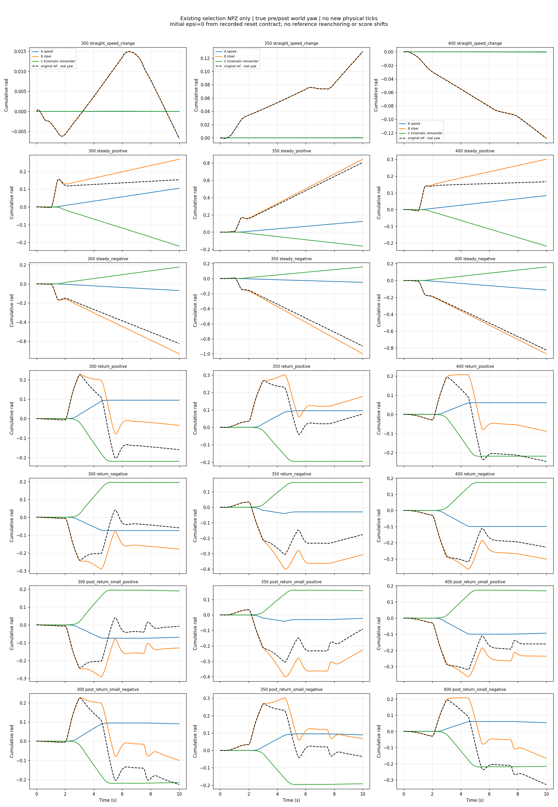

# 固定300工程提名：旧协议与新诊断分开

[已有300实际XY与配对跟踪图](../../local_lower_noalpha_v2_0300/INDEX.md)。本轮只读同一批selection300/350/400及固定R196 NPZ，未混入final reload，未重跑七场景或旧300恢复。

|checkpoint|原局部合格/7|旧Q原样保留|phase_consistent_score_v3|逐平台最坏归一化RMSE M|
|---|---|---|---|---|
|300|7/7|1.739090418|0.883505543|1.406943142|
|350|6/7|1.734558897|0.947839539|1.492163871|
|400|7/7|1.728899854|0.921191366|1.499943298|
|R196|3/7|3.506210243|1.701287987|1.903832813|

旧summarize_local在小角场景将tol[1]改为.01后用于全程Q，前置大转弯平方项相对.02放大4倍。新诊断只在实际发布到达±.04平台+.5秒的小角窗口用.01，其余用.02，速度始终.05；保留原Q的通道/时间平均方式及共同姿态惩罚，不改原通过判据/安全计数/best400。M对每个命令平台+.5秒后的有效样本分别计算，至少1秒，否则N/A；这个更严格的描述性分层尺度出现M>1，不等于回写原模型不合格。

300最差平台是正向回正场景前置[2.935,4.500)的1.9m/s、+.28rad平台；350/400最差在小正角场景前置负转平台。新指标也不能只挑一个数字赢家。直行1.9m/s平台300/400转角bias为−.001115/+.003115rad，2.6m/s平台为+.001263/+.002776rad；方向及持续时间影响积分，300不是逐项支配其他候选。

## 世界航向误差分解

逐5ms以同区间下发v_c/delta_c及后状态真实速度、转角分解A=kappa(delta_c)(v_c-v)、B=v(kappa(delta_c)-kappa(delta))、C=v*kappa(delta)-r_actual。r_actual来自真实world yaw的pre/post差，不用body gyro替代。初始误差明确为0（原local reset将reference_pose设为实际pose），第一步pre yaw从首个post reference yaw减dt*omega_c还原。A+B+C严格等于r_c-r_actual，累计闭合最大误差约5.68e-5rad，包含float32参考积分舍入；未修正/平移曲线。

直行末端A/B/C贡献：300为0/−.006692/−.000027rad，400为0/−.127783/−.000392rad。该例主要对应持续转角偏置项B，不能用总reward解释，也不能把C命名为已测轮胎滑移率。全部平台bias/RMSE/MAE/P95/max及时间、正负比例、最长连续超差：[平台全表](platforms.md)、[结构化完整统计](phase_diagnostics.json)。零转角平台yaw-rate bias和缺失force字段也在JSON保留；已有local验证没有子步力矩记录，标unavailable。

固定300进入diagnostic_only组合的依据：原7/7、单个原完整失配状态已通过、直行偏置较小且速度最差场景门槛余量优于400。原协议best400保持，连续两个不同后期checkpoint通过未达成；本轮既不再训练凑通过，也不代表正式部署或上层任务已合格。
