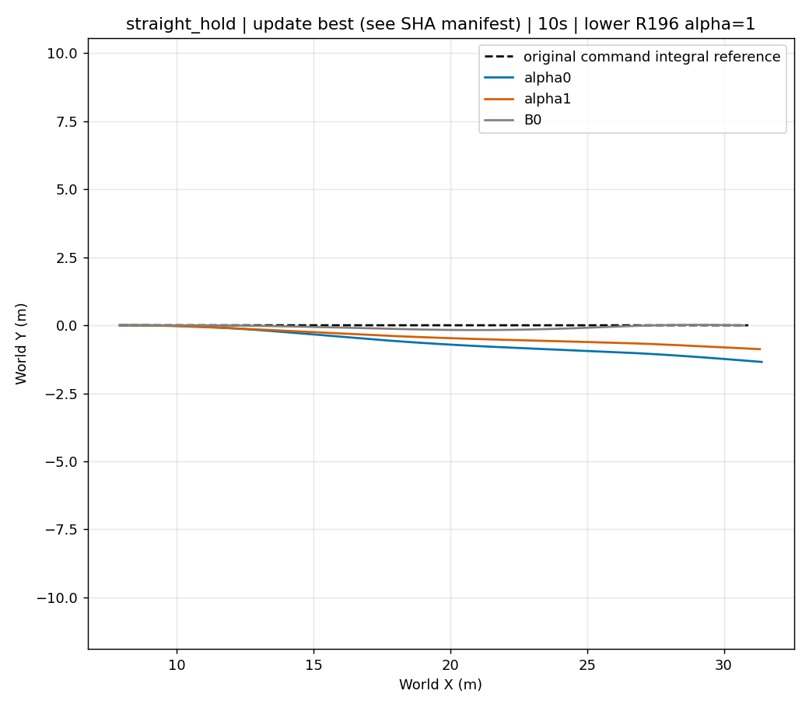
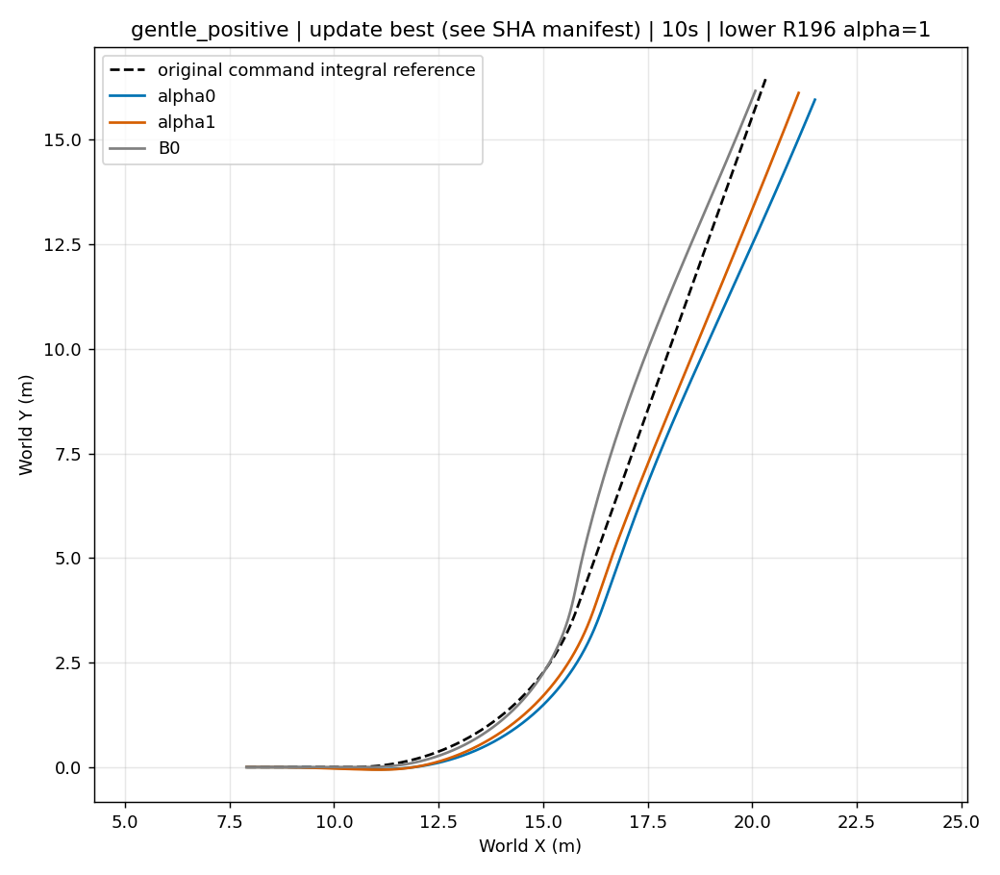
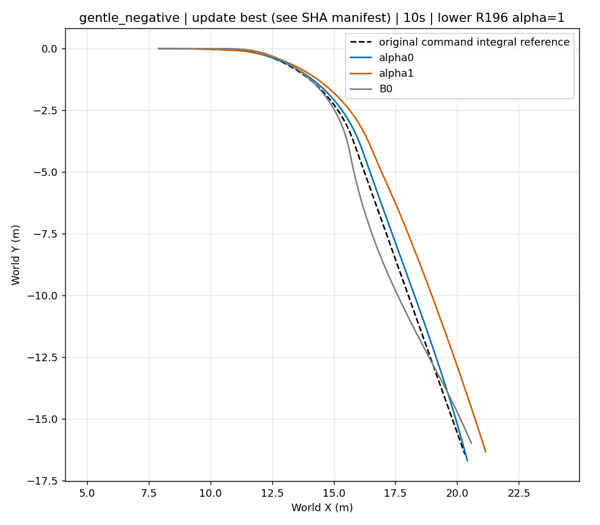
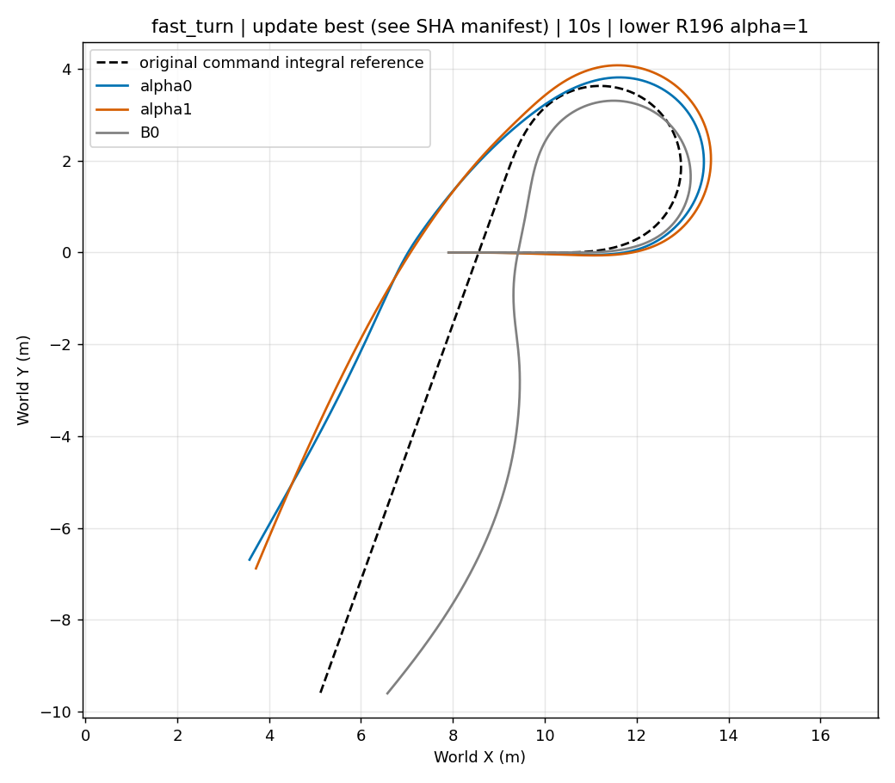
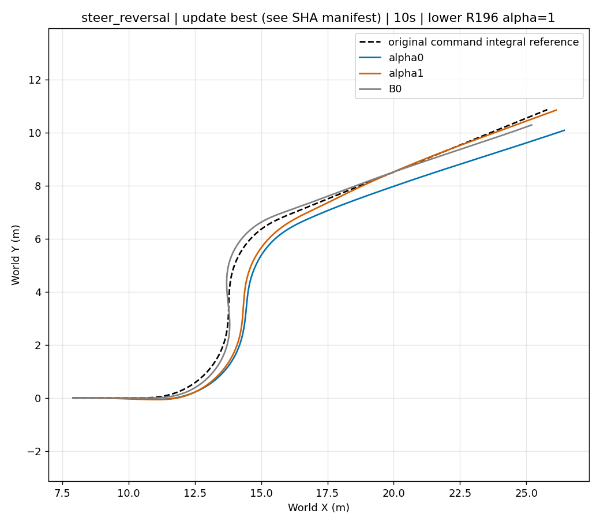
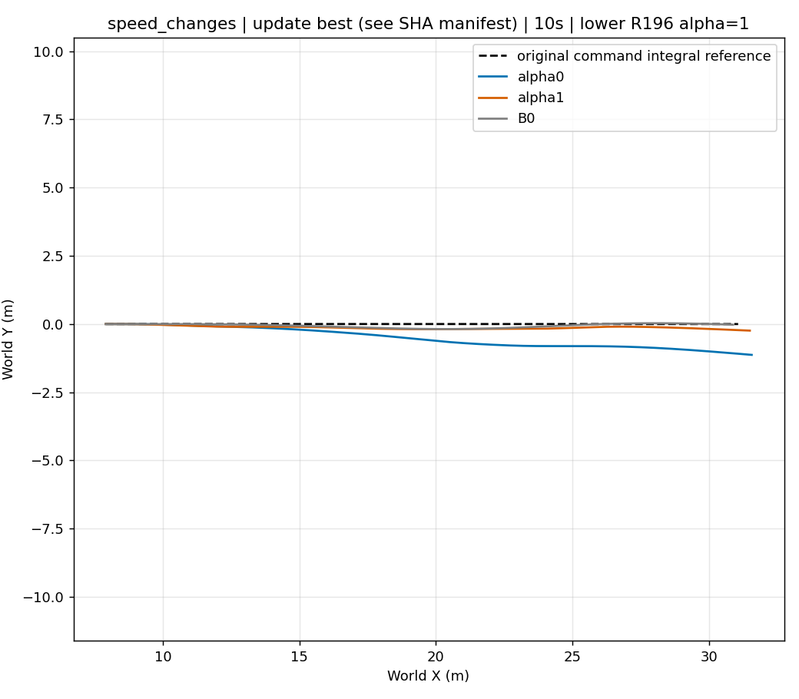

# V5.2 reloaded best — physical results

Best identity: ../final_best_loaded.json. Last remains the final learner; best is selected only among fixed-protocol validated candidates.

10s conclusions are primary; fast_turn16s is separate. See validation_metrics.json and per-endpoint validated_candidates.json.

## 其余图表与原始数据

- [fast_turn_10s_control.png](fast_turn_10s_control.png)
- [fast_turn_10s_motor_chain.png](fast_turn_10s_motor_chain.png)
- [fast_turn_10s_reward.png](fast_turn_10s_reward.png)
- [fast_turn_10s_reward_components.png](fast_turn_10s_reward_components.png)
- [fast_turn_16s_control.png](fast_turn_16s_control.png)
- [fast_turn_16s_motor_chain.png](fast_turn_16s_motor_chain.png)
- [fast_turn_16s_reward.png](fast_turn_16s_reward.png)
- [fast_turn_16s_reward_components.png](fast_turn_16s_reward_components.png)
- [gentle_negative_10s_control.png](gentle_negative_10s_control.png)
- [gentle_negative_10s_motor_chain.png](gentle_negative_10s_motor_chain.png)
- [gentle_negative_10s_reward.png](gentle_negative_10s_reward.png)
- [gentle_negative_10s_reward_components.png](gentle_negative_10s_reward_components.png)
- [gentle_positive_10s_control.png](gentle_positive_10s_control.png)
- [gentle_positive_10s_motor_chain.png](gentle_positive_10s_motor_chain.png)
- [gentle_positive_10s_reward.png](gentle_positive_10s_reward.png)
- [gentle_positive_10s_reward_components.png](gentle_positive_10s_reward_components.png)
- [speed_changes_10s_control.png](speed_changes_10s_control.png)
- [speed_changes_10s_motor_chain.png](speed_changes_10s_motor_chain.png)
- [speed_changes_10s_reward.png](speed_changes_10s_reward.png)
- [speed_changes_10s_reward_components.png](speed_changes_10s_reward_components.png)
- [steer_reversal_10s_control.png](steer_reversal_10s_control.png)
- [steer_reversal_10s_motor_chain.png](steer_reversal_10s_motor_chain.png)
- [steer_reversal_10s_reward.png](steer_reversal_10s_reward.png)
- [steer_reversal_10s_reward_components.png](steer_reversal_10s_reward_components.png)
- [straight_hold_10s_control.png](straight_hold_10s_control.png)
- [straight_hold_10s_motor_chain.png](straight_hold_10s_motor_chain.png)
- [straight_hold_10s_reward.png](straight_hold_10s_reward.png)
- [straight_hold_10s_reward_components.png](straight_hold_10s_reward_components.png)

全部六场景B0/alpha0/alpha1原始5ms NPZ保存在各场景子目录；数值指标见[validation_metrics.json](validation_metrics.json)。
