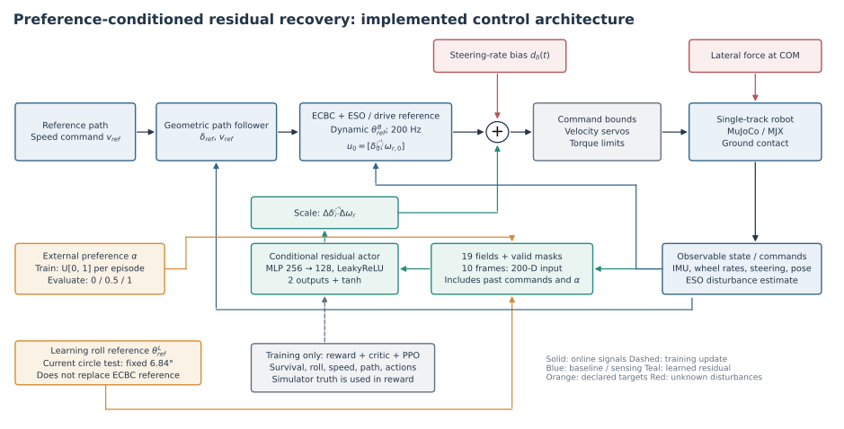
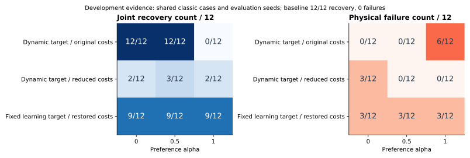
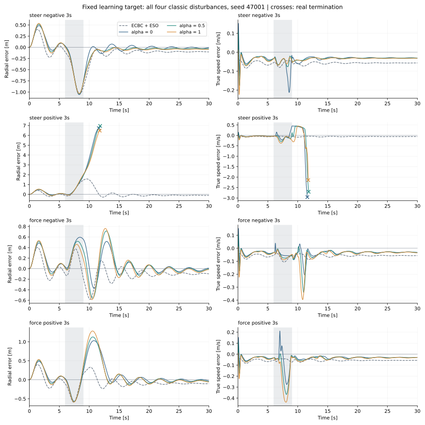

# 执行器约束下单轨机器人的速度—路径偏好条件残差扰动恢复控制

**Preference-Conditioned Residual Control for Disturbance Recovery of a Single-Track Robot under Actuator Constraints**

> 内部论文草稿，证据截止2026-09-12。本文以已实现代码和冻结仿真结果为基础。现有直接残差已显示局部有效性，但条件优先级、固定侧倾目标及节能机制尚未形成可投稿的完整正面证据。正文如实呈现这一边界；第9节给出形成正式投稿稿件的实验与方法收敛路线。此稿不包含虚构实车实验、录用承诺或形式稳定性证明。

## 摘要

单轨机器人在连续转弯中受到转向指令偏置或持续侧向力时，侧倾平衡、行进速度和路径偏差相互影响。仅降低轨迹误差可能增加速度波动，而持续保持速度也可能扩大恢复过程的横向占用。本文围绕这一问题构建保留模型1状态反馈控制及扩张状态观测器的有界残差学习框架，使用同一个条件策略输出前轮转向角速度和后轮轴转速补偿。策略接收可测状态、指令历史与外部速度偏好参数；训练采用随机持续扰动，评估采用固定扰动面板和配对初态，并报告生存、联合恢复时间、速度误差、路径误差及采样机械功。

现有开发实验表明，在一组同预算、同物理配置的直接残差与响应映射对照中，直接残差将恢复时间从12.583 s降至5.888 s，径向RMSE从0.1792 m降至0.1232 m；响应映射在该面板上没有优于直接残差。进一步的偏好条件实验显示，加大偏好权重或生存奖励并不能自动形成可靠的速度—路径取舍。最新固定学习侧倾目标实验中，三档偏好各完成9/12次受扰恢复，同时均在正向转向扰动下发生3次物理失败。该结果说明，当前框架具有可研究的恢复能力，但条件可控性和训练稳定性仍是决定最终方法有效性的关键问题。本文据此明确了分层证据组织、受约束目标表达及后续必要消融，而不将已有开发结果等同于广泛泛化或实车有效性。

**关键词：** 单轨机器人；扰动恢复；残差强化学习；速度—路径权衡；执行器约束；偏好条件策略。

## 1 引言

### 1.1 问题来源与研究动机

与静态站立的机器人不同，单轨车辆在转弯时通常需要非零侧倾。受扰后将侧倾角简单拉回零，并不一定恢复原有圆周运动；只恢复速度或只回到路径，也可能留下持续振荡。本文关注的任务不是一般导航，也不是从任意倒地状态重新起立，而是机器人在连续接地、已有基础控制器能够跟踪的转弯运动中，受到未知有限时长扰动后恢复到可接受的运动状态。

在近似无侧滑的局部运动中，横向加速度与速度及曲率有如下关系：

$$a_y\approx v^2\kappa,\qquad \Delta a_y\approx 2v\kappa\Delta v+v^2\Delta\kappa. \tag{1}$$

式(1)用于解释任务耦合，并非当前策略动作必须经过的动力学映射。减速会降低同曲率下的横向加速度需求，但不能据此断言所有受扰状态下减速都是最优动作。反复减速后再加速可能增加正向做功；是否减少电池能耗还依赖电机效率、制动方式和能量回收。因而，速度保持既是任务约束，也可能具有能量意义，但本文不预设其必然节能。

用户提出的研究问题可明确表述为：**在生存约束优先的前提下，能否用一个可解释的偏好条件，协调后轮驱动与前轮转向，使机器人在持续受扰后实现不同的速度保持与路径恢复取舍？** “生存优先”是问题要求；当前加权奖励尚不是严格的字典序优化或安全保证。

### 1.2 与已有工作的关系

传统控制叠加学习残差已有成熟先例。Johannink等将反馈控制与强化学习残差叠加，用于具有接触不确定性的机器人控制；因此“传统控制＋残差”本身不能作为本稿的新颖性主张。[R1](https://arxiv.org/abs/1812.03201)

更直接的相关工作是Huo等的无人自行车分层残差路径跟踪。该研究将姿态和位置控制分层，并在传统控制器上叠加学习补偿。因此，单纯将TD3更换为PPO，或将对象称为单轨机器人，都不足以构成清楚的方法贡献。[R2](https://www.sciencedirect.com/science/article/pii/S092188902500082X)

PPO提供裁剪策略梯度目标和多轮小批量更新机制，本文将其作为训练工具，不声称提出新的PPO算法。[R3](https://arxiv.org/abs/1707.06347) 多目标强化学习中已有使用偏好条件表达多个目标的研究，因此把α拼到观测中也不是独立的创新证明。[R4](https://arxiv.org/abs/1908.08342)

### 1.3 本稿的合理定位

本稿的候选贡献应落在任务、机制及证据之间的联系上：第一，针对单轨系统持续转弯中的两类持续扰动，建立同时约束姿态、速度和路径的恢复评价；第二，研究在相同执行器接口和基础控制器上，两路有界残差能否形成可控偏好，而非只增加网络规模；第三，检验该取舍对路径相对横向占用和机械功的影响。上述三项目前成熟度不同，不能全部写为“已验证贡献”。

| 项目 | 当前证据 | 正式投稿所需证据 |
|---|---|---|
| 直接残差改善转弯恢复 | 一组同预算开发对照支持 | 多训练种子、独立初态及更多路径 |
| 两路协调优于单转向残差 | 已有实现入口，当前不足以定论 | 单通道/双通道同预算对照 |
| α表达速度—路径取舍 | 已实现条件输入与加权目标；结果不稳定 | 生存通过后，偏好变化产生可重复的物理指标变化 |
| 执行器响应或余量分配 | 有原型和筛查；映射对照未胜出 | 若保留为主方法，必须补机制消融及公平传统协调对照 |
| 能量与恢复空间 | 有指标；没有普遍节能证据 | 同任务完成度、同观察窗口下比较，必要时补实测功率 |

## 2 任务定义与系统接口

### 2.1 路径、状态与恢复目标

参考路径记为p(s)，切向航向为ψ_ref(s)，曲率为κ(s)。s是几何路径参数；当前控制并不要求跟踪预设的时间相位。圆形路径的有符号横向误差及航向误差定义为：

$$e_y=\sqrt{(x-x_c)^2+(y-y_c)^2}-R,\qquad e_\psi=\operatorname{atan2}(\sin(\psi-\psi_{ref}),\cos(\psi-\psi_{ref})). \tag{2}$$

圆轨迹中e_y以向外为正；8字路径使用局部路径投影定义右向误差，绘图和统计必须注明坐标约定。不能将世界坐标最大纵向偏移误当作恢复横向空间。速度误差为真实车体纵向速度与参考速度之差；网络只接收轮速代理，不提前获取仿真真实扰动力。

$$e_v=v_{true}-v_{ref},\qquad \hat v=r_w\omega_r,\qquad r_w=0.1\;\mathrm{m}. \tag{3}$$

v_true用于仿真奖励与评价。若推广实车训练或评价，需要独立定位/测速手段，不能把轮速乘半径当作已校准的地面真速度。

### 2.2 执行器和时序

控制周期5 ms，即200 Hz；MuJoCo物理步长0.2 ms，每控制步推进25个物理子步。前轮接口是转向角速度rad/s，后轮接口是轮轴角速度rad/s。下表是当前训练侧显式约束，不等于实车已标定参数。

| 量 | 当前配置 | 说明 |
|---|---:|---|
| 转向角范围 | ±0.8 rad | 执行层结合当前位置限制外向运动 |
| 前轮角速度命令 | ±3 rad/s | ECBC内部先限±4，再统一经过执行层 |
| 后轮角速度命令 | ±60 rad/s | 基础驱动采用速度参考除以轮半径代理 |
| 转向残差幅值 | ±1 rad/s | 归一化动作经比例变换 |
| 后轮残差幅值 | ±5 rad/s | 不是电机转矩控制 |
| 人为附加延迟/变化率限制 | 默认无 | XML伺服及转矩限制依然存在 |
| 侧倾失败界 | 绝对值0.7 rad | 另含物理接触失败与数值异常 |

论文中的“执行器约束”指实际实现保留了命令、位置及仿真伺服约束。不能在未测量相关竞争之前，把全部失效归因于执行器饱和；也不能通过收紧基线限制、放宽学习策略限制制造优势。

### 2.3 随机训练扰动与固定评估扰动

转向扰动是加在转向角速度命令通道上的偏置，不是直接修改测量角，也不是瞬时将车把转到一个角度。其在基础命令与残差合成之前加入，并接受共同执行层限制。侧向力沿车体当前航向的左法向施加于整车质心；仿真将其换算为施加到根体的等效力与力矩。

$$d_\delta(t)=A_\delta h(t;t_0,T_d),\qquad F_\perp(t)=A_F h(t;t_0,T_d). \tag{4}$$

h在事件外为0，事件内为常值1或半正弦包络。一个回合当前只采一种非零扰动类型，不能把结果表述为已经覆盖两个通道同时受扰。训练中起始时间4–7 s、时长1–3 s，转向幅值绝对值0.1–0.4 rad/s，侧力1–3 N，方向随机；20%名义回合，波形随机。最新标准面板采用6–9 s持续常值事件：±0.4 rad/s或±3 N，另加名义工况，回合30 s。

## 3 控制结构与条件残差策略

**图1.** 当前代码对应的在线控制结构。蓝色为基础控制与状态反馈，绿色为学习残差，橙色为外部条件，红色为未知扰动；虚线仅表示训练更新。框图中不存在已部署的自动α估计网络或MPC层。学习侧固定参考与ECBC动态参考分开表示。

### 3.1 保留基础控制与ESO

本文沿用项目代码中的ECBC名称表示模型1状态反馈控制器，不重新命名为LQR。ECBC根据速度估计与转向参考得到内部动态侧倾目标。令m₂、m₄采用控制代码中的局部模型系数：

$$m_2=-\frac{(m\hat v_c^2h-mal g)\cos\lambda}{L},\qquad m_4=-mgh,\qquad \theta^{B}_{ref}=\frac{m_2}{m_4}\delta_{ref}. \tag{5}$$

其中a为质心纵向位置参数、l为拖距、h为质心高度、L为轴距、λ为主销相关倾角参数；速度保护为v̂_c=max(0.5,v̂)。代码还对m₂的绝对值设置0.1下界并保留符号。式(5)不是完整非线性车辆动力学，只是基础控制内部使用的局部关系。当前参数m=5.4 kg、a=0.164 m、h=0.2 m、L=0.408 m、l=0.024 m、λ=25°、g=9.8 m/s²来自源码配置，实车仍需确认。

基础转向控制用三个误差的状态反馈并叠加ESO估计的平衡偏移：

$$\dot\delta_0=\operatorname{clip}\left(K(\hat v_c)[\delta_{ref}-\delta,\;\theta^{B}_{ref}-\theta-\hat d/a_4,\;-\dot\theta]^T,-4,4\right). \tag{6}$$

ESO未启用时将偏移项置0；当前3 s后启用。K及a₄由原控制代码计算。ESO带宽40、控制带宽5、扰动低通频率8的当前设置保留。本文不把保持这些参数等同于闭环稳定性的数学证明。

后轮基础量是参考速度的轮轴速度前馈，而不是新增一个已实现的独立速度反馈器：

$$u_0=[\dot\delta_0,\;v_{ref}/r_w]^T. \tag{7}$$

### 3.2 基础侧倾目标与学习侧倾目标

基础控制仍使用动态θ_ref^B；学习侧定义θ_ref^L。早期实验二者相同，最新开发变体仅将学习目标固定为约6.84°：

$$\theta^{L}_{ref}=0.11938052083641214\;\mathrm{rad},\qquad e_\theta=\theta-\theta^{L}_{ref}. \tag{8}$$

该常数来自当前左转圆轨迹的开发记录平均值，不是一般最优平衡角。它改变学习观测、姿态惩罚和训练恢复加分的目标，不改变ECBC的控制计算。对右转或8字，固定正侧倾可能与物理需求冲突，不能直接推广。因此固定目标在本文定位为诊断变体，是否作为最终方案必须由对照决定。

### 3.3 观测与历史

单帧按固定顺序包含19个字段，前15项与3项路径量及α组成：

| 序号 | 内容 | 获取方式或含义 |
|---|---|---|
| 1–4 | eθ、θ、θ̇、v̂ | 核心姿态与速度代理 |
| 5–9 | δ、δ̇、机体z轴角速度、后轮速度、前轮速度 | 传感器/编码器；z轴角速度不直接等于Euler偏航导数 |
| 10–12 | δ_ref、v_ref、基础转向角速度 | 控制器内部可得 |
| 13–15 | 上一步最终两路命令、ESO扰动估计 | 已执行命令及估计量，非真实扰动标签 |
| 16–18 | 路径横向误差、航向误差、曲率 | 依赖定位与已知参考路径 |
| 19 | α | 外部指定偏好 |

10帧按旧到新堆叠，另附10个有效帧掩码，输入总维度为200。首末帧间隔45 ms，不能将其描述为几秒历史。历史中的命令是最终执行层命令，而不是额外堆叠的一整套原始网络输出。重置会清空历史、ESO、延迟队列等闭环状态；当前没有显式姿态风险输入，也没有俯仰角字段，不能在论文中宣称已经利用俯仰观测。

$$z_t=\operatorname{concat}(o_{t-9},\ldots,o_t,\mu_{t-9},\ldots,\mu_t)\in\mathbb{R}^{200}. \tag{9}$$

μ为有效掩码。观测归一化由任务配置确定并与checkpoint绑定。路径定位在仿真中可得，实车定位精度和延迟尚未验证。

### 3.4 网络、条件与执行约束

Actor采用256→128隐藏层及LeakyReLU；两维输出经tanh，部署时输出均值动作，训练时在预tanh空间采样。Critic使用相同观测，不存在当前已实现的特权真实扰动输入。初始Actor末层置零，使确定性均值输出为零残差，但训练探索噪声仍会产生非零动作。

$$a_t=\tanh f_\phi(z_t),\qquad \Delta u_t=\operatorname{diag}(1,5)a_t. \tag{10}$$

$$u_t=\mathcal{A}\left(u_{0,t}+[d_\delta(t),0]^T+\Delta u_t,\delta_t,\xi_t\right). \tag{11}$$

A是包含位置约束、命令限幅、可配置延迟/变化率队列的实际执行模块，ξ为其内部状态。当前没有把a先映射成“横向恢复需求”再经模型求逆。零残差在相同扰动、相同执行器配置和初始状态下回到原基础控制链。这个回归性质是工程一致性，不是安全证明。

α训练时逐回合从[0,1]均匀采样且回合内固定，当前测试取0、0.5、1。它同时影响观测和奖励，而不是在线直接将某一电机分配给速度任务。只有在不同α下出现可重复的物理取舍，才有证据称其实现了偏好控制。当前未训练在线变化α，更未训练自动α选择器。

## 4 奖励、训练与恢复评价

### 4.1 当前完整奖励

当前采用生存率奖励5/s，保留姿态、转向和动作二次惩罚，并用α调整速度与路径组的相对权重：

$$w_v=0.01+1.98\alpha,\qquad w_p=0.01+1.98(1-\alpha). \tag{12}$$

$$C_\theta=10e_\theta^2+\dot\theta^2,\quad C_v=\frac{100e_v^2}{0.3482045463855167}. \tag{13}$$

$$C_p=\frac{20e_y^2+e_\psi^2+80\max(|e_y|-0.2,0)^2}{3.0783592369780886}. \tag{14}$$

$$C_u=(\delta-\delta_{ref})^2+0.01(a_1^2+a_2^2). \tag{15}$$

非失败转移的奖励为：

$$r_t=0.005[5-C_\theta-w_vC_v-w_pC_p-C_u]+5I_{new}. \tag{16}$$

失败转移直接采用r_t=−100，替换全部常规项；正常时限截断仍使用式(16)，reset记录行奖励为0。I_new表示扰动结束后首次连续0.5 s满足|eθ|≤0.05 rad、|θ̇|≤0.15 rad/s、|ev|≤0.2 m/s、|δ−δ_ref|≤0.05 rad时的事件，每回合至多奖励一次。一次性+5不乘dt。该奖励**没有路径及航向达标条件**，与下文联合恢复标准不同；应在下一版方法中明确是否对齐，不能追改既有奖励记录。

两个归一化分母来自开发数据的固定成本标定，不随当前批次自动重估。相同状态下，α对即时奖励的偏导为：

$$\frac{\partial r_t}{\partial\alpha}=1.98\Delta t(C_p-C_v). \tag{17}$$

式(17)忽略α改变策略后引起的状态变化，仅是固定状态的奖励偏导。它不是策略参数梯度，标定均值相等也不能保证所有工况或当前策略数据中两项均衡。惩罚权重比199:1并不意味着实际惩罚值永远相差199倍。

### 4.2 PPO与已知训练限制

$$L^{clip}=\mathbb{E}[\min(\rho_t\hat A_t,\operatorname{clip}(\rho_t,1-\epsilon,1+\epsilon)\hat A_t)],\quad \rho_t=\exp(\log\pi_\phi-\log\pi_{old}). \tag{18}$$

当前最小化负裁剪目标、0.5倍价值均方误差与负熵项的和；ε=0.2，学习率3×10⁻⁴，γ=0.9995，GAE λ=0.99，熵系数0.001，4 epochs，minibatch 2048。训练在预tanh高斯空间计算概率比。每次收集8192×256个转移，最多32次更新，即67,108,864训练控制步。每环境总调度40.96 s，仅约1.37个30 s回合，失败重置会改变实际覆盖。大批量不意味着每个环境经历了很多次独立恢复。

$$\widehat D_{KL}=\mathbb{E}[(\rho_t-1)-(\log\pi_\phi-\log\pi_{old})]. \tag{19}$$

当前仅检查非有限损失/参数，尚无target-KL停止或回退。已有日志出现很大的式(19)值，可能由极端概率比贡献；不能将其当作精确分布KL，但必须视为更新诊断异常。提出的KL停止和错峰预热尚未进入现有实验，不得写为已实施改进。

### 4.3 联合恢复与失败删失

标准评估与同策略、同初态的无扰动轨迹配对。定义额外横向误差Δey(t)=ey^dist(t)−ey^nom(t)，联合带为：

$$B(t)=I(|e_y|\leq0.2)I(|\Delta e_y|\leq0.05)I(|e_\psi|\leq0.15)I(|e_v|\leq0.2). \tag{20}$$

当前“恢复成功”还要求机器人曾离开额外横向误差带、未物理失败，并在观察终点满足连续0.5 s联合保持。数据中同时保存首次保持和最终稳定保持完成时间，两者不可混用。恢复时间相对扰动结束计时；未恢复者是观察窗口内未完成，不报成恢复时间0，也不能只对成功子集求平均后称全组更快。

$$\mathrm{RMSE}_v=\sqrt{N^{-1}\sum e_v^2},\qquad \mathrm{RMSE}_y=\sqrt{N^{-1}\sum e_y^2}. \tag{21}$$

固定目标系列的汇总沿原轨迹含reset行，历史响应映射对照的速度统计排除了reset。两者分别报告，不把不同口径拼接成严格排名。发生提前失败时保留短轨迹RMSE，但主表不把短窗口与完整30 s直接排序。

### 4.4 恢复空间与能量指标

$$W_{root}=\max(0,\max e_{right})+\max(0,\max(-e_{right})). \tag{22}$$

式(22)在扰动开始至实际轨迹终点计算，表示根参考点相对路径的两侧占用之和，不含车体宽度、侧倾扫掠包络，也不是已求出的最小可行恢复空间。若未来声称适应可用通道宽度，应将左右边界作为明确控制条件，并补实际约束验证。

$$E^+=\sum_t\Delta t\sum_j\max(\tau_{j,t}\dot q_{j,t},0),\qquad e_{dist}=E^+/s_{travel}. \tag{23}$$

现有机械功统计按执行器分别取正再相加，在200 Hz采样。它不覆盖全部物理子步峰值，不含电机电损耗，不是电池能量。对失败或未完成任务，较小累计功不能直接认定节能。当前奖励无E项，动作平方成本不能替代式(23)。

## 5 实验设计与数据角色

本研究运行MuJoCo/MJX，训练使用RTX 4090D，标准回放为CPU MuJoCo。此前发现的CPU/GPU转向伺服配置差异已经修复；论文仍须用一致配置和固定策略逐项验证后端差异，不能假定任意长轨迹完全一致。没有新的物理模型修改来增强学习策略表现。

最新实验的训练种子63，开发种子46001/46002，标准初态种子47001/47002/47003。标准种子虽与训练分开，但已多次用于开发反馈，属于回归数据，而非从未查看的独立测试集。三初态种子也不是三次独立训练。固定末次32是当前条件实验预声明端点；旧通用门槛选出的中期checkpoint可作为事后开发候选，但不能追溯替换末次结论。

| 实验块 | 数据与目的 | 当前角色 |
|---|---|---|
| 直接残差/响应映射对照 | 同预算8,388,608步；24受扰例，各自开发选模 | 比较两种动作表达的开发证据 |
| 历史条件策略 | 动态学习目标，原跟踪成本、生存1/s、α端点比19 | 条件网络开发 |
| 生存奖励策略 | 动态目标，跟踪成本×0.1、生存5/s、α端点比199 | 复合奖励改动开发 |
| 固定学习侧倾策略 | 学习目标6.84°，原成本、生存5/s、α端点比199 | 最新诊断变体 |

后三块训练预算均67,108,864步且种子63，但改变了多个设计量；尤其固定目标与生存奖励两轮同时改变侧倾目标和跟踪成本，不能把差异单独归因于固定侧倾。比较时取共同α=0/0.5/1和共同经典工况；上一轮额外α仍保留在完整产物中。

## 6 已有结果

### 6.1 直接残差存在有效的开发证据，响应映射尚未显示优势

下表来自`response_comparison_20260910/analysis/summary.json`。两方法训练预算相同，开发选模分别为direct更新16和mapped更新32；三初态种子×八事件、30 s观察。该面板与后续4 m圆形条件实验不同，不能跨表直接排名。

| 指标 | ECBC＋ESO | 直接残差 | 响应映射 |
|---|---:|---:|---:|
| 联合恢复 | 24/24 | 24/24 | 24/24 |
| 物理失败 | 0 | 0 | 0 |
| 恢复时间 / s | 12.583 | 5.888 | 8.841 |
| 径向RMSE / m | 0.17920 | 0.12321 | 0.13872 |
| 真速度RMSE / (m/s) | 0.05968 | 0.03456 | 0.04103 |
| 根参考点走廊宽度 / m | 0.90021 | 0.73294 | 0.79558 |

直接残差相对基线在该面板缩短恢复时间53.2%，降低径向RMSE31.2%、速度RMSE42.1%。这支持继续研究学习补偿；映射恢复更慢的结果则要求降低其贡献定位。该结果不是“所有映射无效”的证明，也不能支撑把未验证的分配器作为最终主方法。

### 6.2 偏好条件系列：权重变化尚未成为稳定的行为变化

**图2.** 每格为共同四受扰工况×三初态种子，共12回合；不同α共享各自同一训练策略，因此格子之间不独立。蓝图为联合恢复数，红图为物理失败数。三轮共用基线为12/12恢复、零失败。未显示的α=0.25/0.75仍保留原始记录。图反映开发迭代，不是独立单因素消融。

| 变体 | α=0 恢复/失败 | α=0.5 恢复/失败 | α=1 恢复/失败 |
|---|---|---|---|
| 动态目标＋原成本（历史条件） | 12/0 | 12/0 | 0/6 |
| 动态目标＋缩小成本（生存） | 2/3 | 3/0 | 2/0 |
| 固定学习目标＋恢复原成本 | 9/3 | 9/3 | 9/3 |

这里每个单元的分母均为12。生存奖励轮次减少了高α的物理失败，但多数幸存回合未满足路径稳定恢复。固定学习目标轮次提高了相对生存轮次的恢复完成数，却在所有α的正向转向案例中出现一致失败。因而“奖励长期为负导致主动死亡”只能是一个待核验的优化激励解释，不能作为已经证实的唯一根因。

### 6.3 最新固定目标结果的工况分解

最新固定目标三档均在正向转向扰动的三个种子中失败，终止约11.49–11.825 s；其余三个受扰工况均恢复，共9/12。所有名义回合未失败。下表仅对每组完整运行30 s的同一工况比较：

| 工况 | 指标 | 基线 | α=0 | α=0.5 | α=1 |
|---|---|---:|---:|---:|---:|
| 负侧力3 s | 径向RMSE m | 0.17932 | 0.22629 | 0.24933 | 0.25393 |
| 负侧力3 s | 速度RMSE m/s | 0.05983 | 0.04319 | 0.05888 | 0.07217 |
| 正侧力3 s | 径向RMSE m | 0.17535 | 0.29917 | 0.31196 | 0.33927 |
| 正侧力3 s | 速度RMSE m/s | 0.05714 | 0.05343 | 0.06973 | 0.08570 |
| 负转向3 s | 径向RMSE m | 0.28346 | 0.25446 | 0.25887 | 0.26342 |
| 负转向3 s | 速度RMSE m/s | 0.05813 | 0.04295 | 0.03695 | 0.03855 |
| 正转向3 s | 物理失败/3 | 0 | 3 | 3 | 3 |

正负侧力中增大α没有获得预期速度优势，负转向中α=0.5有局部速度收益，但不能扩大为全工况单调可控。名义径向RMSE三档为0.08454/0.08603/0.09115 m，优于基线0.11471 m；名义速度RMSE为0.03181/0.03281/0.03519 m/s，增大α仍未带来更小速度误差。固定学习目标不能据此被视为最终方法。

**图3.** 最新固定策略、预定首个种子47001，完整列出四个受扰工况。阴影6–9 s为持续扰动，叉号为真实失败终点，曲线不外推。图用于展示失效过程，主结论依赖全部三种子计数。奖励组成图另见附录链接。

### 6.4 训练退化与采样覆盖

固定目标轮次在更新1/8/16的开发面板上三档均8/8恢复；更新24分别只恢复2/8、2/8、0/8，末次32均6/8。最后一次近似KL诊断约1296.95；32次更新中11次没有受扰转移。前一生存轮次相应为1980.80及12次无受扰更新。这些均是日志可核实的现象。

一批环境从相近阶段开始，事件结束后多次更新主要看到无扰动或后恢复数据，可能造成策略分布漂移；较大概率比也说明更新约束值得检查。但目前没有隔离实验能断言单一根因。把网络变宽、继续放大生存奖励或增加α端点差距，均不能替代对采样和优化过程的检查。

### 6.5 能量结果的边界

固定目标名义正机械功三档约4.696/4.538/4.275 J，高于基线3.237 J。正负侧力的完整30 s做功也没有显示节能优势。含失败工况的总平均功不应拿来与完整30 s基线作节能排名。当前只能说速度保持与机械功存在值得研究的联系，不能写“提出方法显著提升能量效率”。

## 7 讨论：什么值得保留，什么需要收敛

### 7.1 保留任务主线，避免算法名称替代贡献

持续转弯、两路控制、持续扰动以及执行器响应是真实任务特征，值得保留。PPO、条件MLP和解析映射都是可用工具；目前没有证据要求整体替换为Flow Matching或Diffusion-MPC。若以后研究生成式预测控制，应先证明普通采样MPC在相同在线时间预算内存在候选质量瓶颈，不能因为模型名称新就认定更容易发表。

### 7.2 “生存第一”与软加权之间仍有缺口

常数生存奖励和失败惩罚只改变期望回报，不能严格保证安全优先。若最终论文使用“生存优先分配”表述，应明确其算法含义，例如先限制允许的失败率再比较可行候选的速度/路径目标；不能仅依据一个较大正奖励就宣称实现字典序控制。未来机制不必把动力学映射重新插入残差之前，但必须有可测、可证伪的优先级效果。

### 7.3 固定目标的角色

固定6.84°暂时移除了学习姿态目标的动态变化，但基础控制器仍动态变化；两者目标可能冲突。最新正转向失效未被消除，且该轮同时恢复了跟踪惩罚尺度。因此应把固定目标作为对照轴，补同奖励下动态/固定目标对照，再决定最终表述。不能把该诊断常数直接移植到所有曲率和转向方向。

### 7.4 可发表的机制问题

更有价值的问题是：在不改变ECBC和物理约束时，如何让同一条件策略在保持足够恢复成功率的前提下，形成跨工况可解释的速度—路径取舍？若共享条件策略始终无法做到，应与独立固定偏好策略比较，区分“任务本身无这种取舍”与“共享网络没有学会条件化”。需要贡献的是可验证的条件恢复机制，不是单纯修改奖励常数。

## 8 正式稿结构与图表清单

建议正式稿按“问题→基础控制与条件机制→训练协议→公平对照→机制消融→边界”组织，而不是按调参顺序叙述。若投稿篇幅有限，第6节开发迭代保留必要负结果，其余移到补充材料。

| 正式章节 | 要回答的问题 | 必须出现的图表 |
|---|---|---|
| 引言与相关工作 | 为什么现有自行车残差跟踪不能直接回答持续恢复偏好问题 | 文献定位表，不宣称首次 |
| 系统与任务 | 两类扰动、执行器接口、速度与路径如何耦合 | 车辆/扰动示意、参数与符号表 |
| 所提方法 | α如何进入策略与目标，生存约束如何处理 | 当前图1；若添加上层选择器，另画并标注真实实现 |
| 实验协议 | 训练与测试如何分离、预算是否公平 | 面板与训练预算表 |
| 主要结果 | 是否优于合理基线，失败是否减少 | 成功率、删失恢复时间、速度/路径散点图 |
| 机制与消融 | 收益来自驱动通道、历史、偏好还是约束机制 | 单/双通道、固定/动态目标、条件/独立策略对照 |
| 空间与能量 | 有效恢复是否减少空间或机械功 | 路径相对包络、同完成度能量图 |
| 讨论与结论 | 实车、泛化、失败模式及剩余限制 | 失败案例时序，完整媒体索引 |

## 9 下一阶段可执行研究计划（尚未执行）

### 9.1 先通过训练与恢复可靠性检查

先在现有训练模块中诊断近似KL、概率比分位数、裁剪比例及各α的优势分布，再实现有明确阈值和记录的更新停止/回退。训练数据采用真实滚动预热或完整错峰reset，记录预热交互预算；禁止只改tick而保留不一致的ESO和历史。先运行工程短测，再做固定奖励的有界小训练，对照仅改变这一类训练机制。该工作服务于稳定训练，不宜单独包装成论文核心创新。

### 9.2 预声明固定的经典开发面板

保留α=0/0.5/1、四种3 s扰动及名义情况。先看物理失败，再看联合恢复，最后看误差与成本。检查中期候选时明确标注事后开发分析，不替换已冻结末次结果。若经典面板仍出现新失败，应停止升级方法规模并定位失败，而非自动追加数千万步直至偶然胜出。

### 9.3 公平方法对照与单因素消融

| 对照 | 目的 | 固定内容 |
|---|---|---|
| ECBC＋ESO | 基础抗扰水平 | 同车辆、路径、伺服、扰动 |
| 传统速度—转向协调补偿 | 排除只需简单规则即可获得的收益 | 独立、明确且合理的调参预算 |
| 转向单通道残差 | 检验后轮补偿是否必要 | 同观测、训练步数与评价 |
| 普通双通道残差 | 检验α机制本身是否必要 | 同网络容量和总训练预算 |
| 固定α独立策略 vs 条件共享策略 | 检验条件可控性 | 同总预算与按策略预算分别报告，避免多策略多花预算 |
| 动态/固定学习侧倾参考 | 隔离目标冲突 | 相同奖励、生存项、采样及种子 |

最初每项只做小预算工程/开发筛查；有明确收益再冻结至少3个独立训练种子和全新标准初态。旧标准种子不转称holdout。效果方向与方差应按训练种子汇总，不能把同一个策略的多回合当作独立训练重复来获得过窄置信区间。

### 9.4 先验证固定偏好，再研究动态α与能量

当固定α能够在共同成功工况中产生稳定取舍后，才在回合内训练分段变化α，并保证10帧历史包含变化过程。上层α选择器可输出有界参数并带变化率限制，目标包括失败、恢复误差和经实测或明确定义的机械功；这是候选设计，未实现、未训练，不能画入当前图1。策略不应直接通过降低自身惩罚权重“选择便宜奖励”；外层评价必须固定，否则α可能只是改变打分方式。

### 9.5 路径推广与实车

圆轨迹作为可解释开发场景保留；下一步采用左右转、少量速度/半径组合、8字连续换向，参考角必须随场景重新定义。项目已有8字路径和持续扰动仿真设施，但最新条件模型没有相应泛化验证。实车先标定转向伺服、轮速代理、执行延迟和定位误差，再验证200 Hz推理时间及零残差回归；实车执行需单独授权。扰动强度从小到大并设置实际保护方案，不能用仿真限幅替代安全论证。

## 10 结论草稿

本文围绕单轨机器人持续转弯的扰动恢复，建立了保留状态反馈及ESO、叠加两路有界残差的条件控制与评价框架。现有同预算开发对照表明，直接残差能够改善指定面板中的恢复时间及速度、路径误差；但响应映射、强化生存奖励和固定学习侧倾目标尚未形成稳定的结构性优势。当前α机制也未在全部工况中实现预期速度优先行为。因此，后续工作应以训练稳定性、条件可控性及公平消融为先，再研究动态偏好、能量和实车验证。本稿提供的是可复核的方法与开发证据，不主张已完成安全保证、普遍泛化或节能证明。

## 参考文献

[R1] Johannink T., Bahl S., Nair A., et al. Residual Reinforcement Learning for Robot Control. arXiv:1812.03201, 2018. [作者论文](https://arxiv.org/abs/1812.03201).

[R2] Huo B., Yu L., Liu Y., Chen Z. Hierarchical residual reinforcement learning based path tracking control method for unmanned bicycle. Robotics and Autonomous Systems, 190, 104996, 2025. DOI:10.1016/j.robot.2025.104996. [出版方页面](https://www.sciencedirect.com/science/article/pii/S092188902500082X).

[R3] Schulman J., Wolski F., Dhariwal P., Radford A., Klimov O. Proximal Policy Optimization Algorithms. arXiv:1707.06347, 2017. [作者论文](https://arxiv.org/abs/1707.06347).

[R4] Yang R., Sun X., Narasimhan K. A Generalized Algorithm for Multi-Objective Reinforcement Learning and Policy Adaptation. NeurIPS, 2019. [会议论文](https://proceedings.neurips.cc/paper_files/paper/2019/file/4a46fbfca3f1465a27b210f4bdfe6ab3-Paper.pdf).

本稿仅核对直接相关的基础文献，不宣称已完成系统综述。正式投稿前仍需针对最终机制补查持续扰动、偏好控制及单轨实车研究。

## 附录A：证据与复核入口

- [当前项目状态](../../PROJECT.md)、[当前验证与历史快照](../VALIDATION.md)、[训练操作说明](../../learning/README.md)。
- [最新90条标准结果](../../runs/priority_fixed_roll_20260912/standard_results.json)、[最新汇总](../../runs/priority_fixed_roll_20260912/analysis/results.json)。
- [最新完整对比视频/状态图](../../runs/priority_fixed_roll_20260912/complete_media/INDEX.md)。
- [最新奖励组成：45残差轨迹、15组图](../../runs/priority_fixed_roll_20260912/analysis/reward_breakdown/INDEX.md)。三α仍是五工况×三种子=15组图，每图三条策略曲线，不能误写9组。
- [直接残差/响应映射对照](../../runs/response_comparison_20260910/analysis/summary.json)。
- [本稿图表输入哈希](evidence_manifest.json)。原始runs不入Git，论文主文表格、图和清单作为审计快照；没有原始runs时只能阅读，不能完整重算。

## 附录B：正式投稿前的完成标准

论文主方法必须在预声明的共同工况和预算下，先满足可信的生存与恢复要求，再展示条件机制的额外收益。至少补齐独立训练重复、普通双通道及单通道消融、不同路径/速度半径验证、固定物理成功标准下的能量比较。若自动α或分配层无法证明必要性，应收敛到有证据支持的直接残差方法，而不以未验证模块维持标题的新颖性。作者、机构、硬件实测参数和伦理/数据声明由真实实验信息填写，本文不虚构这些内容。
